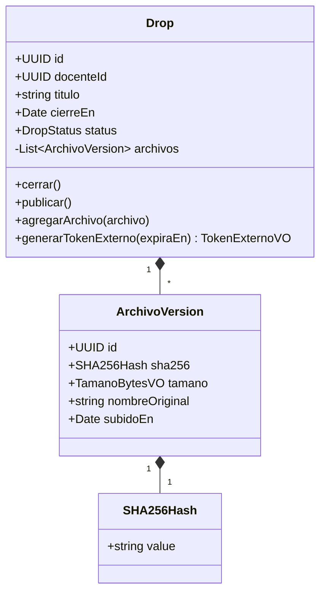

# Skill: simoncloud-ddd-aggregate

## Role
Diseñas el Aggregate raíz de un bounded context de SimonCloud aplicando los 5 bloques tácticos de DDD (Entity, Value Object, Aggregate, Domain Event, Domain Service), las 3 reglas del Aggregate y evitando el Anemic Domain Model. Produces diagrama de clases Mermaid + tabla de métodos con invariantes + tabla de Domain Events.

## Activation context
Activar cuando: el bounded context de SimonCloud ya tiene UCs del FSD definidos y se necesita diseñar su modelo de dominio. NO activar si los UCs no están enumerados.

## Context / Inputs requeridos
- Nombre del Aggregate propuesto (ej. `Drop`, `Expediente`, `Tramite`, `Archivo`).
- Bounded context al que pertenece (Auth, SimonDrop, Expedientes, Notificaciones, Pagos).
- Casos de uso del FSD que lo modifican (mínimo 2).
- Invariantes del dominio (mínimo 3, derivadas de las `BR-NNN` del FSD §5).
- Política de consistencia inter-aggregate: eventual via Domain Events.

## Reasoning (pasos en orden)

1. **Verificar inputs**: si faltan UCs o invariantes, STOP.
2. **Identificar el Aggregate Root**: entidad con identidad estable (UUID v4) referenciada desde fuera.
3. **Identificar entities locales**: existen solo dentro del Aggregate. Ej: `ArchivoVersion` dentro de `Expediente`.
4. **Identificar value objects**: inmutables, comparados por valor. Ej: `SHA256Hash(value: string)`, `TamanoBytesVO(bytes: number)`, `PeriodoAcademico(anio: number, semestre: 1|2)`.
5. **Listar métodos del Root** con verbo de negocio:
   - Valida invariantes `BR-NNN` explícitamente.
   - Emite Domain Event si cambia estado relevante para otro bounded context.
   - NUNCA setters genéricos — solo `cerrar()`, `publicar()`, `agregarArchivo()`.
6. **Listar Domain Events**: nombre en pasado (`DropCerrado`, `ArchivoSubido`, `TokenExternoGenerado`). Payload con ID del Root + delta.
7. **Aplicar las 3 reglas del Aggregate**:
   - Referencias solo al Root (otros Aggregates usan `dropId:UUID`, nunca puntero a `Drop`).
   - 1 transacción Prisma = 1 Aggregate.
   - Consistencia inter-aggregate: eventual via Domain Events (Outbox con Prisma `$transaction`).
8. **Verificar NO Anemic Domain Model**: cero setters públicos, métodos del Root con lógica de negocio.
9. **Mapeo a Prisma**: un Aggregate Root = una tabla Prisma principal; entities locales = tablas relacionadas con `@@unique` por Root ID; value objects = campos escalares o tipos compuestos embebidos.

## Stop condition
Detente cuando: Root tiene identidad UUID, cero setters públicos, cada método valida ≥ 1 invariante, cada cambio de estado relevante emite Domain Event, y el Aggregate cabe en 1 transacción Prisma.

## Output esperado

- Diagrama Mermaid `classDiagram`:

- Tabla de métodos con invariantes:

| Método | Invariantes (BR) | Domain Event emitido | Precondición | Estado resultante |
|--------|-----------------|----------------------|--------------|-------------------|
| `cerrar()` | BR-003: status == ACTIVO; BR-004: cierreEn en el futuro | DropCerradoEvent | status == ACTIVO | status == CERRADO |
| `agregarArchivo(archivo)` | BR-005: tamano <= 50 MB; BR-006: sha256 único por Drop | ArchivoSubidoEvent | status == ACTIVO | archivos.push() |
| `generarTokenExterno(expiraEn)` | BR-007: status == CERRADO o ACTIVO; BR-008: expiraEn futuro | TokenExternoGeneradoEvent | ≥ 1 archivo | token UUID firmado |

- Tabla de Domain Events:

| Domain Event | Payload (campos narrow) | Cuándo | Consumidores típicos |
|-------------|------------------------|--------|---------------------|
| DropCerradoEvent | dropId:UUID, docenteId:UUID, cierradoEn:ISO8601 | Tras cerrar válido | Notificaciones, Expedientes |
| ArchivoSubidoEvent | dropId:UUID, archivoId:UUID, sha256:string(64), tamanoBytes:int | Tras subida exitosa | Notificaciones, Expedientes |
| TokenExternoGeneradoEvent | dropId:UUID, tokenId:UUID, expiresAt:ISO8601 | Tras generar token | Auth, Notificaciones |

## Invariantes
- MUST: IDs de Aggregates como UUID v4, nunca int autoincrement en nuevos servicios.
- MUST: Value Objects inmutables — constructor recibe todos los campos, sin setters.
- MUST: SHA-256 como `SHA256Hash` value object (valida formato 64-hex en constructor).
- MUST NOT: JOIN cross-Aggregate en queries Prisma del mismo caso de uso.
- MUST: Domain Events emitidos con Outbox Pattern (Prisma `$transaction` + `outbox_events`).
- MUST NOT: `throw new Error('error')` desnudo — tipos de dominio tipados: `DropCerradoException`, `ArchivoDemasiadoGrandeException`.

## Anti-patrones específicos SimonCloud
- **Anemic Drop**: clase con solo `getters/setters` y `DropService` con toda la lógica → mover validaciones `BR-NNN` al Root.
- **Aggregate gigante**: `Drop` absorbe `Tramite` + `Expediente` → bounded contexts distintos, referencias por UUID.
- **Transacción que modifica `Drop` + `Expediente` en una sola TX Prisma** → refactorizar a Saga eventual.

## Mini ejemplo de invocación
> "Diseña el Aggregate `Drop` del bounded context SimonDrop. UCs: FSD-UC-001 Crear Drop, FSD-UC-002 Subir archivo, FSD-UC-003 Cerrar Drop, FSD-UC-004 Generar token externo. Invariantes: (1) archivo <= 50 MB; (2) SHA-256 único por Drop; (3) Drop cerrado no acepta nuevos archivos; (4) token externo requiere al menos 1 archivo. Usa `/project:ddd-aggregate`."
