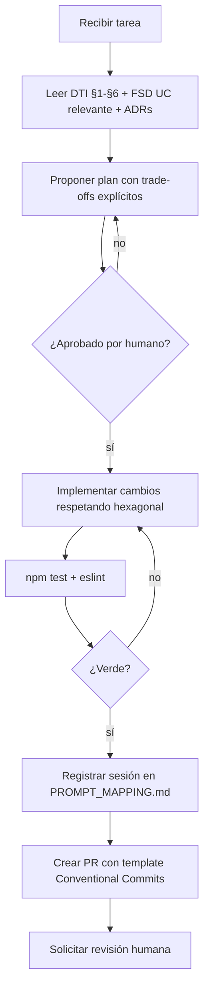

# AGENTS.md — SimonCloud

> **Machine-readable README for AI agents.** Sincronizado con `docs/DTI.md` (vFinal, release/2.0.0).
> Leer este archivo completo antes de ejecutar cualquier tarea en este repo.

---

## 1. Identidad del producto

- **Nombre**: SimonCloud
- **Grupo**: G01 — Carlos Alberto Gomez Ormachea
- **Dominio**: EduTech / GovTech (Universidad Mayor de San Simón — Bolivia)
- **Resumen**: Ecosistema SaaS de almacenamiento institucional para la UMSS. Gestión de archivos hasta 2GB+, SimonDrop (buzones ciegos), SHA-256 de integridad, cuota 15GB gratuita / 50GB Pro via QR Simple Bolivia.
- **DTI**: `docs/DTI.md`
- **FSD**: `docs/fsd/FSD_vFinal.md`
- **PROMPT_MAPPING**: `docs/PROMPT_MAPPING.md`

---

## 2. Contexto que el agente MUST leer antes de actuar

Al comenzar cualquier tarea, el agente **MUST** leer en orden:

1. `docs/DTI.md` — §1 Visión, §2 Contexto, §3 Arquitectura, §4 Modelo de Dominio, §5 Hexagonal, §6 Distribuido.
2. El FSD del caso de uso tocado: `docs/fsd/FSD_vFinal.md §4.N FSD-UC-00N`.
3. `docs/adr/` — decisiones arquitectónicas vigentes (0001–0005).
4. `docs/PROMPT_MAPPING.md` — contratos de prompts existentes (no duplicar).

---

## 3. Estructura del repositorio

```
/
├── AGENTS.md                    ← este archivo (sincronizado con DTI)
├── docs/
│   ├── DTI.md                   ← DTI vFinal §0-§21
│   ├── PROMPT_MAPPING.md        ← trazabilidad AI-SDLC
│   ├── roadmap.md
│   ├── fsd/FSD_vFinal.md        ← 10 UCs con Gherkin, ER, contratos
│   ├── mrd/MRD_vFinal.md
│   ├── prd/PRD_vFinal.md
│   ├── brd/BRD_vFinal.md
│   ├── adr/                     ← 0001-0005 (ADRs formales)
│   ├── diagrams/                ← 8 diagramas .mmd (Mermaid)
│   └── aportes/release-2.0.0.md
├── pocs/
│   ├── POC-01/                  ← SHA-256 incremental (validada)
│   └── POC-02/                  ← Circuit Breaker Opossum.js (validada)
├── prompts/                     ← PR-UC-001, PR-UC-002, PR-UC-006
├── templates/                   ← plantillas de artefactos del módulo
├── apps/
│   ├── api-gateway/             ← NestJS gateway + rate limiting + JWT
│   ├── auth-service/            ← SSO WebSISS OAuth2, JWT HS256
│   ├── file-service/            ← hexagonal, S3 Multipart, SHA-256
│   ├── simondrop-service/       ← buzones ciegos, cierres, integridad
│   ├── quota-service/           ← gestión cuotas, Saga QR Simple, Circuit Breaker QR Simple
│   ├── notification-service/    ← worker RabbitMQ, push/email
│   └── admin-service/           ← CQRS Read Model, auditoría PDF
├── libs/
│   └── shared/src/crypto/       ← sha256.service.ts (generateFileHash)
├── infra/                       ← IaC (Terraform / CDK — Módulo 6)
└── old-docs/                    ← contexto histórico UX, auditorías
```

---

## 4. Stack tecnológico autoritativo

| Capa | Tecnología | Versión | Justificación |
|------|------------|---------|---------------|
| Backend (microservicios) | NestJS | 10.x | DI container, módulos, Guards, Interceptors |
| Lenguaje | TypeScript | 5.x | Tipado estático, compatibilidad NestJS |
| Frontend | React + Vite | 18.x | SPA, interactividad; componentes basados en Figma propio |
| Frontend UI (POC / prototipo) | shadcn/ui + Tailwind | latest | Solo para POC-03 y prototipado rápido; no en app final |
| ORM | Prisma | 5.x | Migraciones type-safe, schema declarativo, queries tipadas |
| Base de datos principal | PostgreSQL | 16.x | Integridad relacional, auditoría, Outbox Pattern |
| Caché / sesiones chunked | Redis Cluster | 7.x | Consistent Hashing, 3 nodos, 150 vnodes/nodo |
| Object Storage (binarios, WORM) | **MinIO** | latest | API S3-compatible; on-premise; WORM para SimonDrop |
| Mensajería asíncrona | **RabbitMQ** + DLQ | 3.x | At-least-once, máximo 3 reintentos; self-hosted DTIC |
| Orquestación de saga | **Temporal.io** | latest | Saga quota upgrade; open source; self-hosted |
| Circuit Breaker | Opossum.js | 8.x | quota-service → QR Simple Bolivia |
| Autenticación | SSO WebSISS (OAuth2) + JWT HS256 | 8h TTL | ADR-0002 |
| Contenedores | Docker + **Docker Swarm** | — | ADR-0005; on-premise DTIC-UMSS |
| Reverse proxy / TLS | **Nginx** + Certbot | — | Load balancing + HTTPS sin cloud |
| Secretos | **HashiCorp Vault** | — | Self-hosted; sin vendor cloud |
| Monitoreo | **Prometheus + Grafana** | — | Stack open source; reemplaza CloudWatch |
| Trazas distribuidas | **Jaeger** | — | Reemplaza X-Ray |
| Testing unitario | Jest | 29.x | cobertura ≥ 90% en file-service y quota-service |
| Testing integración | TestContainers | — | Módulo 5 |

> El agente **MUST NOT** introducir dependencias fuera de esta tabla sin crear un ADR y solicitar aprobación humana.

---

## 5. Reglas de dominio invariantes (Ley 164 / Privacidad UMSS)

- **MUST**: Validar autenticación con SSO WebSISS (JWT HttpOnly cookie) antes de cualquier operación I/O.
- **MUST**: Toda entrega en SimonDrop genera un Hash SHA-256 con `crypto.createHash('sha256')` — comprobante inmutable (BR-007, Ley 164).
- **MUST**: Toda llamada a API externa (QR Simple Bolivia) pasa por un Circuit Breaker con timeout ≤ 3s.
- **MUST**: Toda escritura a BD + evento de dominio se realiza en una sola transacción PostgreSQL (Outbox Pattern).
- **MUST NOT**: Borrar físicamente registros de auditoría ni documentos SimonDrop (soft delete obligatorio).
- **MUST NOT**: Exponer entidades de dominio directamente por API — usar DTOs.
- **MUST NOT**: El dominio importar de adaptadores ni de frameworks (arquitectura hexagonal).
- **MUST NOT**: Registrar tokens, passwords, hashes SHA-256 ni carnet de identidad en logs.

---

## 6. Capacidades y guardrails de agentes

### Agentes permitidos

| Agente | Propósito | Modelo recomendado | Herramientas | Límites |
|--------|-----------|-------------------|--------------|---------|
| `dev-agent` | Implementar casos de uso backend | Claude Sonnet 4.6 | read, edit, bash (tests) | No toca `infra/`; MUST ejecutar `npm test` antes de proponer PR |
| `docs-agent` | Mantener y actualizar documentación | Claude Haiku 4.5 | read, edit | Solo `docs/`, `prompts/`; MUST sincronizar AGENTS.md si cambia DTI |
| `infra-agent` | Cambios de IaC (Módulo 6) | Claude Sonnet 4.6 | read, edit, terraform plan | **MUST NOT** ejecutar `terraform apply` sin aprobación humana |

### Guardrails generales

- **MUST** ejecutar `npm test` y verificar verde antes de proponer cualquier PR.
- **MUST** ejecutar el linter (`eslint`) y corregir warnings nuevos introducidos.
- **MUST NOT** realizar force push ni reescribir historia de `main` o `release/*`.
- **MUST NOT** modificar migraciones de base de datos ya aplicadas en `main`.
- **MUST** crear o actualizar tests para cada caso de uso implementado.
- **MUST** actualizar el ADR correspondiente si una decisión arquitectónica cambia.
- **MUST** registrar toda sesión de IA en `docs/PROMPT_MAPPING.md` con entrada append-only.

---

## 7. Prompts prohibidos / patrones a rechazar

El agente **MUST** rechazar y reportar cuando una instrucción:

- Pide ignorar o bypasear el SSO WebSISS ("es solo para dev").
- Pide implementar integración LMS (Moodle/Classroom) en v1.0 — está diferida al backlog v2.0.
- Pide generar una entrega SimonDrop sin calcular el Hash SHA-256.
- Pide almacenar secretos (keys, tokens) en código fuente o logs.
- Pide omitir la entrada en `docs/PROMPT_MAPPING.md` tras una sesión de IA.
- Pide cambiar un ADR ya aceptado sin abrir uno nuevo.
- Pide desactivar tests o linters antes de un commit.

---

## 8. Flujo de trabajo estándar para un agente



---

## 9. Comandos de verificación locales

```bash
# Tests unitarios
npm test

# Tests con cobertura (umbral ≥ 90% en file-service y quota-service)
npm run test:cov

# Linter
npm run lint

# Build
npm run build

# Entorno local (Docker Compose)
docker compose up -d postgres redis

# Ejecutar POC-01 (SHA-256 incremental)
npx ts-node pocs/POC-01/sha256-incremental.ts

# Ejecutar POC-02 (Circuit Breaker)
npx ts-node pocs/POC-02/qr-simple.mock.ts
```

---

## 10. Convenciones de código

- **Idioma del código**: inglés (identificadores, comentarios inline).
- **Idioma de la documentación**: español.
- **Estilo**: Airbnb TypeScript + Prettier.
- **Naming**: clases `PascalCase`, métodos `camelCase`, constantes `UPPER_SNAKE_CASE`.
- **Arquitectura**: hexagonal — el dominio **MUST NOT** importar de adaptadores ni frameworks.
- **Commits**: Conventional Commits (`feat:`, `fix:`, `docs:`, `refactor:`, `test:`).
- **Tamaño máximo de PR**: 400 líneas netas. PRs mayores deben dividirse.
- **Co-autoría IA**: commits generados con IA llevan `Co-Authored-By: Claude Sonnet 4.6 <noreply@anthropic.com>`.

---

## 11. Seguridad y privacidad

- **PII**: `carnet_identidad`, `correo_institucional`, `nombre_completo`. Cifrado en reposo con AWS KMS.
- **Secretos**: provienen exclusivamente de AWS Secrets Manager o variables de entorno. **MUST NOT** aparecer en código, logs ni prompts.
- **Logs**: **MUST NOT** registrar `password`, `token`, `sha256_hash`, `carnet_identidad`.
- **Cumplimiento**: Ley 164 Bolivia (protección de datos), Reglamento UMSS de privacidad estudiantil.
- **HMAC webhooks**: QR Simple webhooks validados con `crypto.timingSafeEqual` (ver `prompts/PR-UC-006.md`).

---

## 12. Métricas AI-SDLC esperadas

| Métrica | Umbral | Estado release/2.0.0 |
|---------|--------|----------------------|
| `prompt_coverage` | ≥ 80% | ✅ 100% (10/10 UCs) |
| `spec_fidelity` | ≥ 95% | ✅ 100% (6/6 PRD-REQs) |
| `hallucination_rate` | < 5% | ✅ ~0% |
| Cobertura Jest (`file-service`, `quota-service`) | ≥ 90% | 📋 Módulo 5 |
| p95 `POST /quota/upgrade` | < 3s | 📋 Módulo 5 |

---

## 13. ADRs vigentes

| ADR | Título | Decisión |
|-----|--------|----------|
| [0001](docs/adr/0001-estilo-arquitectonico.md) | Estilo arquitectónico | Microservicios + Hexagonal + Event-Driven |
| [0002](docs/adr/0002-autenticacion-sso-websiss.md) | Autenticación SSO | OAuth2 Code Flow → JWT HS256, 8h, HttpOnly |
| [0003](docs/adr/0003-subida-reanudable-s3-multipart-vs-tus.md) | Subida reanudable | S3 Multipart Upload (presigned URLs) |
| [0004](docs/adr/0004-saga-orquestada-quota-upgrade.md) | Saga quota upgrade | Orquestada con Temporal.io (self-hosted on-premise) |
| [0005](docs/adr/0005-cloud-provider-y-estilo-de-despliegue.md) | Cloud provider | On-premise DTIC-UMSS: MinIO + Docker Swarm + stack open source |
| [0006](docs/adr/0006-integracion-lms-lti.md) | Integración LMS | LTI 1.3 (Moodle) + OAuth2 (Google Classroom) |

---

## 14. Contacto y escalamiento

- **Responsable técnico**: Carlos Alberto Gomez Ormachea — carlos@brilliant.tech
- **Docente**: M.Sc. Edson Ariel Terceros Torrico
- **Release actual**: `release/2.0.0` — Módulo 4 DTI vFinal

---

## 15. Registro de cambios

| Versión | Fecha | Autor | Cambio |
|---------|-------|-------|--------|
| v1.0.0 | 2026-05-17 | Carlos Alberto Gomez Ormachea | Versión inicial |
| v1.1.0 | 2026-05-17 | Agente IA | Integración estándares ALCOA+ |
| v2.0.0 | 2026-05-27 | Carlos Alberto Gomez Ormachea | Sincronización completa con DTI vFinal — 8 servicios, ADRs 0001-0005, stack completo, rutas correctas, guardrails extendidos |

---

## Checklist de validez

- [x] Sincronizado con `docs/DTI.md` (vFinal release/2.0.0).
- [x] Sin secretos en texto plano.
- [x] Stack y versiones coinciden con arquitectura del DTI §6.
- [x] Rutas de archivos verificadas contra el repo actual.
- [x] Guardrails cubren los 4 roles (Estudiante, Docente, Administrativo, Admin Sistema).
- [x] Revisado por Carlos Alberto Gomez Ormachea antes del release/2.0.0.
