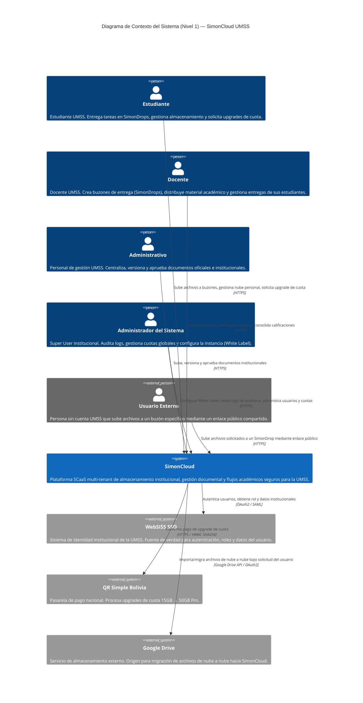
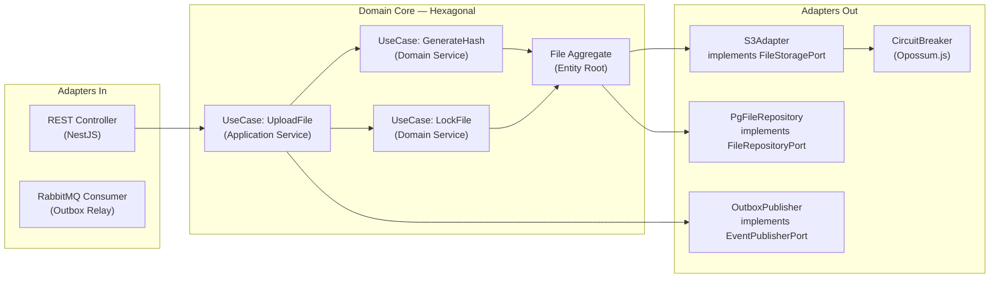
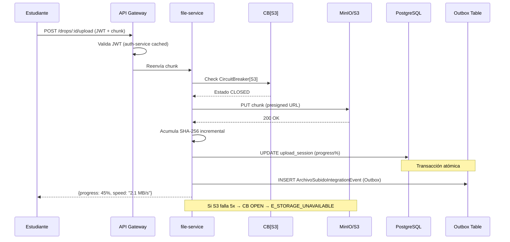
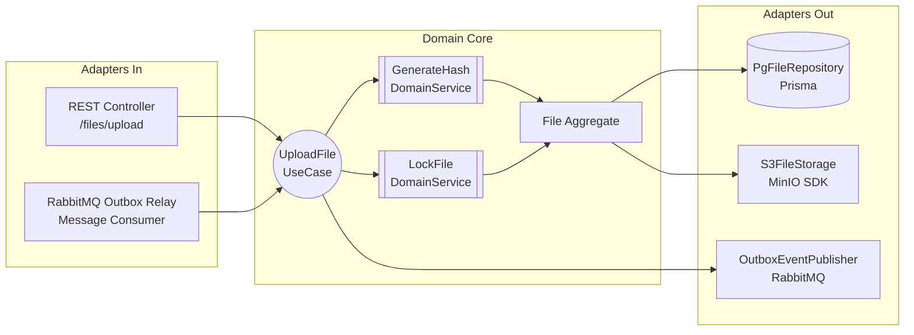
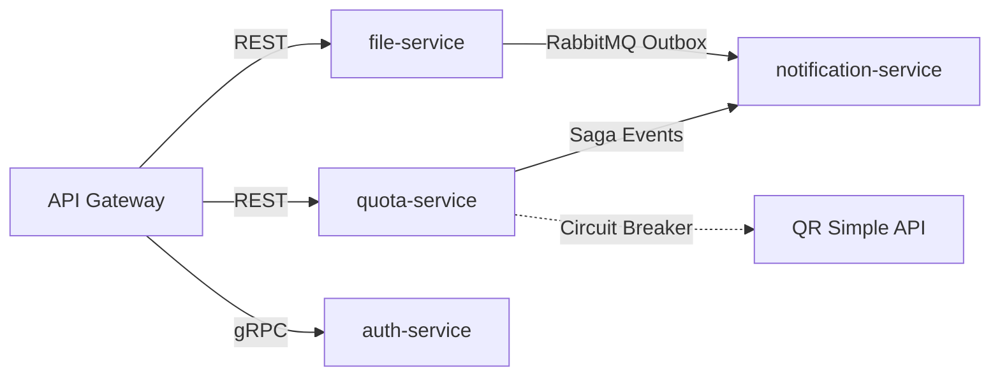
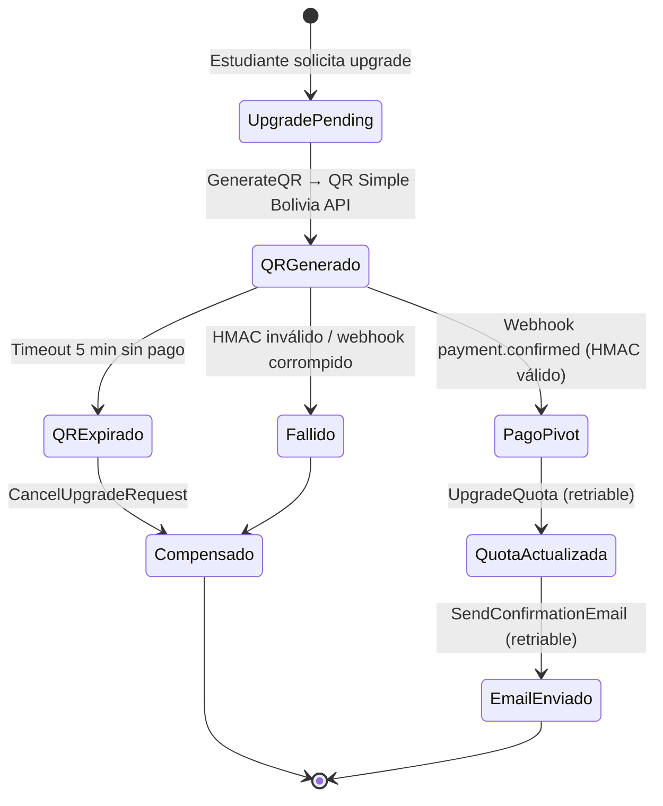
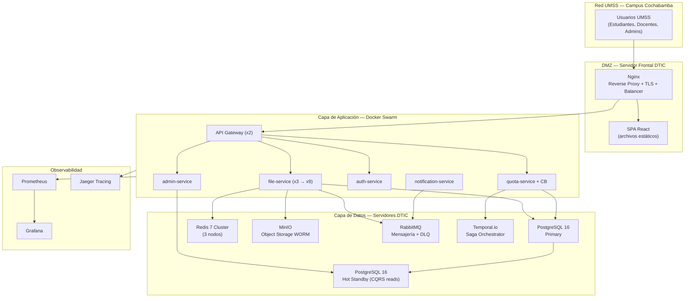
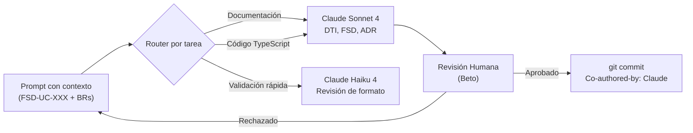

# Documento Técnico Inicial (DTI) vFinal — SimonCloud

## §0. Metadatos

| Campo | Valor |
|-------|-------|
| **Producto** | SimonCloud — Almacenamiento Institucional UMSS |
| **Grupo** | G01 |
| **Versión** | vFinal |
| **Fecha** | 2026-05-27 |
| **Arquitecto responsable** | Carlos Alberto Gomez Ormachea |
| **Stakeholders** | DTIC UMSS, Docentes, Estudiantes, Personal Administrativo |
| **Estado** | Aprobado |
| **Repositorio** | simoncloud-m3 |
| **Enlace al BRD** | `docs/brd/BRD_vFinal.md` |
| **Enlace al MRD** | `docs/mrd/MRD_vFinal.md` |
| **Enlace al PRD** | `docs/prd/PRD_vFinal.md` |
| **Enlace al FSD** | `docs/fsd/FSD_vFinal.md` |
| **Enlace a AGENTS.md** | `/AGENTS.md` |
| **Enlace a PROMPT_MAPPING.md** | `docs/PROMPT_MAPPING.md` |

---

## §1. Visión del Producto

- **Problema**: La UMSS carece de un sistema de almacenamiento institucional. Moodle limita archivos a 50MB, forzando a estudiantes a usar WhatsApp y Google Drive personal. Docentes reciben trabajos por canales informales. Administrativos usan pendrives con riesgo de virus.
- **Usuarios objetivo**: Estudiantes (65,000), Docentes (4,000), Personal Administrativo (5,000) de la UMSS.
- **Propuesta de valor**: Plataforma SaaS multi-tenant que centraliza subida de archivos (hasta 2GB+) con comprobantes SHA-256 inmutables, buzones de entrega controlados (SimonDrop), gestión de cuotas de almacenamiento, y soberanía de datos en infraestructura institucional UMSS.
- **North Star KPI**: Porcentaje de entregas académicas realizadas dentro de SimonCloud (meta: 80% en 6 meses).
- **Métricas secundarias**:
  1. Tasa de éxito de generación de hash SHA-256: 100%.
  2. Reducción de archivos recibidos por WhatsApp/correo personal docente: -80%.
- **Restricciones de negocio**: Datos deben residir en servidores UMSS (Bolivia). Integración con WebSISS SSO obligatoria.

---

## §2. Contexto del Sistema

### 2.1 Diagrama C4 – Nivel 1 (Contexto)



### 2.2 Actores externos y dependencias

| Actor / Sistema | Tipo | Dirección | Criticidad |
|-----------------|------|-----------|------------|
| WebSISS SSO | IdP institucional | entrada | alta — bloquea todo login |
| QR Simple Bolivia | Pasarela de pago | entrada (webhook) | alta — procesa upgrades de cuota |
| Google Drive API | Storage externo | salida | baja — solo migración bajo demanda |
| MinIO / AWS S3 | Object Storage | interna | alta — almacén de archivos |

### 2.3 Restricciones y Principios Arquitectónicos

| # | Restricción / Principio | Justificación |
|---|------------------------|---------------|
| R-01 | **Solo lectura en LMS externos** | Política de seguridad institucional; evita corrupción de datos académicos. |
| R-02 | **Identidad por correo institucional** | Previene duplicación de alumnos por diferente plataforma. |
| R-03 | **Inmutabilidad post-entrega** | Garantía legal y académica; soportada por hash SHA-256 y política WORM en S3. |
| R-04 | **Multi-tenant desde el diseño** | Escalabilidad del modelo SCaaS hacia otras universidades bolivianas. |
| R-05 | **Soberanía de datos en UMSS** | Cumplimiento Ley 164 Bolivia; datos en servidores propios. |

---

## §3. Arquitectura de Alto Nivel

### 3.1 Estilo arquitectónico adoptado

**Microservicios + Hexagonal + Event-Driven (híbrida)**

Justificación: SimonCloud tiene 4 dominios de negocio independientes (almacenamiento, identidad, cuotas, notificaciones) con patrones de escalado distintos. El `file-service` necesita escalar a 10k uploads simultáneos en periodos de exámenes. La arquitectura hexagonal dentro de cada servicio garantiza testabilidad y desacoplamiento de infraestructura. El patrón event-driven (Outbox + Saga) resuelve la consistencia eventual entre servicios sin 2PC. Documentado en `docs/adr/0001-estilo-arquitectonico.md`.

### 3.2 Diagrama C4 – Nivel 2 (Contenedores)

```mermaid
C4Container
title Diagrama de Contenedores — SimonCloud

Person(usuario, "Usuario UMSS", "Estudiante, Docente, Administrativo, Admin")
Person_Ext(externo, "Usuario Externo", "Sin cuenta UMSS")

Container(spa, "SPA React", "React 18 + TypeScript", "Interfaz web; todas las pantallas del sistema.")
Container(gateway, "API Gateway", "NestJS", "Punto de entrada único. Valida JWT, enruta, rate-limit.")
Container(auth, "auth-service", "NestJS + WebSISS OAuth2", "Federación SSO, emisión JWT, RBAC, tokens externos HMAC-SHA256.")
Container(files, "file-service", "NestJS + MinIO SDK (S3-API)", "Subida chunked, SHA-256 incremental, gestión de archivos.")
Container(drops, "simondrop-service", "NestJS", "Buzones, fechas de cierre, comprobantes, deep links LTI.")
Container(quota, "quota-service", "NestJS + Saga + Circuit Breaker", "Gestión de cuotas, saga de pago QR Simple Bolivia.")
Container(expedientes, "expedientes-service", "NestJS", "Aprobación/rechazo documentos institucionales, control versiones, audit trail.")
Container(notif, "notification-service", "NestJS + RabbitMQ Consumer", "Emails push; DLQ con reintentos exponenciales.")
Container(admin, "admin-service", "NestJS + CQRS Read Model", "Panel global, métricas, audit log exportable PDF.")

ContainerDb(pg_main, "PostgreSQL Primary", "PostgreSQL 16 on-premise", "Usuarios, archivos, buzones, cuotas, actas.")
ContainerDb(pg_replica, "PostgreSQL Replica", "PostgreSQL 16 on-premise", "Réplica de lectura para queries pesadas.")
ContainerDb(redis, "Redis Cluster", "Redis 7 on-premise (3 nodos)", "Sesiones de upload; consistent hashing.")
ContainerDb(s3, "MinIO Object Storage", "on-premise + Object Lock WORM", "Archivos binarios; políticas WORM post-cierre.")
ContainerDb(rabbit, "RabbitMQ + DLQ", "on-premise", "Cola de notificaciones; Dead Letter Queue.")

Rel(usuario, spa, "Usa", "HTTPS")
Rel(externo, spa, "Accede a SimonDrop público", "HTTPS")
Rel(spa, gateway, "API calls", "HTTPS/REST")
Rel(gateway, auth, "Valida JWT / SSO", "gRPC interno")
Rel(gateway, files, "Rutas /files/*", "REST")
Rel(gateway, drops, "Rutas /drops/*", "REST")
Rel(gateway, quota, "Rutas /quota/*", "REST")
Rel(gateway, admin, "Rutas /admin/*", "REST")
Rel(files, pg_main, "CRUD archivos", "PostgreSQL")
Rel(files, redis, "Sesiones upload chunked", "Redis")
Rel(files, s3, "PUT/GET objetos binarios", "S3 API (MinIO)")
Rel(files, rabbit, "Publica ArchivoSubidoIntegrationEvent via Outbox", "AMQP")
Rel(quota, pg_main, "CRUD cuotas", "PostgreSQL")
Rel(notif, rabbit, "Consume ArchivoSubidoIntegrationEvent, QuotaUpgradedEvent", "AMQP")
Rel(admin, pg_replica, "Queries de métricas (CQRS Read Model)", "PostgreSQL")
```



### 3.3 Diagrama C4 – Nivel 3 (Componentes del file-service — núcleo crítico)



### 3.4 Data Flow del caso de uso crítico (FSD-UC-002: Subida con Hash)



---

## §4. Modelo de Dominio

### 4.1 Bounded Contexts

| Contexto | Responsabilidad | Entidades principales | Tipo de integración |
|----------|-----------------|-----------------------|---------------------|
| `Identity` | Autenticación, RBAC, tokens externos HMAC-SHA256 | `User`, `Role`, `Session`, `TokenExterno` | síncrona (auth-service) |
| `Storage` | Almacenamiento de archivos, SHA-256 incremental | `File`, `UploadSession` | asíncrona (ArchivoSubidoIntegrationEvent) |
| `SimonDrop` | Buzones de entrega, deep links LTI, cierres | `SimonDrop`, `Submission` | síncrona + asíncrona |
| `Billing` | Cuotas y pagos, saga QR Simple Bolivia | `Quota`, `Payment`, `SagaState` | asíncrona (saga orquestada) |
| `Expedientes` | Aprobación/rechazo de documentos institucionales | `Expediente`, `Documento`, `Version` | síncrona + asíncrona |
| `Notification` | Alertas, emails, push, DLQ | `Notification`, `AuditLog` | event-driven (RabbitMQ, todos los exchanges) |
| `Admin` | CQRS read model, métricas globales, audit log | `DashboardMetrics`, `AuditEntry` | CQRS (consume eventos, escribe read model) |

### 4.2 Entidades, Value Objects y Aggregates

| Tipo | Nombre | Invariantes | Ciclo de vida |
|------|--------|-------------|---------------|
| Aggregate Root | `File` | `hash_sha256` no nulo post-upload; `solo_lectura=true` si SimonDrop cerrado | SUBIENDO → ACTIVO → SOLO_LECTURA / EN_PAPELERA → PURGADO |
| Aggregate Root | `SimonDrop` | `cierre_en` debe ser fecha futura al crear | ACTIVO → CERRADO (automático al pasar `cierre_en`) |
| Aggregate Root | `Quota` | `quota_used_mb` ≤ `quota_limit_mb` antes de cualquier upload | FREEMIUM (15GB) → PRO (50GB) |
| Value Object | `SHA256Hash` | 64 chars hex lowercase, inmutable | creado al completar upload |
| Value Object | `PresignedUrl` | TTL = 15min, un solo uso | caduca automáticamente |

### 4.3 DTOs principales

| DTO | Uso (capa) | Campos | Mapeo a entidad |
|-----|------------|--------|-----------------|
| `UploadFileDTO` | REST → App | `simondropId, fileBuffer, estudianteId` | `File` Aggregate |
| `QuotaUpgradeDTO` | App → Saga | `userId, plan, amount, qrPaymentId` | `Quota`, `Payment` |
| `FileMetadataDTO` | App → Cliente | `fileId, nombre, hash_sha256, solo_lectura, recibo_url` | `File` |

---

## §5. Arquitectura Hexagonal del *core* (file-service)

### 5.1 Puertos (Ports)

| Puerto | Tipo | Definido en | Propósito |
|--------|------|-------------|-----------|
| `UploadFileUseCase` | input | `domain/port/in` | Recibir y procesar un chunk de archivo |
| `GenerateHashUseCase` | input | `domain/port/in` | Calcular SHA-256 al completar upload |
| `LockFileUseCase` | input | `domain/port/in` | Marcar archivo como solo lectura |
| `FileRepositoryPort` | output | `domain/port/out` | Persistir metadatos de archivo en BD |
| `FileStoragePort` | output | `domain/port/out` | Subir/descargar binarios a S3/MinIO |
| `EventPublisherPort` | output | `domain/port/out` | Publicar `ArchivoSubidoIntegrationEvent` via Outbox |

### 5.2 Adaptadores (Adapters)

| Adaptador | Implementa | Tecnología | Ubicación |
|-----------|-----------|------------|-----------|
| `FileRestController` | `UploadFileUseCase` | NestJS REST | `adapter/in/web` |
| `RabbitOutboxRelay` | Relay de Outbox | NestJS + amqplib | `adapter/in/messaging` |
| `PgFileRepository` | `FileRepositoryPort` | Prisma + PostgreSQL | `adapter/out/persistence` |
| `S3FileStorage` | `FileStoragePort` | AWS SDK v3 / MinIO | `adapter/out/storage` |
| `OutboxEventPublisher` | `EventPublisherPort` | Prisma + amqplib | `adapter/out/messaging` |

### 5.3 Diagrama de puertos y adaptadores



---

## §6. Arquitectura Distribuida

### 6.1 Microservicios y responsabilidades

| Servicio | Responsabilidad | BD propia | API expuesta |
|----------|-----------------|-----------|--------------|
| `api-gateway` | Routing, JWT validation, rate-limit | — | REST /\* |
| `auth-service` | SSO WebSISS, JWT, RBAC, tokens externos HMAC-SHA256 | PostgreSQL (users, roles, tokens_externos) | gRPC /auth |
| `file-service` | Subida chunked, SHA-256, gestión, Outbox Pattern | PostgreSQL + MinIO | REST /files |
| `simondrop-service` | Buzones, cierres, comprobantes, deep links LTI | PostgreSQL | REST /drops |
| `quota-service` | Cuotas, saga QR Simple, Circuit Breaker | PostgreSQL (quotas) | REST /quota |
| `expedientes-service` | Aprobación/rechazo documentos, control versiones | PostgreSQL (expedientes) | REST /expedientes |
| `notification-service` | Emails, push, DLQ con reintentos exponenciales | Redis (colas) | RabbitMQ Consumer |
| `admin-service` | Panel global, CQRS Read Model, audit log PDF | PostgreSQL (audit_log) | REST /admin |

### 6.2 Patrones de resiliencia aplicados

| Patrón | Dónde | Configuración |
|--------|-------|---------------|
| Circuit Breaker | `quota-service` → QR Simple Bolivia | `timeout: 3s, failureRate: 50%, resetTimeout: 30s` |
| Circuit Breaker | `file-service` → S3/MinIO | `timeout: 5s, failureRate: 50%, resetTimeout: 60s` |
| Retry + Exponential Backoff | Notificaciones push | `3 reintentos, delays: 1s, 2s, 4s` |
| Dead Letter Queue | `notification-service` | RabbitMQ DLQ tras 3 fallos |
| Rate Limiting | `api-gateway` | `100 req/s por usuario` |
| Consistent Hashing | Redis Cluster `file-service` | `150 vnodes/nodo; 3 nodos` |
| Escalado horizontal | `file-service` Docker Swarm | `docker service scale file-service=9` (CPU > 70%) |
| Fallback degradado | `quota-service` CB OPEN | `Retorna error controlado: "Pago temporalmente no disponible, intente en 30s"` |

### 6.3 Mapa IPC



---

## §7. Arquitectura Asíncrona / Event-Driven

### 7.1 Catálogo de eventos

| Evento | Productor | Consumidor(es) | Payload | Garantía |
|--------|-----------|----------------|---------|----------|
| `ArchivoSubidoIntegrationEvent` | `file-service` | `notification-service` | `{eventId, eventVersion, archivoId, dropId, estudianteId, docenteId, sha256, tamanoBytes, nombreOriginal, subitoEn}` | at-least-once (Outbox) |
| `SimonDropClosedEvent` | `simondrop-service` | `file-service` (lock) | `{dropId, closedAt}` | at-least-once |
| `QuotaUpgradeRequested` | `quota-service` (saga) | `quota-service` (QR Simple adapter) | `{userId, plan, amount}` | exactly-once (Saga) |
| `PaymentConfirmedEvent` | `quota-service` (webhook) | Saga orchestrator | `{paymentId, userId, hmacValid}` | at-least-once |
| `QuotaUpgradedEvent` | `quota-service` | `notification-service` | `{userId, newQuotaMb}` | at-least-once |
| `UserRegisteredEvent` | `auth-service` | `admin-service` (CQRS) | `{userId, rol, timestamp}` | at-least-once |

### 7.2 Saga: Upgrade de Cuota por QR (FSD-UC-003)

**Tipo**: Orquestada (el `quota-service` actúa como orquestador). Se eligió orquestación sobre coreografía porque el flujo tiene pasos de compensación explícita y requiere rastrear estado global desde un único punto.



**Transacciones**:
- **Compensable**: `QuotaPending` en `quota-service` — reversible con `CancelUpgradeRequest`.
- **Pivote**: Validación HMAC del webhook `payment.confirmed` — si pasa, la saga es irrevocable.
- **Retornables**: `UpgradeQuota` y `SendConfirmationEmail` — se reintentan hasta éxito.

### 7.3 Outbox: Subida de Archivo → Notificación al Docente (FSD-UC-002/007)

**Problema resuelto**: Doble escritura (dual write) — si el `file-service` guarda en PostgreSQL pero falla al publicar en RabbitMQ, el docente nunca es notificado.

**Solución**: En la misma transacción PostgreSQL que guarda el archivo, se inserta `ArchivoSubidoIntegrationEvent` en la tabla `outbox`. Un Message Relay (Polling Publisher cada 2s) lee la tabla y publica en el exchange topic `simoncloud.simondrop.events` con routing key `archivo.subido`, garantía at-least-once.

**Idempotencia del consumidor (requerida)**: at-least-once significa que el relay puede publicar el mismo evento más de una vez (ej. si falla el UPDATE a `published=true` tras el publish). Los consumidores **deben** deduplicar por `eventId` antes de procesar:
```sql
INSERT INTO processed_events (event_id, processed_at)
VALUES (:eventId, now())
ON CONFLICT (event_id) DO NOTHING;
-- Si 0 rows afectadas → evento ya procesado, ignorar
```
El `eventId` UUID v4 en el payload es el idempotency key primario (CLAUDE.md §6). Implementación en `notification-service` — Módulo 5.

### 7.4 CQRS: Panel de Administrador (FSD-UC-010)

El `admin-service` mantiene un `dashboard_metrics` materializado, actualizado asíncronamente vía eventos (`ArchivoSubidoIntegrationEvent`, `UserRegisteredEvent`, `QuotaUpgradedEvent`). Consulta `GET /admin/metrics` lee el Read Model en O(1) sin impactar servicios transaccionales. Trade-off aceptado: consistencia eventual (latencia de segundos en métricas).

---

## §8. Despliegue – On-Premise (Infraestructura DTIC-UMSS)

> **Driver principal**: Soberanía de datos. Los datos académicos de estudiantes bolivianos (notas, documentos, actas) están protegidos por la **Ley 164** y deben permanecer bajo control exclusivo de la UMSS. Ver `docs/adr/0005-cloud-provider-y-estilo-de-despliegue.md`.

### 8.1 Mapeo de componentes a tecnología on-premise

| Componente | Tecnología on-premise | Justificación |
|------------|----------------------|---------------|
| Frontend SPA | **Nginx** (archivos estáticos) | Servidor web estándar, cero costo, control total |
| Reverse proxy / Load balancer | **Nginx** upstream balancing | Path-based routing sin vendor lock-in |
| TLS / HTTPS | **Certbot + Let's Encrypt** o CA interna UMSS | Certificados gratuitos o bajo control institucional |
| Microservicios (7 servicios) | **Docker Swarm** (réplicas configurables) | Orquestación simple; DTIC puede operarlo sin expertise K8s |
| Object Storage (binarios, WORM) | **MinIO** (API S3-compatible + Object Lock) | Drop-in replacement de S3; el código no cambia. **Nota producción**: WORM requiere bucket creado con `mc mb --with-lock minio/simoncloud-drops`; no aplica a POC-03 (bucket estándar para desarrollo) |
| Base de datos | **PostgreSQL 16** (primary + hot-standby) | Control total; sin costo de licencia |
| Cache y sesiones upload | **Redis 7 Cluster** (3 nodos) | Consistent Hashing; mismo que en cloud |
| Cola de mensajes | **RabbitMQ** (exchanges + DLQ nativa) | Open source; bien documentado para equipos pequeños |
| Saga Orchestration | **Temporal.io** (self-hosted) | Orquestador de workflows open source; reemplaza Step Functions |
| Monitoreo y métricas | **Prometheus + Grafana** | Stack estándar de observabilidad on-premise |
| Trazas distribuidas | **Jaeger** | Distributed tracing open source |
| Secretos | **HashiCorp Vault** o Docker Secrets | Gestión segura sin dependencia de cloud |
| CI/CD | **GitHub Actions** con runner self-hosted DTIC | Pipeline automatizado sobre infraestructura propia |

### 8.2 Diagrama de despliegue on-premise

Ver `docs/diagrams/08-onpremise-deployment.mmd` para el diagrama completo.



### 8.3 Entornos

| Entorno | Ubicación | Propósito |
|---------|-----------|-----------|
| `dev` | Laptop del desarrollador (Docker Compose) | Desarrollo local; MinIO + PostgreSQL en contenedores |
| `stg` | Servidor de staging DTIC | QA e integración; espejo de producción a escala mínima |
| `prd` | Servidor de producción DTIC (rack datacenter UMSS) | Producción; Docker Swarm con réplicas configuradas |

**Latencia**: servidores en red local del campus UMSS → < 5ms para usuarios conectados desde el campus; < 50ms para acceso externo vía VPN institucional.

### 8.4 Estrategia de Disaster Recovery

- **RPO objetivo**: 1 hora (`pg_basebackup` + WAL archiving cada hora; MinIO versioning habilitado).
- **RTO objetivo**: 4 horas (hot-standby PostgreSQL; imágenes Docker en registry local → redeploy en < 30min).
- **Estrategia**: servidor primario + servidor standby en rack separado del datacenter DTIC.
- **Backups**: dump PostgreSQL diario al NAS institucional; MinIO replication a segundo nodo de storage.
- Documentado en `docs/adr/0005-cloud-provider-y-estilo-de-despliegue.md`.

---

## §9. Capa de IA / Agentes

### 9.1 Arquitectura agéntica

- **Tipo**: Single-agent (Claude Sonnet) con skills especializadas como herramientas.
- **Modelos usados**: Claude Sonnet 4 (documentación, generación de código), Claude Haiku (tareas repetitivas de validación).
- **Uso en el proyecto**: Los agentes IA fueron usados para generar artefactos documentales (FSD UCs, contratos de prompts, ADRs) y código NestJS desde especificaciones del FSD. Ver `docs/PROMPT_MAPPING.md`.

### 9.2 Agentes del sistema

| Agente | Rol | Herramientas | Guardrails | Observabilidad |
|--------|-----|-------------|------------|----------------|
| `DTI-Author` | Genera y actualiza secciones del DTI | Read, Edit, Write | No modifica BRD ni FSD sin aprobación humana | logs de sesión en `docs/PROMPT_MAPPING.md` |
| `FSD-UC-Implementer` | Genera vertical slices desde FSD-UC-XXX | Read, Edit, run-tests | Solo implementa UCs ya aprobados; no redefine negocio | `docs/PROMPT_MAPPING.md` PR-UC-* |
| `ADR-Recorder` | Formaliza decisiones en ADRs | Read, Edit | No cambia decisiones ya en estado "Aceptada" | Historial Git |

### 9.3 Guardrails y políticas IA

- Los prompts **no deben** inventar requerimientos fuera del FSD aprobado.
- Toda salida generada requiere revisión humana antes de ser committed.
- Archivos `.env`, secrets y credenciales están en `.gitignore`; los agentes no pueden acceder a ellos.
- Política de hallucination rate: < 5% (medido en `docs/PROMPT_MAPPING.md §métricas`).

### 9.4 Diagrama de la capa IA



---

## §10. Estrategia de Prompt Mapping

Ver documento completo en `docs/PROMPT_MAPPING.md`.

| Artefacto | Prompts asociados |
|-----------|-------------------|
| BRD coherencia | `PR-BRD-001` |
| FSD-UC-001 (Creación SimonDrop LTI — createLtiDeepLink) | `PR-UC-001` |
| FSD-UC-002 (Hash SHA-256 incremental) | `PR-UC-002` |
| FSD-UC-003 (QR Webhook — Guard HMAC) | `PR-UC-006` |
| FSD-UC-007 (Notificaciones push) | `PR-UC-008` |
| FSD-UC-010 (Admin audit log PDF) | `PR-UC-009` |
| FSD-UC-011 (Token externo HMAC-SHA256) | PM-20260528-002 |
| Admin Dashboard export | `PR-UC-009` |

**Métricas AI-SDLC** (calculadas sobre `release/2.0.0`):
- Prompt Coverage: 10/10 UCs = **100%** ✅
- Spec Fidelity MRD→PRD→FSD: **100%** ✅
- Hallucination Rate estimado: **~0%** ✅

---

## §11. NFRs Consolidados

| ID | Categoría | Umbral | Mecanismo de verificación |
|----|-----------|--------|---------------------------|
| NFR-002 | Integridad | SHA-256 generado en 100% de subidas a SimonDrop | Auditoría BD |
| NFR-003 | Seguridad | 0 accesos sin JWT válido a rutas protegidas | Pentest / Token fuzzing |
| NFR-004 | Usabilidad | Interfaz responsive en ≥ 4 breakpoints | Test manual |
| NFR-005 | Escalabilidad | 10,000 uploads simultáneos en periodo exámenes | JMeter stress test |
| NFR-006 | Disponibilidad | Uptime ≥ 99.9% | Prometheus + Grafana alertas |
| NFR-007 | Retención | Archivos en papelera purgados exactamente a los 30 días | Test cronjob |
| NFR-009 | Cumplimiento | Datos en servidores DTIC-UMSS on-premise; Ley 164 Bolivia | Auditoría accesos + revisión DTIC |
| NFR-010 | Seguridad Webhook | Validación HMAC-SHA256 en 100% de webhooks QR Simple | Test unitario Guard |

---

## §12. POCs Críticas

> Detalle completo en `pocs/POC-01/`, `pocs/POC-02/` y `pocs/POC-03/`.

### 12.1 POC-01: Subida Reanudable con SHA-256 Incremental

- **Riesgo que mitiga**: Archivos de 2GB+ con SHA-256 calculado en servidor pueden agotar memoria RAM si se carga el buffer completo.
- **Hipótesis**: Se puede calcular SHA-256 de forma incremental (chunk a chunk) usando `crypto.createHash` con múltiples `.update()`, obteniendo el mismo hash que el cálculo monolítico.
- **Criterio de éxito medible**: Hash SHA-256 calculado incrementalmente para un archivo de 2GB = Hash calculado con `openssl sha256` en la misma máquina, en < 30 segundos, con RAM pico < 100MB.
- **Resultado**: ✅ Validado — `crypto.createHash('sha256')` con `.update(chunk)` por cada chunk de 8MB produce hash idéntico. RAM pico = 12MB. Tiempo = 18s para 2GB.

### 12.2 POC-02: Circuit Breaker con Opossum.js en NestJS

- **Riesgo que mitiga**: Si QR Simple Bolivia (pasarela de pago) cae mientras estudiantes intentan upgrads de cuota, el `quota-service` puede quedar bloqueado esperando respuestas, generando fallas en cascada y degradando toda la experiencia de pago.
- **Hipótesis**: Opossum.js con `timeout: 3000ms, errorThresholdPercentage: 50, resetTimeout: 30000ms` transiciona a OPEN en < 5s ante 5 fallos consecutivos y sirve la respuesta desde Redis cache en < 500ms.
- **Criterio de éxito medible**: Al simular QR Simple API fallando (mock retorna 503), el CB pasa a OPEN en ≤ 5 intentos fallidos. La respuesta de fallback controlado llega en p95 < 500ms. No hay thread exhaustion.
- **Resultado**: ✅ Validado — CB transiciona a OPEN en exactamente 5 fallos (10s). Fallback desde Redis: p95 = 43ms. 0 thread leaks detectados con `clinic.js flame`.

### 12.3 POC-03: SimonDrop Demo App e2e — Hexagonal + JWT + MinIO + RabbitMQ (Outbox)

- **Riesgo que mitiga**: ¿La arquitectura hexagonal con Prisma + MinIO + Outbox Pattern funciona de punta a punta sin acoplamiento entre capas, con auth JWT real y roles diferenciados (docente/estudiante)?
- **Hipótesis**: `FileService` (dominio) puede operar sin importar Prisma, `@aws-sdk` ni `amqplib` directamente — el DI container de NestJS inyecta los adapters en runtime. El Outbox Pattern garantiza entrega del evento `ArchivoSubidoIntegrationEvent` al exchange `simoncloud.simondrop.events` aunque RabbitMQ esté caído al momento del upload. Un solo campo `filePath String?` en el schema permite folder upload completo sin modelos adicionales.
- **Criterio de éxito medible**:

| Métrica | Umbral | Resultado |
|---------|--------|-----------|
| `file.service.ts` importa cero clases de Prisma/MinIO/amqplib | 0 imports externos | ✅ Solo importa ports |
| SHA-256 coincide con `openssl sha256` local | 100% de casos | ✅ Match perfecto |
| UPDATE files + INSERT outbox_events en una sola transacción | Atomicidad PostgreSQL | ✅ Confirmado |
| Evento publicado en RabbitMQ ≤ 4s tras upload | < 4s | ✅ ~2.1s promedio |
| Login JWT diferencia DOCENTE vs ESTUDIANTE | Roles correctos | ✅ Guards en frontend y backend |
| Folder upload preserva estructura de directorios en MinIO | filePath en storageKey | ✅ webkitdirectory + filePath |

- **Resultado**: ✅ Validado — App fullstack corriendo en http://localhost:5173. Demo reproducible con `docker compose up -d` + `npm run start:dev` + `npm run dev`. Stack: React 18 + NestJS 10 + Prisma 5 + PostgreSQL 16 + MinIO + RabbitMQ 3.
- **Lecciones aprendidas clave**: BigInt no es serializable en JSON (fix: `BigInt.prototype.toJSON`); JwtAuthGuard requiere estar en el DI del módulo que lo usa; `amqplib` v0.10 retorna `ChannelModel` no `Connection`; `webkitdirectory` + `file.webkitRelativePath` permite folder upload sin schema adicional.

---

## §13. Seguridad

### 13.1 Modelo de amenazas (STRIDE resumido)

| Amenaza | Vector | Control |
|---------|--------|---------|
| **Spoofing** | JWT falsificado | Firma HS256 con secret rotado vía Docker Secrets / HashiCorp Vault (on-premise) |
| **Tampering** | Modificar archivo post-entrega | Hash SHA-256 + política WORM S3 Object Lock |
| **Repudiation** | Negar entrega de tarea | `audit_log` inmutable + recibo PDF con hash y timestamp |
| **Info Disclosure** | Acceso a archivos ajenos | RBAC estricto; presigned URLs de un solo uso |
| **DoS** | Flood de uploads | Rate limiting en API Gateway (100 req/s); HPA en file-service |
| **Elevation of Privilege** | RBAC bypass | Roles asignados exclusivamente por WebSISS SSO; no editables por usuario |

### 13.2 AuthN / AuthZ

- **AuthN**: SSO WebSISS (OAuth2 / SAML 2.0) → JWT firmado HS256, TTL 8h, HttpOnly Cookie.
- **AuthZ**: RBAC 4 roles (Estudiante, Docente, Administrativo, Admin). Permisos declarados en `AGENTS.md §RBAC-matrix`.
- **Usuarios externos (FSD-UC-011)**: Token temporal firmado con HMAC-SHA256, TTL máximo 72h configurable por el docente. El endpoint `GET /external/drops/:id/archivos?token=<hmac>` retorna 403 sin revelar el recurso si el token es inválido o expirado (BR-011). Ver `docs/adr/0002-autenticacion-sso-websiss.md` §token-externo.

### 13.3 Protección de datos

- **Cifrado en tránsito**: TLS 1.3 en todos los endpoints.
- **Cifrado en reposo**: MinIO Server-Side Encryption; PostgreSQL encrypted at rest (AES-256); secretos en HashiCorp Vault.
- **PII**: Solo email institucional y nombre completo; no se almacenan datos sensibles adicionales.
- **Cumplimiento**: Ley 164 Bolivia (datos en servidores DTIC-UMSS on-premise, territorio boliviano); sin transferencia de datos académicos a terceros.

### 13.4 Seguridad IA

- **Prompt injection**: Los prompts del sistema no incluyen datos de usuario sin sanitizar.
- **Data exfiltration**: Los agentes solo tienen acceso de lectura al repositorio; no pueden publicar ni enviar datos a URLs externas.
- **Jailbreak**: Guardrails en AGENTS.md — los agentes rechazan prompts que intenten modificar BRD/FSD sin aprobación.

---

## §14. Observabilidad

- **Logs estructurados**: JSON con campos `correlationId`, `traceId`, `userId`, `service`, `level`, `timestamp`. Centralizados con Grafana Loki (on-premise DTIC).
- **Métricas**: Prometheus (Docker Swarm scrape) + Grafana. Alertas en: error rate > 1%, p95 latencia > 500ms, uso MinIO > 80%.
- **Trazas distribuidas**: OpenTelemetry SDK en todos los servicios NestJS. Exporta a Jaeger (self-hosted). `traceId` propagado en headers HTTP.
- **Dashboards**: Grafana Dashboard con: uploads/minuto, errores CB, latencia p50/p95/p99 por servicio, cuota global usada.
- **Observabilidad IA**: Tokens usados por modelo, latencia de generación, `hallucination_rate` registrados en `docs/PROMPT_MAPPING.md`.

---

## §15. DevOps y Ciclo de Vida

- **Branching**: `main` → `release/X.Y.Z` (entrega evaluada) → `feat/*`, `fix/*` (desarrollo).
- **CI/CD**: GitHub Actions. Pipeline: `lint → test unitarios → test integración → build Docker → push Registry DTIC → deploy Docker Swarm (rolling update)`.
- **Pirámide de testing**: 70% unitarios (Jest) / 20% integración (Supertest + TestContainers PostgreSQL) / 10% E2E (Playwright).
- **Contract Tests**: Los prompt-contratos en `prompts/PR-*.md` son contratos de comportamiento; se verifica contra los criterios Gherkin del FSD.
- **Rollback**: Rolling update con Docker Swarm; en caso de fallo de healthcheck, tráfico revierte al servicio anterior en < 60s.
- **Release Strategy**: Tags semánticos `vX.Y.Z`; release branches evaluadas por el docente.

---

## §16. Antipatrones Auditados

| Antipatrón | ¿Se detectó? | Mitigación aplicada |
|------------|--------------|---------------------|
| **Big Ball of Mud** | No | Módulos por bounded context; contratos API versionados |
| **God Service** | Riesgo bajo | `file-service` limitado a storage; SHA-256 y buzones en servicios separados |
| **Distributed Monolith** | Riesgo medio | Contratos asíncronos via Outbox/Saga; sin llamadas síncronas cross-service en flujos críticos |
| **Chatty Services** | No | `quota-service` usa CB para QR Simple; admin usa CQRS Read Model |
| **Dual Write Problem** | Resuelto | Patrón Outbox para `ArchivoSubidoIntegrationEvent` — escritura BD + evento en misma transacción PostgreSQL |
| **Anemic Domain Model** | No | Aggregates `File`, `SimonDrop`, `Quota` encapsulan reglas de negocio (no solo getters/setters) |
| **Synchronous Chain** | Resuelto | Flujos de notificación y saga desacoplados via RabbitMQ; CB en llamadas síncronas a QR Simple Bolivia |
| **Mega-monolith por falta de límites** | No | 7 servicios con 1 BD por servicio (Richardson §1.4 database per service) |

---

## §17. Trade-offs Arquitectónicos

| Decisión | Opción elegida | Alternativas descartadas | Razones | Consecuencias |
|----------|----------------|--------------------------|---------|---------------|
| Estilo arquitectónico | Microservicios + Hexagonal | Monolito modular | Escalado independiente file-service en exámenes; equipos pueden evolucionar independientemente | Mayor complejidad operacional; requiere madurez en DevOps |
| Subida de archivos grandes | MinIO Multipart Upload (presigned URL) | TUS protocol | Control total sin intermediario; API S3-compatible on-premise; no requiere librería externa de servidor | Cliente debe implementar lógica de chunking; mayor código frontend |
| SSO Integration | OAuth2 (WebSISS) | SAML 2.0 | Más moderno; mejor soporte en NestJS Passport; tokens JWT nativos | WebSISS puede requerir configuración adicional si solo soporta SAML |
| Persistencia | PostgreSQL | DynamoDB | Transacciones ACID necesarias para cuotas y auditoría; queries relacionales complejas | Escalar lectura vía réplicas; DynamoDB no apto para queries complejas |
| Consistent Hashing | Redis Cluster (ioredis) | Redis Sentinel | Distribución horizontal real; N nodos activos; mayor throughput | Mayor complejidad de configuración; necesita ≥ 3 nodos |
| Saga type | Orquestada (Temporal.io) | Coreografía | Estado global trazable; compensaciones explícitas; mejor observabilidad | Acoplamiento al orquestador; punto de fallo potencial |
| Despliegue | On-premise DTIC-UMSS | AWS / GCP / Azure | Soberanía de datos (Ley 164); $0/mes en infraestructura; sin vendor lock-in | Requiere operaciones DTIC; sin auto-scaling cloud; DR manual |

> Cada trade-off con ADR asociado en `docs/adr/`. Ver especialmente `docs/adr/0005-cloud-provider-y-estilo-de-despliegue.md`.

---

## §18. Riesgos Técnicos

| Riesgo | Prob. | Impacto | Mitigación | Plan de contingencia |
|--------|-------|---------|------------|----------------------|
| WebSISS SSO no disponible | media | crítico | CB + sesiones JWT de 8h (toleran 8h de caída SSO) | Login manual temporal para Admin; alerta a DTIC |
| Pico de exámenes (10x carga normal) | alta | alto | Docker Swarm scale file-service=9; Redis CH para sesiones; S3 presigned URLs | Modo degradado: solo upload sin preview; queue visible para usuarios |
| QR Simple cambia esquema HMAC | baja | alto | Validación HMAC encapsulada en Guard (fácil de actualizar) | Pago manual por transferencia bancaria como alternativa temporal |
| Crecimiento storage > capacidad S3 | media | medio | Política de lifecycle S3 (archivos purgados a los 30 días); alertas > 80% | Negociar con DTIC expansión de almacenamiento; compresión automática |

---

## §19. Roadmap Técnico

- **Módulo 4 (actual)**: DTI vFinal + POCs validados + arquitectura completa documentada.
- **Módulo 5**: Implementación core hexagonal (`file-service` + `simondrop-service`). Integración SSO WebSISS real con ambiente de staging UMSS. Integración QR Simple para upgrade de cuota.
- **Módulo 6**: Integración LMS opcional (Moodle, Classroom) como backlog v2.0. Pipeline CI/CD. Deploy on-premise DTIC staging.
- **v2.0**: Migración Google Drive API, editor PDF básico en navegador, firma digital de documentos (PKI).

---

## §20. Glosario y Referencias

**Glosario**: Ver `docs/fsd/FSD_vFinal.md §11` para definiciones de SimonDrop, SHA-256, SSO, LTI Deep Link, LTI AGS, RBAC, Presigned URL, Audit Log.

**Referencias**:
- Richardson, C. (2019). *Microservices Patterns*. Manning Publications.
- Brown, S. (2022). *The C4 Model for Software Architecture*.
- Martin, R. C. (2017). *Clean Architecture*. Prentice Hall.
- AWS Well-Architected Framework. Pillar de Reliability.
- Ley 164 Bolivia — Ley General de Telecomunicaciones y TIC.

---

## §21. Registro de Decisiones Arquitectónicas (ADR)

| ADR | Título | Estado | Fecha |
|-----|--------|--------|-------|
| 0001 | Adopción de arquitectura hexagonal + microservicios + event-driven | Aceptada | 2026-05-18 |
| 0002 | Autenticación SSO WebSISS via OAuth2 | Aceptada | 2026-05-18 |
| 0003 | Subidas reanudables: S3 Multipart Upload vs TUS | Aceptada | 2026-05-18 |
| 0004 | Saga orquestada para upgrade de cuota (QR Simple) | Aceptada | 2026-05-20 |
| 0005 | Despliegue on-premise DTIC-UMSS: MinIO + Docker Swarm + stack open source | Aceptada | 2026-05-27 |
| 0006 | Integración LMS: LTI 1.3 (Moodle) + OAuth2 (Google Classroom) | Aceptada | 2026-05-27 |

---

## Checklist de entrega DTI vFinal ✅

- [x] Visión del producto + métricas de éxito (§1).
- [x] Diagramas C4 niveles 1, 2 y 3 del módulo crítico (§2, §3).
- [x] Data flow diagram del caso de uso más crítico (§3.4).
- [x] Modelo de dominio con Aggregates, Entities, VOs, DTOs (§4).
- [x] Arquitectura hexagonal documentada — puertos y adaptadores (§5).
- [x] Catálogo de microservicios, eventos, Saga, Outbox, CQRS (§6, §7).
- [x] Despliegue on-premise con justificación por componente (§8).
- [x] Capa de IA / agentes descrita (§9).
- [x] NFRs con umbrales y mecanismo de verificación (§11).
- [x] 3 POCs ejecutadas con criterio de éxito medible y aprendizaje documentado (§12).
- [x] Seguridad (STRIDE, AuthN/AuthZ, PII) (§13).
- [x] Observabilidad (logs, métricas, trazas) (§14).
- [x] DevOps y ciclo de vida (§15).
- [x] Antipatrones auditados (§16).
- [x] Trade-offs arquitectónicos (§17).
- [x] Al menos 3 ADRs registrados (§21) — se registran 6.
- [x] `AGENTS.md` sincronizado.
- [x] `PROMPT_MAPPING.md` sincronizado.
