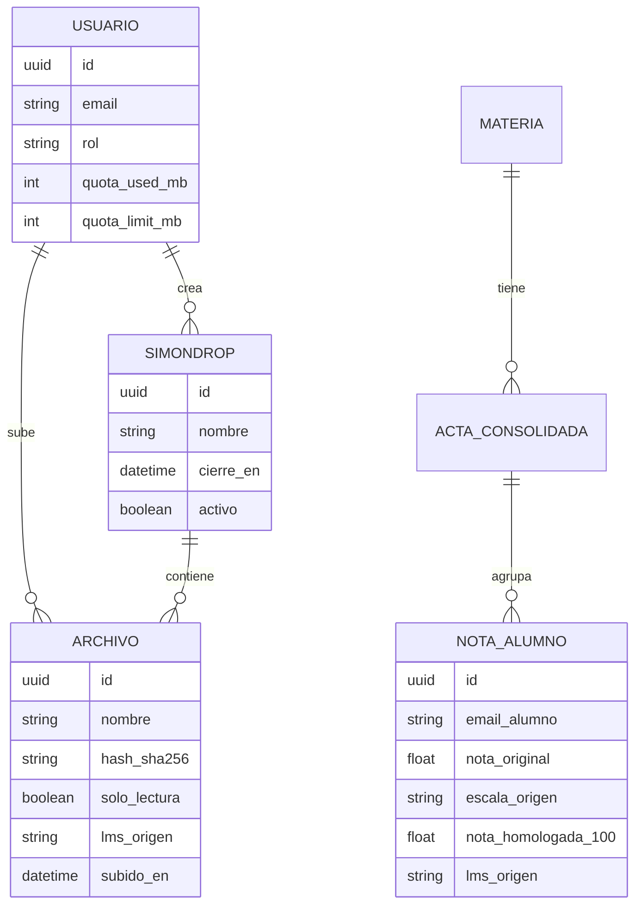

# Functional Specification Document (FSD) – SimonCloud

## 0. Metadatos ⚡🔧

| Campo | Valor |
|-------|-------|
| Producto | SimonCloud |
| Grupo | G01 |
| Versión del documento | v1.0 |
| Fecha | 11/05/2026 |
| Autores | Equipo SimonCloud |
| Revisores | Docente + 1 grupo par |
| Estado | Borrador |
| **Modo elegido** | **FSD clásico 🔧** |
| Trazabilidad a PRD | `PRD_v1.md` |
| Insumos M2 (UI/UX) | `old-docs/definicion_pantallas_simoncloud.md` |
| Fase Spec Kit cubierta | Specify ✅ |
| Prompts utilizados | `PR-FSD-001` |

## 1. Resumen ejecutivo ⚡🔧
SimonCloud es una plataforma que proporciona soberanía digital a la UMSS. Funciona como un hub que centraliza la entrega de trabajos mediante buzones seguros (generando comprobantes Hash inmutables) y unifica la gestión académica permitiendo a los docentes homologar automáticamente calificaciones desde Moodle y Google Classroom, resolviendo conflictos de escalas y duplicidad de estudiantes.

## 2. Alcance ⚡🔧

### 2.1 Dentro del alcance
- Sincronización bidireccional y homologación de notas desde Moodle y Classroom.
- Sistema de subida de archivos con generación de Hash SHA-256.
- Integración de pasarela de pago QR Simple para upgrade de cuotas.

### 2.2 Fuera del alcance (explícito)
- Visualización en línea de documentos complejos (ej. AutoCAD, PSD).
- Chat en tiempo real.

### 2.4 Plan técnico (Spec Kit fase Plan) 🔧

| Bloque | Contenido |
|--------|-----------|
| **Stack tecnológico** | React (Frontend), Node.js/NestJS (Backend), PostgreSQL (DB), Redis (Cache). |
| **Arquitectura prevista** | Arquitectura Hexagonal y basada en Eventos para subidas pesadas. |
| **Project structure** | `apps/backend`, `apps/frontend`, `packages/shared`. |
| **Decisiones técnicas anticipadas** | Se usará JWT para autenticación; subidas mediante presigned URLs de S3 o MinIO. |
| **Restricciones técnicas** | Prohibido modificar datos directamente en Moodle (solo lectura de notas para homologar, no escritura de vuelta a Moodle por seguridad). |

### 2.5 Descomposición en Tasks (Spec Kit) ⚡🔧
| Task ID | Descripción | Caso de uso (FSD-UC) | Prompt asociado | Estado |
|---------|-------------|----------------------|-----------------|--------|
| `T-001` | Implementar endpoint POST /homologate | `FSD-UC-001` | `PR-UC-001` | pendiente |
| `T-002` | Servicio de generación SHA-256 en upload | `FSD-UC-002` | `PR-UC-002` | pendiente |

## 3. Actores y roles del sistema ⚡🔧

| Actor | Tipo | Responsabilidad principal | Permisos clave |
|-------|------|---------------------------|----------------|
| Docente | humano | Gestionar buzones y homologar actas | Lectura LMS, CRUD Buzones |
| Estudiante | humano | Subir archivos y ver sus notas | Escritura en buzón abierto |

## 4. Casos de uso funcionales ⚡🔧

### 4.1 FSD-UC-001 – Homologación de Calificaciones
- **Trazabilidad**: PRD-REQ-001, PRD-REQ-003, PRD-REQ-005 → BRD: BR-001, BR-002, BR-003, BR-004
- **Actor principal**: Docente
- **Precondiciones**:
  1. Docente autenticado vía SSO WebSISS.
  2. Al menos un LMS (Moodle o Classroom) vinculado a la cuenta.
- **Disparador**: Docente presiona "Consolidar Notas" en la pantalla de la materia.
- **Flujo principal**:
  1. Docente selecciona la materia y presiona "Sincronizar".
  2. Sistema extrae listados de Moodle (escala 50) y Classroom (letras) en paralelo.
  3. Sistema cruza alumnos por `email` institucional en un Map.
  4. Sistema aplica conversión: Moodle score × 2; letras (A=90, B=75, C=60, D=50, F=0).
  5. Sistema genera vista previa con columnas por LMS y columna final homologada.
- **Flujos alternativos / excepciones**:
  - **A1 – API Moodle no responde**: el sistema reintenta 3 veces con back-off; si falla, presenta opción de importar desde CSV manual.
  - **A2 – Alumno solo en Classroom**: `moodleGrade = null`; aparece en acta con nota de Classroom únicamente.
  - **A3 – Letra desconocida**: el sistema marca la celda en rojo y no permite cerrar el acta hasta resolverla.
- **Postcondiciones**:
  1. El acta consolidada queda guardada en estado BORRADOR.
  2. Cada nota tiene el atributo `lms_origen` registrado (BR-004 — trazabilidad de fuente).
- **Datos de entrada**: `{ materiaId, docenteToken, moodleToken?, classroomToken? }`
- **Datos de salida**: `ConsolidatedGrade[]` (ver `PROMPT_MAPPINGS.md` PR-UC-001)
- **Criterios de aceptación**:
```gherkin
Escenario: Alumno con notas en ambas plataformas
  Dado un docente con Moodle y Classroom vinculados
  Cuando importa notas de "jperez@umss.edu" (Moodle: 45/50, Classroom: A)
  Entonces el sistema presenta una fila única para Juan Pérez
  Y la columna Moodle muestra 90/100
  Y la columna Classroom muestra 90/100
  Y el campo lms_origen tiene valor "Ambos"

Escenario: API Moodle no disponible
  Dado que la API de Moodle responde con timeout
  Cuando el sistema intenta sincronizar
  Entonces reintenta 3 veces
  Y presenta la opción "Importar CSV de Moodle manualmente"
```

### 4.2 FSD-UC-002 – Subida segura y Comprobante Hash
- **Trazabilidad**: PRD-REQ-002 → BRD: BR-007 (hash SHA-256), BR-005 (inmutabilidad de actas)
- **Actor principal**: Estudiante
- **Precondiciones**:
  1. El SimonDrop está activo (fecha de cierre futura).
  2. El estudiante está autenticado.
- **Disparador**: El estudiante arrastra o selecciona un archivo en la pantalla del buzón.
- **Flujo principal**:
  1. Estudiante selecciona archivo (hasta 2GB).
  2. Sistema inicia subida en chunks via presigned URL a S3/MinIO.
  3. Sistema muestra barra de progreso y velocidad (KB/s).
  4. Al completarse, sistema calcula SHA-256 del buffer.
  5. Sistema cambia estado del archivo a `solo_lectura = true` en BD.
  6. Sistema genera recibo PDF con hash y timestamps.
- **Flujos alternativos / excepciones**:
  - **A1 – Corte de conexión**: la subida se pausa; al reconectar, el sistema reanuda desde el último chunk guardado.
  - **A2 – Archivo supera límite de cuota**: el sistema bloquea la subida y redirige a FSD-UC-003.
  - **A3 – SimonDrop cerrado**: el sistema rechaza la solicitud con mensaje "El plazo de entrega ha vencido."
- **Postcondiciones**:
  1. El archivo existe en S3 en estado inmutable.
  2. La BD tiene registro del hash y timestamps.
  3. El estudiante puede descargar su recibo PDF.
- **Datos de entrada**: `{ simondropId, fileBuffer: Buffer, estudianteId }`
- **Datos de salida**: `{ fileId, hash_sha256, solo_lectura: true, recibo_url }`
- **Criterios de aceptación**:
```gherkin
Escenario: Subida exitosa y generación de hash
  Dado un estudiante autenticado y un SimonDrop activo
  Cuando sube el archivo "proyecto_final.pdf" (50MB)
  Entonces el sistema genera el hash SHA-256 del archivo
  Y cambia el archivo a Solo Lectura
  Y muestra un recibo con el hash y la fecha/hora de entrega

Escenario: Reconexión durante subida
  Dado una subida en progreso al 60%
  Cuando se corta la conexión a internet
  Entonces el sistema muestra "Pausado. Reconectando..."
  Y al recuperar la conexión, reanuda desde el byte 60% sin reiniciar
```

### 4.3 FSD-UC-003 – Upgrade de Cuota por QR
- **Trazabilidad**: PRD-REQ-004 → BRD: BR-010 (QR Simple), BR-006 (RBAC)
- **Actor principal**: Estudiante
- **Precondiciones**:
  1. El estudiante está autenticado y en plan Freemium (15GB).
- **Disparador**: Estudiante presiona "Ampliar a 50GB" en el panel de cuotas.
- **Flujo principal**:
  1. Sistema solicita a QR Simple la generación de un cobro de Bs. 50.
  2. Sistema muestra el QR generado con contador de 5 minutos.
  3. Estudiante escanea y confirma el pago en su app bancaria.
  4. Pasarela envía Webhook `payment.confirmed` con firma HMAC.
  5. Sistema valida la firma HMAC del Webhook.
  6. Sistema actualiza `quota_limit_mb = 51200` en BD.
  7. Sistema muestra confirmación "¡Cuota ampliada a 50GB con éxito!".
- **Flujos alternativos / excepciones**:
  - **A1 – QR expirado (> 5 min)**: el sistema invalida el QR y ofrece generar uno nuevo.
  - **A2 – Webhook con firma inválida**: el sistema descarta el evento sin actualizar la cuota.
  - **A3 – Pasarela no disponible**: el sistema muestra error y sugiere reintentar más tarde.
- **Postcondiciones**:
  1. `quota_limit_mb` del usuario actualizado a 51200 en BD.
  2. Registro de la transacción creado con ID de pago.
- **Criterios de aceptación**:
```gherkin
Escenario: Pago exitoso
  Dado un estudiante con cuota de 15GB
  Cuando paga correctamente el QR de Bs. 50
  Y la pasarela envía el webhook con firma HMAC válida
  Entonces el sistema actualiza su cuota a 50GB en menos de 5 segundos

Escenario: Webhook con firma inválida
  Dado un webhook entrante con firma HMAC incorrecta
  Cuando el sistema lo recibe
  Entonces rechaza el evento sin actualizar la cuota
  Y registra el intento en los logs de seguridad
```

## 5. Reglas de negocio ⚡🔧

| ID (BRD_v2) | Regla | Tipo | Origen | Casos de uso afectados |
|-------------|-------|------|--------|------------------------|
| BR-003 | Identificar y deduplicar estudiantes por correo o ID institucional | validación | BRD_v2 §11 | FSD-UC-001 |
| BR-004 | Mantener trazabilidad de la fuente original de cada calificación (`lms_origen`) | auditoría | BRD_v2 §11 | FSD-UC-001 |
| BR-005 | Actas finales cerradas son inmutables sin autorización Administrativo | normativa | BRD_v2 §11 | FSD-UC-002 |
| BR-006 | Control de acceso por roles RBAC (Docente / Estudiante / Admin) | seguridad | BRD_v2 §11 | FSD-UC-001, FSD-UC-002, FSD-UC-003 |
| BR-007 | Comprobante de entrega con hash SHA-256 para archivos en buzones | seguridad | BRD_v2 §11 | FSD-UC-002 |
| BR-010 | Integración con pasarela QR Simple para licencias Pro | negocio | BRD_v2 §11 | FSD-UC-003 |

## 6. Modelo de datos funcional ⚡🔧

### 6.1 Diagrama ER (Mermaid)


### 6.2 Diccionario de datos

| Entidad | Atributo | Tipo | Obligatorio | Validaciones | Origen |
|---------|----------|------|-------------|--------------|--------|
| `USUARIO` | `id` | UUID | sí | UUIDv4 | sistema |
| `USUARIO` | `email` | string(120) | sí | dominio @umss.edu.bo | WebSISS SSO |
| `USUARIO` | `rol` | enum | sí | Docente / Estudiante / Administrativo / Admin | WebSISS SSO |
| `USUARIO` | `quota_used_mb` | int | sí | ≥ 0 | sistema |
| `USUARIO` | `quota_limit_mb` | int | sí | 15360 (free) o 51200 (pro) | sistema / pago |
| `ARCHIVO` | `hash_sha256` | string(64) | sí | hex lowercase de 64 chars | sistema al subir |
| `ARCHIVO` | `solo_lectura` | boolean | sí | true si el SimonDrop está cerrado o el periodo académico cerró | sistema |
| `ARCHIVO` | `lms_origen` | enum / null | no | Moodle / Classroom / null (si es subida directa) | sistema |
| `SIMONDROP` | `cierre_en` | datetime | sí | debe ser fecha futura al crear | usuario (Docente) |
| `SIMONDROP` | `activo` | boolean | sí | false automáticamente al pasar `cierre_en` | sistema (job) |
| `NOTA_ALUMNO` | `nota_original` | float | sí | 0 ≤ x ≤ escala máxima de origen | API LMS |
| `NOTA_ALUMNO` | `nota_homologada_100` | float | sí | 0.0 ≤ x ≤ 100.0 | sistema (algoritmo) |
| `NOTA_ALUMNO` | `lms_origen` | enum | sí | Moodle / Classroom | sistema |

## 7. Prompt como Contrato Funcional ⚡🔧

### 7.1 Prompt-contrato para FSD-UC-001 (Homologación)
*(Ver archivo `PROMPT_MAPPINGS.md` para detalle completo)*

## 8. Integraciones externas 🔧

| Sistema | Tipo | Protocolo | Operaciones | Autenticación |
|---------|------|-----------|-------------|---------------|
| Moodle UMSS | síncrono | HTTPS/REST | GET /grades | Token LTI |
| QR Simple | asíncrono | Webhook | POST /webhook | Firma HMAC |

## 9. Interfaces de usuario (referencia) ⚡🔧

| Pantalla | Caso de uso cubierto |
|----------|----------------------|
| `/login` — SSO WebSISS | FSD-UC-001, FSD-UC-002, FSD-UC-003 (precondición) |
| `/dashboard` — Dashboard Unificado por rol | todos los UCs |
| `/docente/homologador` — Módulo de consolidación | FSD-UC-001 |
| `/simondrop/:id/upload` — Buzón de entrega | FSD-UC-002 |
| `/cuenta/cuota` — Panel de almacenamiento | FSD-UC-003 |

### 9.1 Trazabilidad con M2 (UI/UX) ⚡🔧

> Los wireframes, mockups y Journeys del Módulo 2 son insumo directo. Las capturas en `old-docs/Journeys/` (20 screenshots de Figma) y los documentos de Auditoría son evidencia de validación de campo.

| Wireframe / Mockup M2 | Pantalla FSD | Caso de uso (FSD-UC) | Estado |
|-----------------------|--------------|----------------------|--------|
| `Pantalla de Login Institucional` (Balsamiq, Auditoría M2 §4) | `/login` | FSD-UC-001..003 precondición | ✅ cubierto |
| `Dashboard Principal con cuota` (Balsamiq, Auditoría M2 §4) | `/dashboard` | todos | ✅ cubierto |
| `Modal de Buzón de Tareas / SimonDrop` (Balsamiq, Auditoría M2 §4) | `/simondrop/nuevo` | FSD-UC-002 | ✅ cubierto |
| `Pantalla de Estado de Subida` con barra de progreso (Balsamiq, Auditoría M2 §4) | `/simondrop/:id/upload` | FSD-UC-002 | ✅ cubierto |
| Journey As-Is: Estudiante Sebastián entrega video 2GB (Auditoría M2 §6) | `/simondrop/:id/upload` | FSD-UC-002 | ✅ cubierto |
| Journey As-Is: Docente Lic. Alejandro recibe 80 trabajos (Auditoría M2 §7) | `/simondrop/nuevo` | FSD-UC-002 | ✅ cubierto |
| Journey As-Is: Administrativa Silvia envío confidencial (Auditoría M2 §8) | `/cuenta/compartir` | fuera de alcance v1.0 | ⚠️ backlog |
| Capturas incidentes críticos (`old-docs/Journeys/Screenshot*.png`, 20 imgs) | NFRs permisos automáticos | FSD-UC-002 (BR-002) | ✅ referenciado |
| Figma Board 20 Happy Paths `https://www.figma.com/board/8b3BCvbLJ0gyO0pyJYXFZd` | todos los flujos | FSD-UC-001..003 | ✅ referenciado |

## 10. Requerimientos No Funcionales (NFR) ⚡🔧

| ID | Requisito | Métrica | Umbral | Cómo se verifica |
|----|-----------|---------|--------|------------------|
| NFR-001 | Tiempo de homologación | p95 | < 5 s | Test de carga k6 |
| NFR-002 | Integridad de entrega | Inmutabilidad | 100% | Auditoría BD |

## 15. Registro de cambios ⚡🔧
| Versión | Fecha | Autor | Cambio |
|---------|-------|-------|--------|
| v1.0 | 11/05/2026 | Equipo | Versión inicial FSD |
