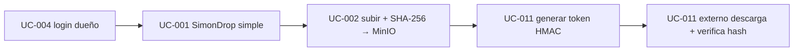

# ADR-0008: Alcance del primer feature oficial — E2E "subida + acceso externo"

| Campo | Valor |
|-------|-------|
| **Estado** | Aceptada |
| **Fecha** | 2026-06-28 |
| **Autores** | Carlos Alberto Gomez Ormachea |
| **Trazabilidad** | `FSD-UC-002`, `FSD-UC-011` (core); `FSD-UC-001`, `FSD-UC-004` (habilitantes); `DD-UC-002`, `DD-UC-011`; `docs/product/DTP.md §A.2` (deltas) |

---

## Contexto

Es el **primer feature oficial** de SimonCloud (ya **no un POC**): debe construirse con
calidad de producción. El flujo elegido es **end-to-end**:

> Un dueño autenticado **sube un archivo** (con comprobante SHA-256, inmutable en MinIO) →
> **genera un token externo HMAC** → un **usuario externo descarga** verificando el hash.

El E2E abarca cuatro casos de uso del FSD. Para no salirnos de un primer feature manejable
**pero real**, hay que decidir explícitamente **qué se implementa real vs qué se simplifica
o stubea**, y registrar las diferencias como deltas frente al DTI/FSD vFinal.

---

## Decisión

### 1. Identidad y actor del feature
- **Un único dueño autenticado con rol DOCENTE** sube el archivo **y** genera el token externo.
  Es una **simplificación deliberada** del flujo multi-actor del FSD (Estudiante sube /
  Docente comparte) para acotar el primer feature. Registrar como delta.

### 2. Qué es REAL (no se stubea)
| Pieza | Por qué |
|---|---|
| **MinIO** (storage + Object Lock) | Es el core del producto (DTI §8, ADR-0005) |
| **SHA-256 comprobante** (string 64-hex) | BR-007; invariante de dominio |
| **Inmutabilidad** `solo_lectura` + WORM | BR-005 |
| **Token HMAC-SHA256**, TTL ≤ 72h, **403 sin leak** | BR-011; seguridad de UC-011 |
| **PostgreSQL + Prisma** (archivo, drop, token, audit_log) | persistencia real |
| **NestJS hexagonal** (file-service) | DTI §5; ports/adapters reales |
| **Frontend** con `libs/design-system` | el DS ya construido (ADR-0007) |

### 3. Qué se STUBEA o SIMPLIFICA (deltas vs DTI/FSD)
| Pieza | Decisión v1 | Delta |
|---|---|---|
| **UC-004 SSO WebSISS** | **Stub** del IdP (no existe WebSISS accesible), pero emite **JWT real (RS256)** con rol | DTI §13.2 |
| **UC-001 Creación de SimonDrop** | **Simplificado**: el docente crea un drop básico directo, **SIN LTI 1.3** | FSD-UC-001 / DTI §9 |
| **UC-002 subida reanudable (chunks 2GB)** | v1: **subida en una sola operación** (presigned PUT), sin reanudación | FSD-UC-002 A1 / ADR-0003 |
| **UC-002 recibo PDF** | v1: recibo **JSON/simple** (hash + timestamps); PDF formal después | FSD-UC-002 paso 6 |
| **Cuota (UC-003)** | **Fuera de alcance** del E2E | — |

### 4. Calidad (no negociable, es feature real)
- Arquitectura **hexagonal** en el `file-service`; dominio sin Prisma/MinIO.
- **Cobertura ≥90%** en la lógica (hash, HMAC, expiración, no-leak, inmutabilidad).
- **Outbox** si se emite el evento `ArchivoSubidoIntegrationEvent` (Keyed) — opcional en v1.
- Secretos (HMAC, claves RS256) por env/Vault, **nunca hardcoded**.

---

## Alternativas consideradas

| Alternativa | Descripción | Razón |
|---|---|---|
| **A. E2E completo "by the book"** | LTI 1.3 + SSO WebSISS real + subida reanudable 2GB + PDF + multi-actor | Inviable como primer feature: dependencias externas (WebSISS, LMS) y alcance enorme |
| **B. Otro POC** | Repetir el enfoque POC-03 | Rechazado: el docente pide un feature **real y oficial** |
| **C. E2E real y acotado** ✅ | Core real (MinIO/SHA-256/HMAC/hexagonal) + habilitantes stub/simplificados, deltas documentados | **Elegida**: real y demostrable sin ahogarse en dependencias |

---

## Consecuencias

**Positivas**:
- Feature **real, demostrable de punta a punta** y enfocado.
- Exprime el DS ya construido (Modal/Select/Switch para generar token, CopyButton para el hash, DataTable para listar).
- Core de seguridad y storage **reales** → valor para la defensa.

**Negativas / riesgos** (mitigados con trazabilidad):
- **Deltas** frente al DTI/FSD (LTI diferido, SSO stub, subida no reanudable) → cada uno se registra en `DTP §A.2` con este ADR.
- El **stub de SSO** debe ser claramente reemplazable por WebSISS real más adelante (interfaz `AuthProvider`).
- La **subida no reanudable** limita archivos grandes en v1 (aceptable para el demo).

---

## Plan documental derivado (antes de implementar)

1. `DD-UC-002` — diseño del slice subida + hash (hexagonal).
2. `DD-UC-011` — ya existe; se enlaza al E2E.
3. (Light) notas de diseño de UC-001-simple y UC-004-stub (en sus DD o en el DTP).
4. `PR-IMPL-003` (UC-002) y `PR-IMPL-001` (UC-011, ya existe) — al momento de implementar.
5. Registrar los **deltas** en `DTP §A.2` y el avance en `aportes/release-3.0.0.md`.
