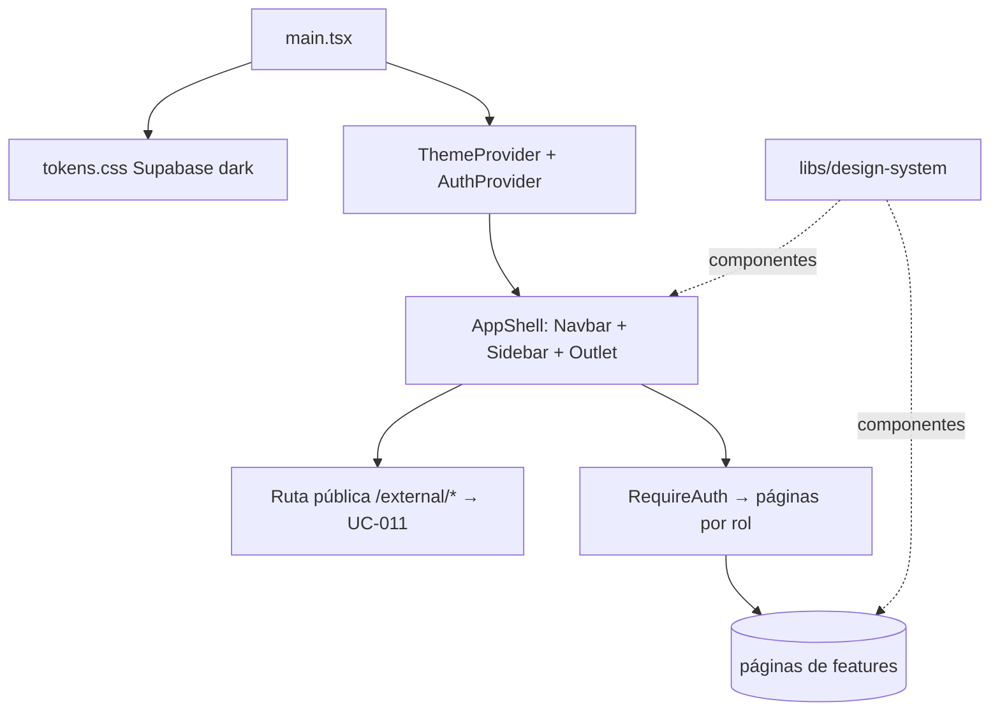

# Design Doc `DD-SHELL-001` — App shell (cascarón)

> **Qué es**: diseño del **cascarón** de la SPA donde se enchufan los features. No es un
> caso de uso: es **infraestructura frontend transversal** que hospeda a los UCs con UI.
> Alcance acordado: **layout + routing + theme + integración del design system**. Los átomos
> faltantes (forms/table/dialog) se construyen aparte y se avisan (ver ADR-0007).
>
> **Trazabilidad**: habilita FSD-UC-001/002/004/011…; consume el DS absorbido por `ADR-0007`.

## 1. Objetivo y contexto

- **Qué resuelve**: una estructura de app consistente (navegación, layout, tema, rutas, auth)
  lista para que cada feature aporte solo sus **páginas**, sin reinventar el chrome.
- **Tema**: **Supabase dark** (tokens CSS de `libs/design-system/tokens/`, sin cambios — ADR-0007).
- **Alcance (dentro)**: layout (Navbar + Sidebar + área de contenido), routing (React Router v6),
  integración de tokens/tema, `AuthContext` + guard de rutas, slots de páginas.
- **Alcance (fuera)**: lógica de cada feature; átomos nuevos (Input, Table, Dialog, Toast) — se
  piden al DS según necesidad.

## 2. Diseño (el "cómo") `[humano+máquina]`

### 2.1 Ubicación (decisión abierta)
- **Recomendado**: `apps/web/` para la SPA viva (`release/3.0.0`), con `libs/design-system/`
  como DS absorbido. `pocs/POC-03/frontend/` queda como **referencia/POC**, no como shell de producción.
- Alternativa: evolucionar `pocs/POC-03/frontend/`. _(Confirmar con el autor — ver §3.)_

### 2.2 Estructura propuesta
```
libs/design-system/            # absorbido (ADR-0007): atoms/molecules/organisms + tokens
apps/web/
  src/
    app/
      AppShell.tsx             # layout: <Navbar/> + <Sidebar/> + <Outlet/>
      routes.tsx               # React Router v6 (rutas públicas vs protegidas)
      providers.tsx            # ThemeProvider(tokens) + AuthProvider
    auth/
      AuthContext.tsx          # sesión + rol (reusa patrón de POC-03)
      RequireAuth.tsx          # guard de ruta por rol (ESTUDIANTE/DOCENTE/ADMIN…)
    pages/                     # ← cada feature aporta su página aquí
      (público) /external/drops/:id   → FSD-UC-011
      (protegido) /docente, /estudiante, /admin …
    main.tsx                   # importa tokens.css del DS
```

### 2.3 Layout y navegación
- **Organisms del DS**: `Navbar` (top) + `SidebarNavItem` (lateral) ya disponibles → componen el chrome.
- **Área de contenido**: `<Outlet/>` de React Router; cada ruta monta una página.
- **Rutas públicas vs protegidas**: el shell separa `/external/*` (sin auth — UC-011) de las
  rutas institucionales (con `RequireAuth` + rol), espejando la separación del DTI §3.

### 2.4 Tema / tokens
- `libs/design-system/tokens/tokens.css` se importa una vez en `main.tsx`; los componentes ya
  consumen `var(--...)`. Tema **Supabase dark** activo por defecto.



## 3. Alternativas / decisiones abiertas

| Decisión | Opción A | Opción B | Pendiente |
|----------|----------|----------|-----------|
| Ubicación del shell | `apps/web/` (limpio, release/3.0.0) ✅ recomendado | evolucionar `POC-03/frontend` | confirmar |
| Routing | React Router v6 (stack oficial) ✅ | — | — |
| Estado auth | Context + guard (patrón POC-03) ✅ | lib externa (zustand…) | — |

## 4. Impacto en specs vivas `[máquina]`

| Artefacto vivo | Cambio |
|----------------|--------|
| `docs/product/DTP.md` §B | Nueva sub-sección "Arquitectura frontend": shell + DS (ref. ADR-0007) |
| `docs/adr/0007-*` | Decisión de absorción del DS (creada) |

> El baseline `docs/baseline/` no se toca.

## 5. Prompts usados `[máquina]`

| Prompt | Tarea | Artefacto |
|--------|-------|-----------|
| `PR-IMPL-002` _(pendiente)_ | Scaffolding del shell (AppShell, routes, providers, auth guard) | `apps/web/src/app/**` |

## 6. Plan de pruebas

- **Routing**: render de rutas públicas vs protegidas; redirección sin sesión.
- **Guard por rol**: un rol sin permiso no accede a la ruta.
- **Tema**: tokens aplicados (smoke/visual). Componentes del DS: tests snapshot (no 90% unitario).

## 7. Definition of Done

- [x] ADR-0007 (absorción DS) creado y enlazado.
- [ ] Ubicación del shell confirmada (`apps/web` vs POC-03).
- [ ] DS absorbido en `libs/design-system/` (ejecución del plan de ADR-0007).
- [ ] `AppShell` + `routes` + `providers` + guard implementados (`PR-IMPL-002`).
- [ ] Tokens Supabase dark integrados.
- [ ] Tests de routing/guard + snapshots del DS.
