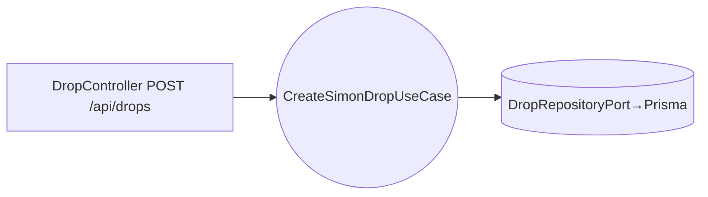

# Design Doc `DD-UC-001` — Creación de SimonDrop simplificada

> **Qué es**: diseño **ligero** de la pieza **habilitante** que crea el SimonDrop donde vive
> el archivo del E2E. No es el feature en sí.
>
> **Alcance v1 (ADR-0008, delta #1)**: el docente crea un **SimonDrop básico directo**,
> **sin LTI 1.3** (la integración LMS queda diferida — ADR-0006).
>
> **Trazabilidad**: `FSD-UC-001` → `PRD-REQ-001` → `BR-006` (RBAC).

## 1. Objetivo y contexto
- **Qué resuelve**: tener un contenedor (SimonDrop) para alojar el archivo subido en UC-002.
- **Posición en el E2E**: `UC-004 → **UC-001 (esta)** → UC-002 → UC-011`.
- **Dentro**: crear drop (título, dueño, estado), listar drops del docente.
- **Fuera (v1)**: deep link LTI 1.3, sincronización con LMS, AGS (diferido, ADR-0006).

## 2. Diseño (el "cómo")
- `domain/`: `SimonDrop` (entidad): `id (uuid v4)`, `titulo`, `ownerId`, `estado: ABIERTO|CERRADO`,
  `fechaCierre?`, `createdAt`. Regla: solo `DOCENTE` crea; archivos solo se suben si `ABIERTO`.
- `application/`: `CreateSimonDropUseCase`, `ListMySimonDropsUseCase`.
- `adapter/in`: `DropController` (`POST /api/drops`, `GET /api/drops`).
- `adapter/out`: `DropRepositoryPort` → Prisma (`simondrop`).

## 3. Alternativas
| Alternativa | ¿Elegida? |
|---|---|
| **Drop directo (sin LTI)** | **Sí (v1)** — acota el E2E |
| Creación vía LTI 1.3 desde el LMS | Diferido (ADR-0006) |

## 4. Impacto en specs vivas
- `docs/product/DTP.md` §A.2 delta #1 (ya registrado). Baseline intacto.

## 5. Prompts
| Prompt | Tarea |
|--------|-------|
| `PR-IMPL-005` _(pendiente)_ | Slice drop: `CreateSimonDropUseCase` + repo Prisma + controller + tests ≥90% |

## 6. Pruebas
- Unit: solo DOCENTE crea; UUID v4 como PK; estado por defecto `ABIERTO`.
- Regla: no permitir subir a un drop `CERRADO` (se verifica en UC-002).

## 7. Definition of Done
- [x] Alcance v1 acotado (ADR-0008, sin LTI) y enlazado.
- [ ] `CreateSimonDropUseCase` + repo + controller (`PR-IMPL-005`).
- [ ] Tests ≥90%.
