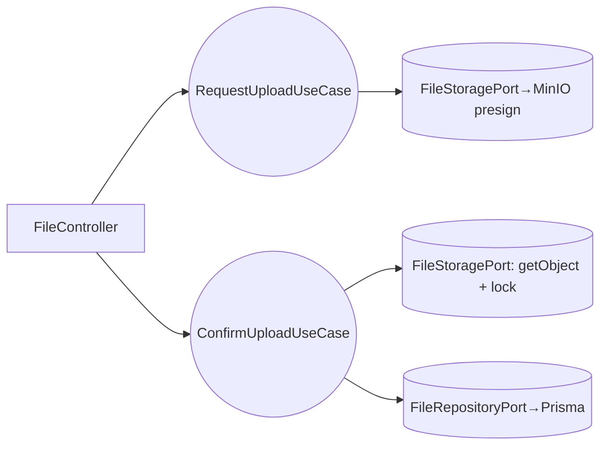

# Design Doc `DD-UC-002` — Subida segura de archivo + comprobante SHA-256

> **Qué es**: diseño del slice de **subida de un archivo** a un SimonDrop con cálculo de
> **comprobante SHA-256**, almacenamiento inmutable en MinIO y registro en BD. Es el primer
> tramo del **feature E2E** (subida → token externo); el segundo tramo es `DD-UC-011`.
>
> **Alcance v1 (ADR-0008)**: subida en **una sola operación** (presigned PUT), sin
> reanudación por chunks; recibo **JSON** (no PDF). MinIO, SHA-256 y la inmutabilidad son
> **reales**.
>
> **Trazabilidad**: `FSD-UC-002` (`docs/product/FSD.md §4.2`) → `PRD-REQ-002` → `BR-007`
> (SHA-256), `BR-005` (inmutabilidad).

## 1. Objetivo y contexto

- **Qué resuelve**: subir un documento de forma segura y dejar un **comprobante de integridad**
  (hash SHA-256 + timestamps), con el archivo **inmutable** (WORM) una vez cerrado.
- **Caso de uso**: `FSD-UC-002` — Subida segura y Comprobante Hash.
- **Posición en el E2E**: `UC-004 (login) → UC-001 (drop simple) → **UC-002 (esta)** → UC-011 (token externo)`.
- **Alcance (dentro)**: presigned PUT a MinIO, cálculo SHA-256, `solo_lectura=true`, registro
  en BD (`archivo`), comprobante JSON.
- **Alcance (fuera, v1)**: subida reanudable por chunks (A1, diferido — ADR-0003), recibo PDF,
  control de cuota (UC-003), 2GB de estrés.

## 2. Diseño (el "cómo") `[humano+máquina]`

### 2.1 Flujo (acotado)
1. El dueño (DOCENTE) solicita subir a un `simondropId` activo → backend valida drop activo y rol.
2. Backend genera **presigned PUT URL** (MinIO) con TTL corto.
3. Frontend sube el archivo directo a MinIO con la presigned URL.
4. Frontend confirma la subida → backend **descarga/streamea** el objeto y calcula **SHA-256**
   (o recibe el hash calculado en cliente y lo **re-verifica** en servidor — fuente de verdad = servidor).
5. Backend marca el objeto **inmutable** (Object Lock) y persiste `archivo { id(uuid), simondropId,
   fileName, sha256, sizeBytes, solo_lectura:true, uploadedAt }`.
6. Backend retorna comprobante `{ fileId, sha256, uploadedAt, solo_lectura }`.

> El SHA-256 **autoritativo se calcula/verifica en el servidor** (no se confía en el cliente).

### 2.2 Componentes (hexagonal — file-service)
- `domain/`: `Archivo` (entidad), `SHA256Hash` (VO ya existente), reglas BR-005/BR-007.
- `application/`: `RequestUploadUseCase` (presigned), `ConfirmUploadUseCase` (hash + persist + lock).
- `adapter/in/`: `FileController` (`POST /api/drops/:id/files/presign`, `POST /api/drops/:id/files/confirm`).
- `adapter/out/`: `FileStoragePort`→MinIO (presign, getObject, setObjectLock), `FileRepositoryPort`→Prisma.
- `domain/port/out/`: `FileStoragePort`, `FileRepositoryPort`.

### 2.3 Contratos
- Presign in: `{ fileName, contentType, sizeBytes }` → out: `{ uploadUrl, objectKey, expiresIn }`.
- Confirm in: `{ objectKey }` → out: `{ fileId, sha256 (64-hex), uploadedAt, solo_lectura:true }`.

## 3. Alternativas consideradas

| Alternativa | Pros | Contras | ¿Elegida? |
|---|---|---|---|
| **A. Presigned PUT directo + hash en server (v1)** | Simple, no pasa el binario por la API, hash autoritativo | Sin reanudación | **Sí (v1)** |
| B. Multipart reanudable (S3 multipart, ADR-0003) | Soporta 2GB + reanudación | Complejo para un primer feature | Diferido |
| C. Subir vía la API (multipart/form-data al backend) | Más simple de cliente | El binario grande pasa por la API; no escala | No |

> La reanudación (B) ya está decidida arquitectónicamente en **ADR-0003**; se difiere su
> implementación a un release posterior (delta registrado en ADR-0008 / DTP §A.2).

## 4. Impacto en specs vivas `[máquina]`

| Artefacto vivo | Cambio |
|---|---|
| `docs/product/FSD.md` (`FSD-UC-002`) | Nota: v1 sin reanudación ni PDF (ADR-0008); el resto del UC se mantiene |
| `docs/product/DTP.md` §A.2 | Delta: subida no reanudable + recibo JSON en v1 |
| `docs/product/DTP.md` §A.3 | Estado `FSD-UC-002` → en curso |

> El baseline `docs/baseline/` no se toca.

## 5. Prompts usados `[máquina]`

| Prompt | Tarea | Artefacto |
|---|---|---|
| `PR-IMPL-003` _(pendiente)_ | Slice NestJS de UC-002 (controllers, use cases, ports, MinIO presign/lock, Prisma) + tests ≥90% | `src/file/**`, `tests/file/**`, migración `archivo` |

## 6. Plan de pruebas y evals

- **Unit** (sin BD/MinIO): `SHA256Hash` (64-hex lowercase, BR-007); `ConfirmUploadUseCase` con
  `FileStoragePort`/`FileRepositoryPort` mockeados; que `solo_lectura` se setee y no se permita re-subir.
- **Integration** (MinIO + BD efímeros): presign → PUT → confirm → objeto con Object Lock + fila en BD.
- **E2E / Gherkin**: escenario "Subida exitosa y generación de hash" del `FSD-UC-002`.
- **Cobertura objetivo**: **≥90%** del slice.

## 7. Definition of Done

- [x] `fsd_uc` declarado y enlazado.
- [x] Diseño (§2) y alternativas (§3) documentados; alcance v1 acotado por ADR-0008.
- [x] ADR enlazado (ADR-0008 alcance; ADR-0003 reanudación diferida).
- [ ] `PR-IMPL-003` ejecutado y registrado en `PROMPT_MAPPING.md`.
- [ ] Tests ≥90% pasando (hash, inmutabilidad).
- [ ] `DTP` actualizado (deltas + estado) vía `/dtp-sync`.
- [ ] PR declara prompts usados, archivos generados vs editados a mano.
