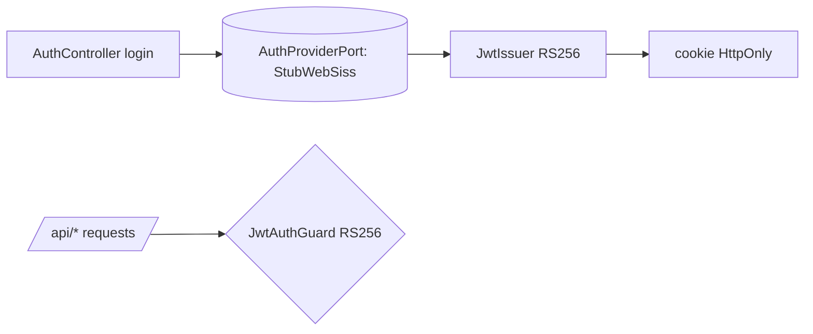

# Design Doc `DD-UC-004` — Autenticación (habilitante del E2E)

> **Qué es**: diseño **ligero** de la pieza **habilitante** de autenticación del feature E2E.
> No es el feature en sí: provee el dueño autenticado (DOCENTE) que sube y comparte.
>
> **Alcance v1 (ADR-0008, delta #3)**: **stub del IdP WebSISS** (no hay WebSISS accesible),
> pero emite un **JWT real (RS256)** con rol. Reemplazable por el SSO real (ADR-0002) sin
> tocar consumidores, vía un puerto `AuthProvider`.
>
> **Trazabilidad**: `FSD-UC-004` → `PRD-US-012` → `BR-006` (RBAC).

## 1. Objetivo y contexto
- **Qué resuelve**: autenticar al dueño y emitir un JWT con rol, para proteger `/api/*`.
- **Posición en el E2E**: tramo inicial (`UC-004 → UC-001 → UC-002 → UC-011`).
- **Dentro**: login stub (usuario semilla), emisión JWT RS256, rol, `JwtAuthGuard`.
- **Fuera (v1)**: redirect OAuth2 a WebSISS real, intercambio de token institucional (diferido, ADR-0002).

## 2. Diseño (el "cómo")
- **Puerto** `AuthProviderPort` (domain): `authenticate(credentials) → { userId, rol, nombre }`.
  - `StubWebSissAuthProvider` (adapter): valida contra usuarios semilla (seed) — reemplazable por `WebSissOAuthAdapter` real.
- **JWT real RS256**: `JwtIssuer` firma con clave privada (env/Vault); `JwtAuthGuard` verifica con la pública (coherente con DTI §3 / G33: api-gateway valida local con RS256).
- **Rol**: `ESTUDIANTE | DOCENTE | ADMINISTRATIVO | ADMIN` (invariante CLAUDE.md §3). Para el E2E se usa `DOCENTE`.
- `adapter/in`: `AuthController` (`POST /api/auth/login` → JWT en cookie HttpOnly).

## 3. Alternativas
| Alternativa | ¿Elegida? |
|---|---|
| **Stub IdP + JWT real RS256 detrás de `AuthProviderPort`** | **Sí (v1)** — real lo crítico (JWT/rol), reemplazable |
| WebSISS OAuth2 real | Diferido (ADR-0002): no hay IdP accesible |
| Sin auth (abrir endpoints) | No — el E2E necesita un dueño con rol |

## 4. Impacto en specs vivas
- `docs/product/DTP.md` §A.2 delta #3 (ya registrado). Baseline intacto.

## 5. Prompts
| Prompt | Tarea |
|--------|-------|
| `PR-IMPL-004` _(pendiente)_ | Slice auth: `AuthProviderPort` + StubWebSiss + JWT RS256 + Guard + tests ≥90% |

## 6. Pruebas
- Unit: emisión/verificación JWT RS256; asignación de rol; guard rechaza inválido/expirado.
- El puerto permite testear sin IdP real.

## 7. Definition of Done
- [x] Alcance v1 acotado (ADR-0008) y enlazado.
- [ ] `AuthProviderPort` + stub + JWT RS256 + guard implementados (`PR-IMPL-004`).
- [ ] Tests ≥90%. Interfaz lista para enchufar WebSISS real (ADR-0002).
