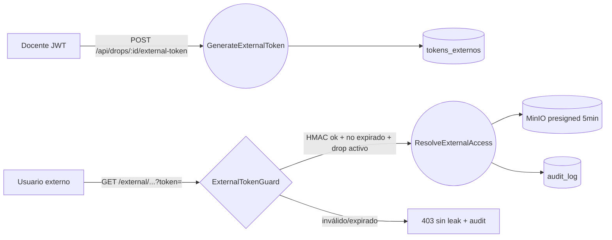

# Design Doc `DD-UC-011` — Acceso de usuario externo con token temporal (HMAC-SHA256)

> **Qué es**: diseño del feature que permite a un usuario externo (evaluador, tribunal)
> descargar un archivo de un SimonDrop mediante un enlace con token temporal firmado,
> **sin cuenta institucional**. Describe el *cómo*; la arquitectura macro ya está decidida
> en el DTI vFinal §3 (coexistencia JWT + HMAC-SHA256).
>
> **Trazabilidad**: implementa `FSD-UC-011` (`docs/product/FSD.md` §4.11) → `PRD-REQ-013`,
> `PRD-US-022` → `BR-011` (token HMAC-SHA256, TTL ≤ 72h, no revela recurso si inválido).
>
> **Parte del feature E2E** (ADR-0008): es el **segundo tramo** del flujo
> `UC-004 → UC-001 → UC-002 (DD-UC-002) → UC-011 (esta)`. El token se genera para el archivo
> subido en `DD-UC-002`, por el mismo dueño (DOCENTE).

## 1. Objetivo y contexto

- **Qué resuelve**: dar acceso de descarga controlado y auditable a personas sin cuenta UMSS
  (tribunal de tesis, evaluadores externos), preservando la integridad (hash SHA-256) y sin
  exponer el recurso ante tokens inválidos o expirados.
- **Caso de uso del FSD**: `FSD-UC-011` (Acceso de Usuario Externo con Token Temporal),
  enlace: `docs/product/FSD.md#411-fsd-uc-011`.
- **Alcance (dentro)**: generación del token por el docente (`POST /api/drops/:id/external-token`,
  JWT), validación del token en `/external/*` (`ExternalTokenGuard`), página pública de descarga,
  URL presignada MinIO (TTL 5 min), registro en `audit_log`.
- **Alcance (fuera)**: gestión de revocación masiva, notificación al docente del acceso (eso es
  FSD-UC-007), UI de administración de tokens.

## 2. Diseño (el "cómo") `[humano+máquina]`

- **Enfoque elegido** (heredado del DTI vFinal §3, "Coexistencia JWT + HMAC-SHA256"):
  - Token **stateful**: se persiste en la tabla `tokens_externos` (`auth-service`), con
    `id`, `dropId`, `hmac`, `expiresAt`, `createdBy`, `revokedAt?`.
  - El valor del enlace es un HMAC-SHA256 sobre `{tokenId.dropId.expiresAt}` con secreto de
    servidor (Vault/Docker Secret). La validación recomputa el HMAC y comprueba expiración y
    estado activo del drop.
  - Rutas separadas por prefijo: `/api/*` (JWT) para generar; `/external/*` (`security: []`,
    sin JWT) para consumir. Los dos guards nunca coexisten en la misma ruta.
- **Componentes tocados (hexagonal)**:
  - `domain/`: `ExternalToken` (VO/entidad), `Sha256Hash` (VO ya existente), regla BR-011.
  - `application/`: `GenerateExternalTokenUseCase`, `ResolveExternalAccessUseCase`.
  - `adapter/in/`: `ExternalAccessController` (`GET /external/drops/:id/archivos`),
    `ExternalTokenController` (`POST /api/drops/:id/external-token`), `ExternalTokenGuard`.
  - `adapter/out/`: `TokenRepositoryPort`→Prisma (`tokens_externos`), `FileStoragePort`→MinIO
    (presigned URL), `AuditLogPort`→Prisma (`audit_log`).
- **Contratos y tipos**:
  - Entrada consumo: `{ token: string (query param) }`.
  - Salida: `{ fileName, sha256, uploadedAt, dropTitle, downloadUrl (presigned, TTL 5 min) }`.
  - `audit_log`: `{ tokenId, dropId, archivoId, ip, userAgent, accessedAt, outcome }`.

## 3. Alternativas consideradas

| Alternativa | Pros | Contras | ¿Elegida? |
|-------------|------|---------|-----------|
| **A. Token stateful HMAC en `tokens_externos`** | Revocable; auditable; alineado al DTI vFinal §3 y BR-011 | Requiere lookup en BD por acceso | **Sí** |
| B. JWT autocontenido firmado (stateless) | Sin BD en validación | No revocable antes de expirar; el FSD pide registro/control; choca con DTI | No |
| C. URL presignada MinIO directa (sin token propio) | Cero código de auth | No cumple BR-011 (no audita por persona, TTL fijo de storage, leak del bucket) | No |

> La decisión de formato **ya está tomada** en el DTI vFinal §3 (coexistencia JWT+HMAC,
> token stateful). Por eso este DD **no crea un ADR nuevo**; referencia esa decisión. Si
> durante la implementación apareciera un delta (p. ej. mover el secreto o cambiar a stateless),
> ahí sí se abriría `ADR-0007` y se registraría en `DTP §A.2`.

## 4. Impacto en las specs vivas `[máquina]`

| Artefacto vivo | Cambio | ¿Delta vs DTI vFinal? |
|----------------|--------|-----------------------|
| `docs/product/FSD.md` (`FSD-UC-011`) | Aclarar que el token es **HMAC stateless en valor** pero **registrado** en `tokens_externos` (resolver la ambigüedad "JWT firmado" del campo *Datos de entrada*) | no (aclaración, no cambio) |
| `docs/product/DTP.md` | §A.3 estado `FSD-UC-011` → "en curso"; al implementar, §A.1 changelog | no |
| `docs/product/PRD.md` | sin cambio | no |

> **Regla de oro**: el baseline `docs/baseline/` **no se toca**. La aclaración del campo
> ambiguo se hace en la copia viva `docs/product/FSD.md`.

## 5. Prompts usados `[máquina]`

| Prompt | Tarea | Artefacto generado |
|--------|-------|--------------------|
| `PR-IMPL-001` | Generar slice NestJS de UC-011 (controllers, guard, use cases, repos Prisma, MinIO presign) + tests Jest ≥90% | `src/external/**`, `tests/external/**`, migración `tokens_externos` |

> El prompt vive en `docs/prompts/impl/PR-IMPL-001.md` (plantilla `templates/PROMPT_TEMPLATE.md`)
> y se referencia desde `docs/PROMPT_MAPPING.md`. **Aún no ejecutado** (diseño primero).

## 6. Plan de pruebas y evals

- **Unit** (sin BD/HTTP): cálculo y verificación HMAC; expiración (límite 72h, BR-011);
  `ResolveExternalAccessUseCase` con `TokenRepositoryPort`/`FileStoragePort` mockeados; que un
  token inválido **no** filtre nombre de archivo ni existencia (BR-011 / escenario 2 y 3 Gherkin).
- **Integration** (BD efímera + MinIO de prueba): generación → persistencia en `tokens_externos`;
  consumo → presigned URL; escritura en `audit_log`.
- **E2E / Gherkin**: los 3 escenarios del `FSD-UC-011` (token válido descarga + hash + audit;
  token expirado sin leak; firma inválida → 403 + audit).
- **Cobertura objetivo**: **≥90%** del slice (regla AGENTS.md / CLAUDE.md §12).

## 7. Definition of Done (checklist)

- [x] `fsd_uc` declarado y enlazado (trazabilidad al FSD).
- [x] Diseño (§2) y alternativas (§3) documentados.
- [x] Evaluado ADR → **no requerido** (decisión pre-existe en DTI vFinal §3); criterio registrado.
- [x] §4 Impacto en specs vivas registrado (sin tocar el baseline).
- [ ] Prompt `PR-IMPL-001` ejecutado y registrado en `PROMPT_MAPPING.md`.
- [ ] Tests/evals implementados y pasando con **cobertura ≥90%**.
- [ ] `docs/product/DTP.md` actualizado (changelog + estado UC) vía `/dtp-sync`.
- [ ] PR declara: prompts usados, archivos generados vs editados a mano.
- [ ] Demo grabado.
