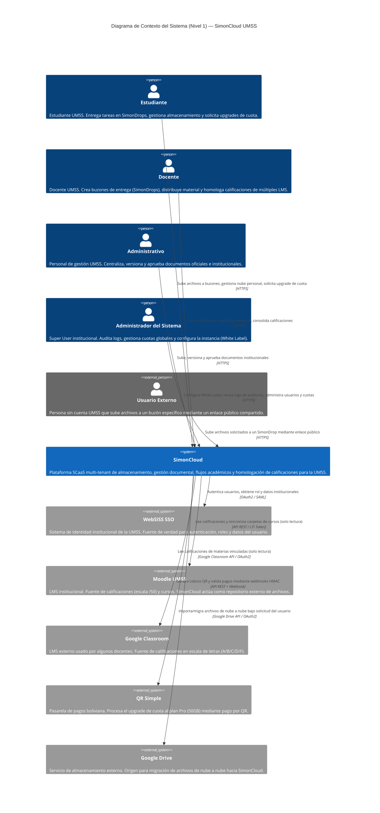

# Documento de Diseño Técnico (DTI) - SimonCloud

## §0. Metadatos del Documento

| Campo | Valor |
|-------|-------|
| **Proyecto** | SimonCloud — Almacenamiento Institucional UMSS |
| **Grupo** | G01 |
| **Versión del documento** | v0.1 (Borrador) |
| **Fecha** | 2026-05-13 |
| **Autores** | Equipo SimonCloud |
| **Estado** | En Revisión |
| **Trazabilidad** | `docs/FSD_v1.md`, `docs/LFSD.md` |
| **Insumos M2 (UI/UX)** | `old-docs/definicion_pantallas_simoncloud.md`, `old-docs/Journeys/` |

---

## §1. Arquitectura de Alto Nivel (Contexto C4 — Nivel 1)

### 1.1 Descripción del Sistema

SimonCloud es una plataforma híbrida de almacenamiento en la nube e institucional, diseñada como un **SaaS multi-tenant (SCaaS)**, que proporciona soberanía digital a la Universidad Mayor de San Simón (UMSS). A diferencia de soluciones comerciales genéricas, el sistema integra nativamente:

- **Flujos académicos:** Entrega segura de tareas mediante buzones (`SimonDrop`) con comprobantes de integridad inmutables (SHA-256).
- **Homologación de calificaciones:** Motor que unifica y reconcilia notas de LMS heterogéneos (Moodle y Google Classroom) en una escala institucional de 100 puntos.
- **Gestión documental:** Control de versiones y estados de aprobación para flujos administrativos (resoluciones, actas).
- **Soberanía y seguridad institucional:** Autenticación SSO vía WebSISS (sistema de identidad de la UMSS), control de acceso por roles (RBAC) y auditoría de logs.

El sistema es accesible por usuarios internos de la UMSS (Estudiantes, Docentes, Administrativos, Administradores de Sistema) y por usuarios externos sin cuenta institucional (para recepción de archivos en buzones públicos).

### 1.2 Diagrama de Contexto (C4 Nivel 1)

El siguiente diagrama identifica a los actores (Personas) y los sistemas externos con los que SimonCloud interactúa como caja negra.

### 1.3 Restricciones y Principios Arquitectónicos Clave

Derivadas del FSD v1 y del contexto institucional:

| # | Restricción / Principio | Justificación |
|---|------------------------|---------------|
| R-01 | **Solo lectura en LMS externos:** SimonCloud no puede escribir de vuelta a Moodle ni Classroom. Solo lee calificaciones para homologar. | Política de seguridad institucional; evita corrupción de datos académicos. |
| R-02 | **Identidad por correo institucional:** El cruce de identidad entre LMS y registro de usuario se hace por `@umss.edu.bo`. | Previene duplicación de alumnos con mismo nombre pero diferente plataforma. |
| R-03 | **Inmutabilidad post-entrega:** Archivos subidos a un SimonDrop cerrado no pueden ser modificados. | Garantía legal y académica; soportada por hash SHA-256. |
| R-04 | **Multi-tenant desde el diseño:** Cada institución (tenant) opera en su propio subdominio y contexto de datos aislados. | Escalabilidad del modelo SCaaS hacia otras universidades. |

### 1.4 Stack Tecnológico Previsto

| Capa | Tecnología | Notas |
|------|-----------|-------|
| **Frontend** | React | SPA; comunicación vía REST/GraphQL con el backend. |
| **Backend** | Node.js / NestJS | Arquitectura Hexagonal y basada en Eventos para subidas pesadas. |
| **Base de Datos** | PostgreSQL | Fuente de verdad para usuarios, archivos, cuotas y actas. |
| **Cache / Colas** | Redis | Caché de sesiones y cola de eventos para subidas chunked. |
| **Object Storage** | S3 / MinIO | Almacenamiento de archivos binarios; presigned URLs para subida directa. |
| **Autenticación** | JWT + WebSISS SSO | Tokens JWT de corta vida; identidad federada via SSO institucional. |

---

### 1.5 Decisiones Arquitectónicas Candidatas (ADRs)

A partir de los requerimientos core de SimonCloud, se identifican las siguientes decisiones críticas que requerirán documentación formal como ADR. La tarea requiere un mínimo de 2; se listan 4 para cubrir los ejes más relevantes:

---

#### ADR-01 (Candidato): Estrategia de Autenticación e Integración SSO con WebSISS

- **Contexto:** SimonCloud debe integrarse con el sistema de identidad institucional (WebSISS) de la UMSS para autenticar a todos sus usuarios internos. Los usuarios externos (sin cuenta UMSS) también deben poder interactuar con buzones públicos.
- **Punto de decisión:** ¿Se integra vía **OAuth2** (delegación de autorización, más estándar en SaaS modernos) o vía **SAML 2.0** (más común en sistemas universitarios heredados)? Además, ¿cómo se gestiona la sesión de usuarios externos que no tienen identidad WebSISS?
- **Impacto:** Afecta el modelo de identidad completo, la gestión de roles (RBAC), la estructura de JWT y el onboarding de nuevas instituciones (escalabilidad multi-tenant).

---

#### ADR-02 (Candidato): Mecanismo de Integración y Sincronización con LMS externos (Moodle / Classroom)

- **Contexto:** Se requiere leer calificaciones de Moodle (escala /50) y Google Classroom (letras A-F) para el motor de homologación. La carpeta "Moodle" en el explorador de archivos debe mantenerse auto-sincronizada.
- **Punto de decisión:** ¿Se implementa **polling periódico** (simple pero con latencia) o se usa el sistema de **webhooks/eventos** de Moodle (real-time pero requiere que Moodle esté configurado para emitirlos)? ¿Cómo se maneja la vinculación de cuentas de Classroom por el docente (OAuth2 per-user)?
- **Impacto:** Latencia de sincronización, consistencia de datos del acta, carga sobre las APIs de los LMS y complejidad del backend de eventos.

---

#### ADR-03 (Candidato): Estrategia de Inmutabilidad y Generación de Comprobante Hash (SHA-256) para Entregas

- **Contexto:** Cada archivo subido a un SimonDrop debe tener un hash SHA-256 calculado que sirva como comprobante legal/académico de entrega. El archivo debe ser inmutable una vez cerrado el buzón.
- **Punto de decisión:**
  1. **¿Dónde se calcula el hash?** En el cliente (antes de subir, para validación temprana) vs. en el servidor tras recibir el archivo completo (única fuente de verdad).
  2. **¿Cómo se garantiza la inmutabilidad en el storage?** Políticas WORM (Write Once Read Many) en S3/MinIO vs. flag `solo_lectura = true` en la BD + validación en la API (más simple pero menos garantizado a nivel de infraestructura).
- **Impacto:** Garantía legal del comprobante, rendimiento de subida, costo de infraestructura y complejidad de la política de almacenamiento.

---

#### ADR-04 (Candidato): Protocolo del Gestor de Subidas Reanudables (SimonDrop Uploader)

- **Contexto:** El sistema debe soportar subidas de archivos de hasta 2GB+ con capacidad de pausar y reanudar sin perder progreso (inspirado en Mega.nz), mostrando velocidad y tiempo estimado.
- **Punto de decisión:** Uso del protocolo abierto **TUS** (diseñado para resumable uploads, con librerías cliente maduras) vs. **S3 Multipart Upload** con presigned URLs (mayor control, integración directa con el object storage, sin intermediario). Los Service Workers en el frontend son necesarios en ambos casos para no bloquear el hilo principal.
- **Impacto:** Complejidad de implementación en frontend y backend, dependencia de librerías externas, UX de progreso y comportamiento ante fallos de red (caso de uso crítico: `FSD-UC-002-A1`).

---

*Próximos pasos: Seleccionar las 2 decisiones de mayor riesgo/impacto para redactar los ADRs formales en `docs/dti/ADR-001.md` y `docs/dti/ADR-002.md`.*
