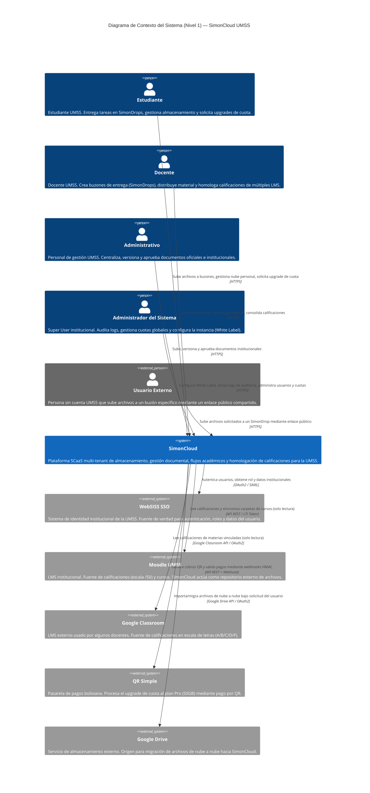
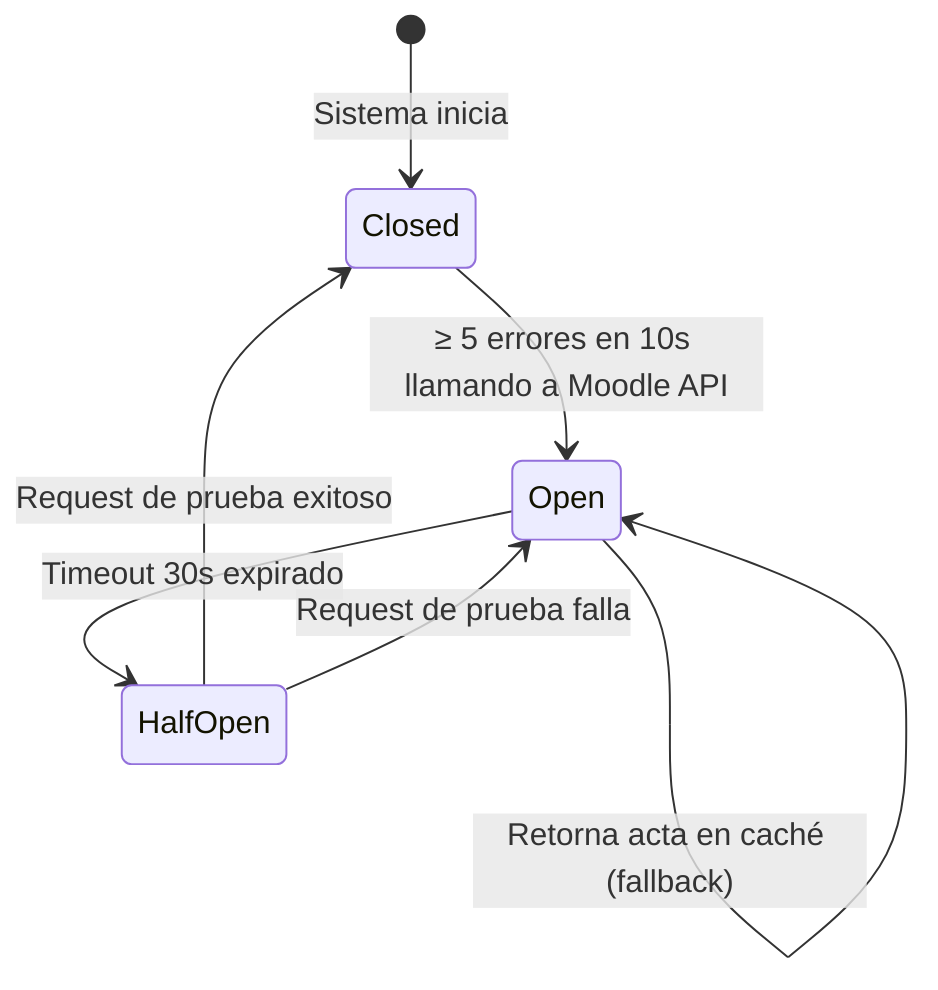
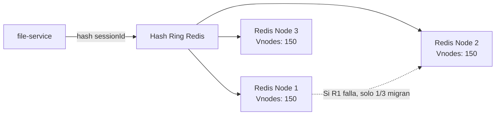
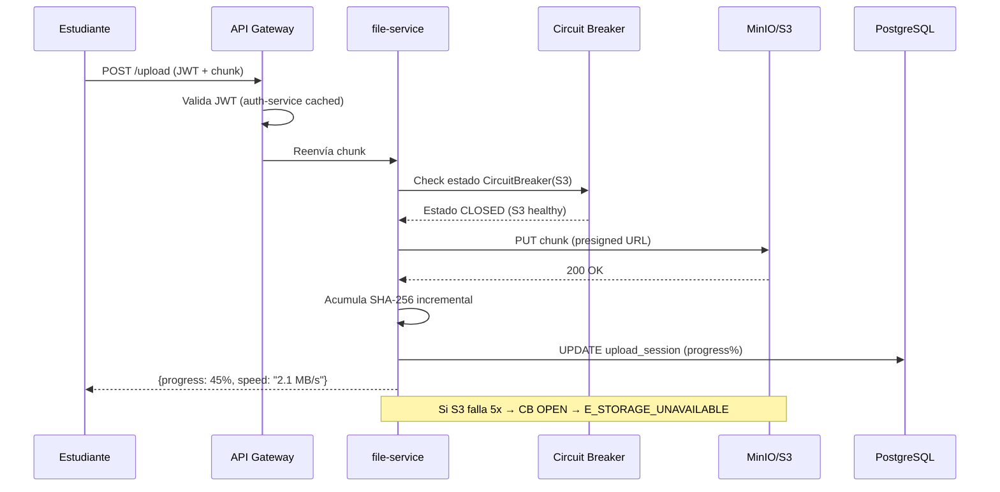
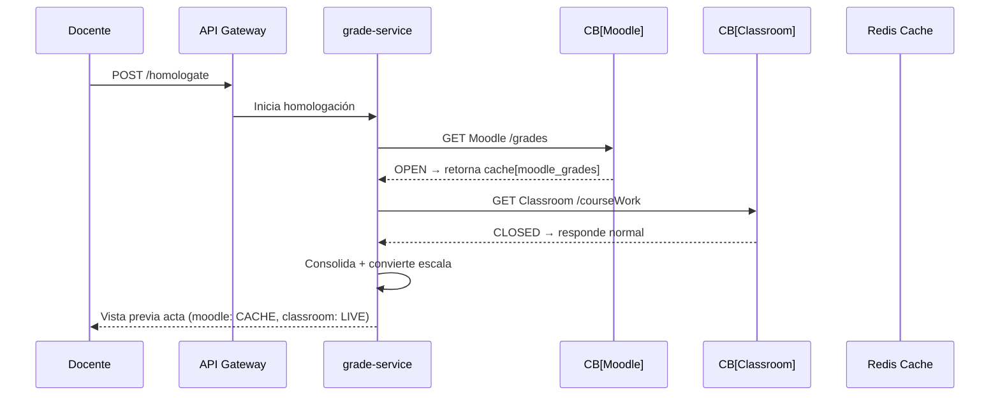
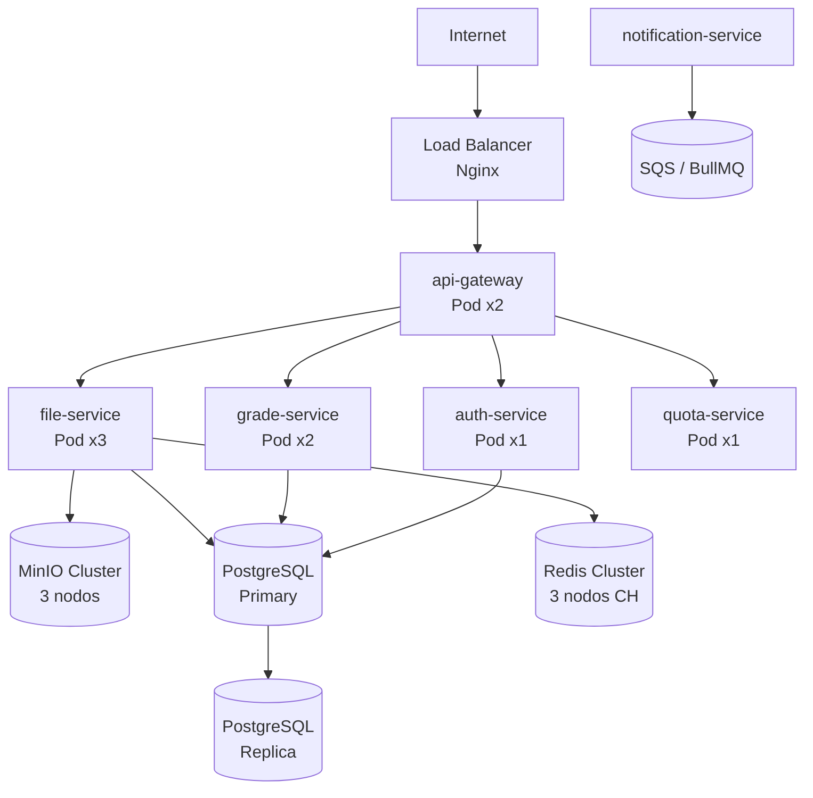

# Documento de Diseño Técnico (DTI) - SimonCloud

## §0. Metadatos del Documento

| Campo | Valor |
|-------|-------|
| **Proyecto** | SimonCloud — Almacenamiento Institucional UMSS |
| **Grupo** | G01 |
| **Versión del documento** | v0.2 (Borrador — Microservices + CB + CH) |
| **Fecha** | 2026-05-18 |
| **Autores** | Equipo SimonCloud |
| **Estado** | En Revisión |
| **Trazabilidad** | `docs/FSD_v1.md`, `docs/LFSD.md` |
| **Insumos M2 (UI/UX)** | `old-docs/definicion_pantallas_simoncloud.md`, `old-docs/Journeys/` |

---

## §1. Arquitectura de Alto Nivel (Contexto C4 — Nivel 1)

### 1.1 Descripción del Sistema

SimonCloud es una plataforma híbrida de almacenamiento en la nube e institucional, diseñada como un **SaaS multi-tenant (SCaaS)**, que proporciona soberanía digital a la Universidad Mayor de San Simón (UMSS). A diferencia de soluciones comerciales genéricas, el sistema integra nativamente:

- **Flujos académicos:** Entrega segura de tareas mediante buzones (`SimonDrop`) con comprobantes de integridad inmutables (SHA-256).
- **Homologación de calificaciones:** Motor que unifica y reconcilia notas de LMS heterogéneos (Moodle y Google Classroom) en una escala institucional de 100 puntos.
- **Gestión documental:** Control de versiones y estados de aprobación para flujos administrativos (resoluciones, actas).
- **Soberanía y seguridad institucional:** Autenticación SSO vía WebSISS (sistema de identidad de la UMSS), control de acceso por roles (RBAC) y auditoría de logs.

El sistema es accesible por usuarios internos de la UMSS (Estudiantes, Docentes, Administrativos, Administradores de Sistema) y por usuarios externos sin cuenta institucional (para recepción de archivos en buzones públicos).

### 1.2 Diagrama de Contexto (C4 Nivel 1)

El siguiente diagrama identifica a los actores (Personas) y los sistemas externos con los que SimonCloud interactúa como caja negra.



### 1.3 Restricciones y Principios Arquitectónicos Clave

Derivadas del FSD v1 y del contexto institucional:

| # | Restricción / Principio | Justificación |
|---|------------------------|---------------|
| R-01 | **Solo lectura en LMS externos:** SimonCloud no puede escribir de vuelta a Moodle ni Classroom. Solo lee calificaciones para homologar. | Política de seguridad institucional; evita corrupción de datos académicos. |
| R-02 | **Identidad por correo institucional:** El cruce de identidad entre LMS y registro de usuario se hace por `@umss.edu.bo`. | Previene duplicación de alumnos con mismo nombre pero diferente plataforma. |
| R-03 | **Inmutabilidad post-entrega:** Archivos subidos a un SimonDrop cerrado no pueden ser modificados. | Garantía legal y académica; soportada por hash SHA-256. |
| R-04 | **Multi-tenant desde el diseño:** Cada institución (tenant) opera en su propio subdominio y contexto de datos aislados. | Escalabilidad del modelo SCaaS hacia otras universidades. |

### 1.4 Stack Tecnológico Previsto

| Capa | Tecnología | Notas |
|------|-----------|-------|
| **Frontend** | React | SPA; comunicación vía REST/GraphQL con el backend. |
| **Backend** | Node.js / NestJS | Arquitectura Hexagonal y basada en Eventos para subidas pesadas. |
| **Base de Datos** | PostgreSQL | Fuente de verdad para usuarios, archivos, cuotas y actas. |
| **Cache / Colas** | Redis | Caché de sesiones y cola de eventos para subidas chunked. |
| **Object Storage** | S3 / MinIO | Almacenamiento de archivos binarios; presigned URLs para subida directa. |
| **Autenticación** | JWT + WebSISS SSO | Tokens JWT de corta vida; identidad federada via SSO institucional. |

---

### 1.5 Decisiones Arquitectónicas Candidatas (ADRs)

A partir de los requerimientos core de SimonCloud, se identifican las siguientes decisiones críticas que requerirán documentación formal como ADR. La tarea requiere un mínimo de 2; se listan 4 para cubrir los ejes más relevantes:

---

#### ADR-01 (Candidato): Estrategia de Autenticación e Integración SSO con WebSISS

- **Contexto:** SimonCloud debe integrarse con el sistema de identidad institucional (WebSISS) de la UMSS para autenticar a todos sus usuarios internos. Los usuarios externos (sin cuenta UMSS) también deben poder interactuar con buzones públicos.
- **Punto de decisión:** ¿Se integra vía **OAuth2** (delegación de autorización, más estándar en SaaS modernos) o vía **SAML 2.0** (más común en sistemas universitarios heredados)? Además, ¿cómo se gestiona la sesión de usuarios externos que no tienen identidad WebSISS?
- **Impacto:** Afecta el modelo de identidad completo, la gestión de roles (RBAC), la estructura de JWT y el onboarding de nuevas instituciones (escalabilidad multi-tenant).

---

#### ADR-02 (Candidato): Mecanismo de Integración y Sincronización con LMS externos (Moodle / Classroom)

- **Contexto:** Se requiere leer calificaciones de Moodle (escala /50) y Google Classroom (letras A-F) para el motor de homologación. La carpeta "Moodle" en el explorador de archivos debe mantenerse auto-sincronizada.
- **Punto de decisión:** ¿Se implementa **polling periódico** (simple pero con latencia) o se usa el sistema de **webhooks/eventos** de Moodle (real-time pero requiere que Moodle esté configurado para emitirlos)? ¿Cómo se maneja la vinculación de cuentas de Classroom por el docente (OAuth2 per-user)?
- **Impacto:** Latencia de sincronización, consistencia de datos del acta, carga sobre las APIs de los LMS y complejidad del backend de eventos.

---

#### ADR-03 (Candidato): Estrategia de Inmutabilidad y Generación de Comprobante Hash (SHA-256) para Entregas

- **Contexto:** Cada archivo subido a un SimonDrop debe tener un hash SHA-256 calculado que sirva como comprobante legal/académico de entrega. El archivo debe ser inmutable una vez cerrado el buzón.
- **Punto de decisión:**
  1. **¿Dónde se calcula el hash?** En el cliente (antes de subir, para validación temprana) vs. en el servidor tras recibir el archivo completo (única fuente de verdad).
  2. **¿Cómo se garantiza la inmutabilidad en el storage?** Políticas WORM (Write Once Read Many) en S3/MinIO vs. flag `solo_lectura = true` en la BD + validación en la API (más simple pero menos garantizado a nivel de infraestructura).
- **Impacto:** Garantía legal del comprobante, rendimiento de subida, costo de infraestructura y complejidad de la política de almacenamiento.

---

#### ADR-04 (Candidato): Protocolo del Gestor de Subidas Reanudables (SimonDrop Uploader)

- **Contexto:** El sistema debe soportar subidas de archivos de hasta 2GB+ con capacidad de pausar y reanudar sin perder progreso (inspirado en Mega.nz), mostrando velocidad y tiempo estimado.
- **Punto de decisión:** Uso del protocolo abierto **TUS** (diseñado para resumable uploads, con librerías cliente maduras) vs. **S3 Multipart Upload** con presigned URLs (mayor control, integración directa con el object storage, sin intermediario). Los Service Workers en el frontend son necesarios en ambos casos para no bloquear el hilo principal.
- **Impacto:** Complejidad de implementación en frontend y backend, dependencia de librerías externas, UX de progreso y comportamiento ante fallos de red (caso de uso crítico: `FSD-UC-002-A1`).

---

*Próximos pasos: Seleccionar las 2 decisiones de mayor riesgo/impacto para redactar los ADRs formales en `docs/dti/ADR-001.md` y `docs/dti/ADR-002.md`.*

---

## §2. Vista Lógica (*Logical View*) — Componentes y Responsabilidades

> **Marcador de tarea:** ✅ Vista Lógica — Microservices Patterns Ch.1 §1.4 (Scale Cube, modularity, own database per service)

La Vista Lógica describe los módulos funcionales del sistema y sus responsabilidades, independientemente de la tecnología de despliegue.

### 2.1 Descomposición en Servicios (Decompose by Business Capability)

Siguiendo el principio de Richardson (Ch.1 §1.4): *"Each service has its own database"* y descomposición por *business capability*, SimonCloud se organiza en los siguientes microservicios lógicos:

| Servicio | Responsabilidad principal | BD propia | Patrón Richardson aplicado |
|----------|--------------------------|-----------|---------------------------|
| `auth-service` | Federación SSO WebSISS, emisión JWT, RBAC | PostgreSQL (users, roles) | §1.4 Database per service |
| `file-service` | Subida chunked, generación SHA-256, gestión de archivos | PostgreSQL + S3/MinIO | §1.4 Database per service |
| `simondrop-service` | Buzones, fechas de cierre, comprobantes | PostgreSQL | §1.4 Decompose by business capability |
| `grade-service` | Homologación Moodle/Classroom, deduplicación | PostgreSQL (actas) | §1.4 Decompose by business capability |
| `quota-service` | Gestión de cuotas, integración QR Simple | PostgreSQL (quotas) | §1.4 Decompose by business capability |
| `notification-service` | Emails institucionales, Push (Web Push API) | Redis (colas) | §1.4 Database per service |
| `admin-service` | Panel global, métricas, gestión usuarios | PostgreSQL (audit_log) | §1.4 Decompose by business capability |
| `api-gateway` | Enrutamiento, autenticación JWT, rate limiting | — | Gateway pattern (Ch.8) |

### 2.2 Aplicabilidad del Circuit Breaker (Richardson, Cap. 3 §3.2)

> **Aplicación a SimonCloud (Nivel Medio-Alto):** El `grade-service` se comunica sincrónicamente con Moodle/Classroom. Se implementa un **Circuit Breaker** como proxy state-machine. Al superar el umbral de fallos (e.g. 50% en 10s), transiciona a `OPEN` evitando el *Thread Exhaustion* (bloqueo de hilos esperando I/O) y previniendo fallas en cascada. En estado `OPEN`, invoca una estrategia de **Fallback** que retorna datos de caché degradados (Redis) en vez de un error 500. Tras un timeout, pasa a `HALF-OPEN` permitiendo requests de prueba (*trial requests*) para auto-recuperarse a `CLOSED` sin intervención manual.



### 2.3 Aplicabilidad del Consistent Hashing

> **Aplicación a SimonCloud (Nivel Medio-Alto):** El `file-service` gestiona sesiones de subida fragmentada (*chunked*) almacenando el progreso en un cluster Redis. Utiliza **Consistent Hashing** mapeando tanto las llaves (session_ids) como los Nodos físicos a un *Hash Ring* matemático. Para evitar problemas de particionamiento desigual (hotspots), cada nodo físico se representa mediante múltiples **Virtual Nodes (vnodes)** en el anillo. Si un nodo falla, sus llaves no se vuelcan sobre un solo vecino, sino que se redistribuyen uniformemente entre los nodos restantes, minimizando el *cache miss ratio* al mínimo teórico (K/N).



---

## §3. Vista de Procesos (*Process View*) — Flujos en Tiempo de Ejecución

> **Marcador de tarea:** ✅ Vista de Procesos — Microservices Patterns Ch.1 §1.5 (drawbacks of microservices: IPC complexity, latency), Ch.3 §3.2 (Circuit Breaker pattern)

### 3.1 Flujo Crítico: Subida de Archivo con Hash SHA-256 (FSD-UC-002)



### 3.2 Flujo Crítico: Homologación de Notas con Fallback (FSD-UC-001)



---

## §4. Vista de Desarrollo (*Development View*) — Estructura del Código

> **Marcador de tarea:** ✅ Vista de Desarrollo — Microservices Patterns Ch.1 §1.6 (Pattern Language), Ch.1 §1.7

### 4.1 Estructura de Repositorio (Monorepo)

```
simoncloud/
├── apps/
│   ├── api-gateway/        ← NestJS Gateway (routing, JWT validation)
│   ├── auth-service/       ← NestJS + WebSISS OAuth2
│   ├── file-service/       ← NestJS + TUS/S3 multipart + SHA-256
│   ├── grade-service/      ← NestJS + Moodle/Classroom APIs + CB
│   ├── quota-service/      ← NestJS + QR Simple webhook
│   ├── notification-service/ ← NestJS + Web Push + SQS consumer
│   └── admin-service/      ← NestJS + audit_log reporting
├── libs/
│   ├── shared-types/       ← DTOs, interfaces comunes (TypeScript)
│   ├── circuit-breaker/    ← Wrapper Opossum.js (CB library NestJS)
│   └── consistent-hash/    ← Wrapper para Redis cluster (ioredis)
├── docs/                   ← BRD, MRD, PRD, FSD, DTI
└── tests/
    ├── unit/
    ├── integration/
    └── e2e/
```

### 4.2 Librería Circuit Breaker en SimonCloud (`libs/circuit-breaker`)

Se usa **Opossum.js** (librería Node.js de facto para Circuit Breaker):

```typescript
// libs/circuit-breaker/src/circuit-breaker.factory.ts
import CircuitBreaker from 'opossum';

export function createCB<T>(fn: (...args: any[]) => Promise<T>, name: string) {
  const cb = new CircuitBreaker(fn, {
    timeout: 3000,          // Fallo si > 3s
    errorThresholdPercentage: 50,  // Abre si >50% fallan
    resetTimeout: 30000,    // Intenta half-open en 30s
  });
  cb.fallback(() => { throw new ServiceUnavailableException(`${name} no disponible`); });
  return cb;
}
```

### 4.3 Consistent Hashing en Redis Cluster (`libs/consistent-hash`)

```typescript
// Configuración ioredis Cluster con vnodes
import { Cluster } from 'ioredis';
const redisCluster = new Cluster(
  [{ host: 'redis-1', port: 6379 }, { host: 'redis-2', port: 6379 }],
  { scaleReads: 'slave', natMap: {} }
  // ioredis implementa Consistent Hashing internamente con CLUSTER SLOTS
);
```

---

## §5. Vista Física (*Physical / Deployment View*) — Infraestructura

> **Marcador de tarea:** ✅ Vista Física — Microservices Patterns Ch.1 §1.4 (Scale Cube: X-axis scaling)

### 5.1 Diagrama de Despliegue (Kubernetes / Docker Compose)



### 5.2 Justificación del Scale Cube (Richardson §1.4)

| Eje | Aplicación en SimonCloud |
|-----|--------------------------|
| **X-axis (Horizontal scaling)** | `file-service` escala a N réplicas en periodos de exámenes (NFR-005: 10k uploads) |
| **Y-axis (Functional decomposition)** | Cada microservicio maneja una capability (file, grade, quota, etc.) |
| **Z-axis (Data partitioning)** | Consistent Hashing en Redis distribuye sesiones de subida por `tenantId` |

---

## §6. Escenarios Arquitectónicos (*Scenarios*) — Casos de Estrés

> **Marcador de tarea:** ✅ Scenarios — Microservices Patterns Casos de Resiliencia

### Escenario 1: Moodle UMSS cae durante periodo de calificaciones

| Campo | Descripción |
|-------|-------------|
| **Estímulo** | Moodle retorna `503` o timeout > 3s en 5 llamadas consecutivas |
| **Fuente** | Moodle UMSS (sistema externo) |
| **Artefacto** | `grade-service` → CircuitBreaker[Moodle] |
| **Entorno** | Producción, periodo de cierre de actas |
| **Respuesta** | CB pasa a estado `OPEN`; `grade-service` retorna acta desde cache Redis con tag `[DATOS DE CACHÉ]` |
| **Medida** | Docente recibe respuesta en < 500ms (desde cache); 0 cascading failures al resto del sistema |
| **Justificación** | Previene la caída total del grade-service por acoplamiento síncrono. |

### Escenario 2: Nodo Redis falla durante subida masiva (10k uploads simultáneos)

| Campo | Descripción |
|-------|-------------|
| **Estímulo** | Redis Node 2 se cae inesperadamente |
| **Fuente** | Fallo de infraestructura |
| **Artefacto** | `file-service` → Redis Cluster (Consistent Hashing) |
| **Entorno** | Producción, periodo de exámenes |
| **Respuesta** | Solo las sesiones de upload mapeadas a vnodes de Node 2 (~33%) son afectadas; el resto continúa normalmente |
| **Medida** | Máximo 33% de sesiones requieren reinicio de chunk; 0% de pérdida de datos (S3 persiste los chunks ya subidos) |
| **Justificación** | Evita hotspots y minimiza la reasignación masiva de llaves en el anillo hash. |

### Escenario 3: Pico de tráfico en inicio de semestre (3x carga normal)

| Campo | Descripción |
|-------|-------------|
| **Estímulo** | 30,000 usuarios concurrentes en las primeras 2 horas del semestre |
| **Fuente** | Usuarios UMSS |
| **Artefacto** | `api-gateway`, `auth-service`, `file-service` |
| **Entorno** | Producción |
| **Respuesta** | Kubernetes Horizontal Pod Autoscaler escala `file-service` de 3 a 9 réplicas basado en CPU > 70% |
| **Medida** | p95 latencia < 2s; 0 errores 503 |
| **Justificación** | Aplica el Scale Cube (X-axis) para manejar el rendimiento bajo alta concurrencia. |

---

## §7. Tarea Parte B: Justificación en el Producto SimonCloud

Matriz de justificación de los patrones investigados, marcando si aplican en SimonCloud con su respectiva línea de justificación. Las referencias de sección (§3.5, §3.5.1, §9, §22, §23) corresponden a la numeración del material del curso.

| Patrón / Concepto | ¿Aplica? | Justificación (1 línea) | Sección de referencia |
|-------------------|----------|--------------------------|----------------------|
| **Circuit Breaker** | **SÍ** | El `grade-service` usa CB para proteger las llamadas a Moodle/Classroom: al detectar ≥5 fallos consecutivos abre el circuito y retorna el acta desde caché Redis, evitando degradación en cascada. | §3.5 (Richardson Cap.3 §3.2) |
| **Consistent Hashing** | **SÍ** | El cluster Redis del `file-service` usa Consistent Hashing con virtual nodes (150 vnodes/nodo) para distribuir sesiones de subida chunked; si un nodo falla solo se reasigna ~1/N de las llaves. | §3.5.1 (material curso) |
| **API Gateway / Microservices IPC** | **SÍ** | El `api-gateway` centraliza autenticación JWT, enrutamiento y rate-limiting como único punto de entrada; todos los servicios se comunican detrás de él sin exposición directa. | §9 (material curso) |
| **Observabilidad / Health Checks** | **SÍ** | El `admin-service` expone un endpoint `/health` y registra todo en `audit_log` inmutable; el Kubernetes liveness probe verifica disponibilidad de cada pod automáticamente. | §22 (material curso) |
| **Production Readiness** | **SÍ** | El despliegue en Kubernetes incluye HPA (auto-scaling por CPU), readiness probes, y estrategia de rollout sin downtime; el `file-service` soporta hasta 10,000 uploads simultáneos (NFR-005). | §23 (material curso) |
