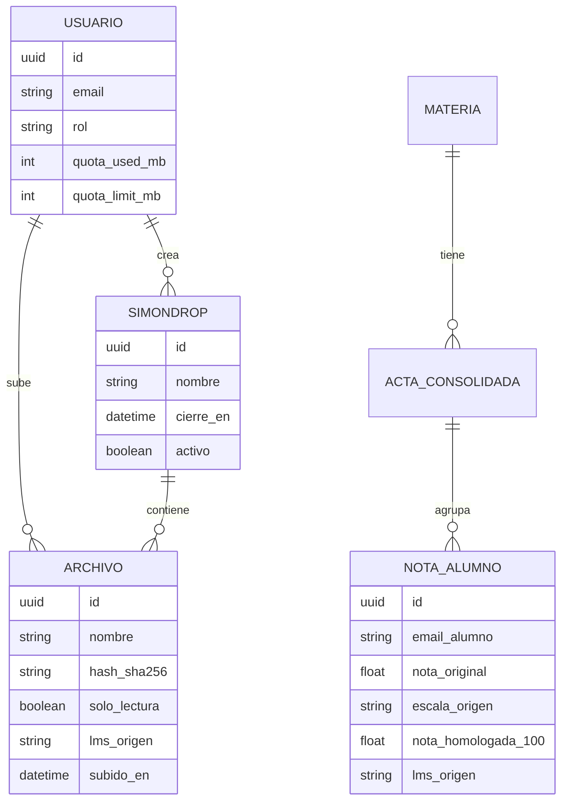
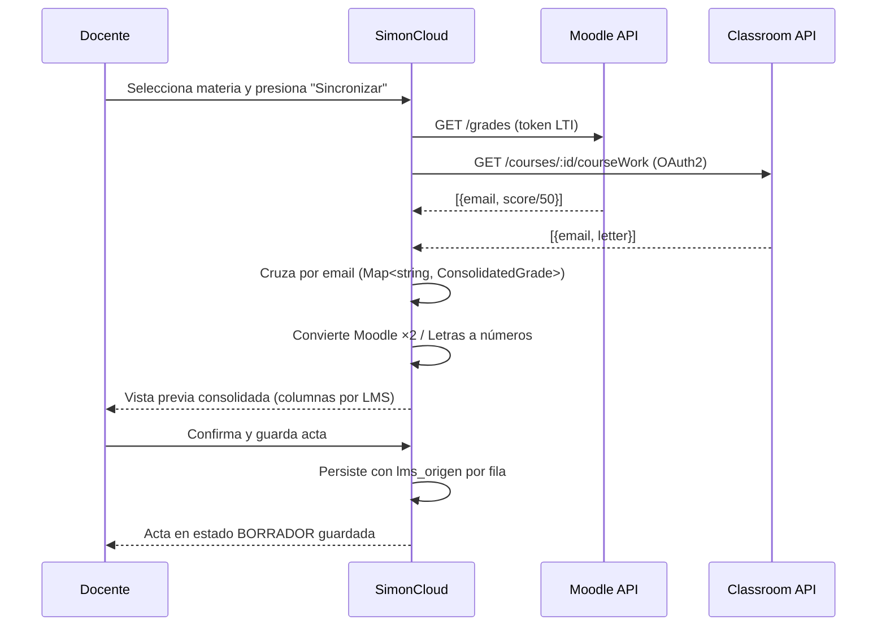
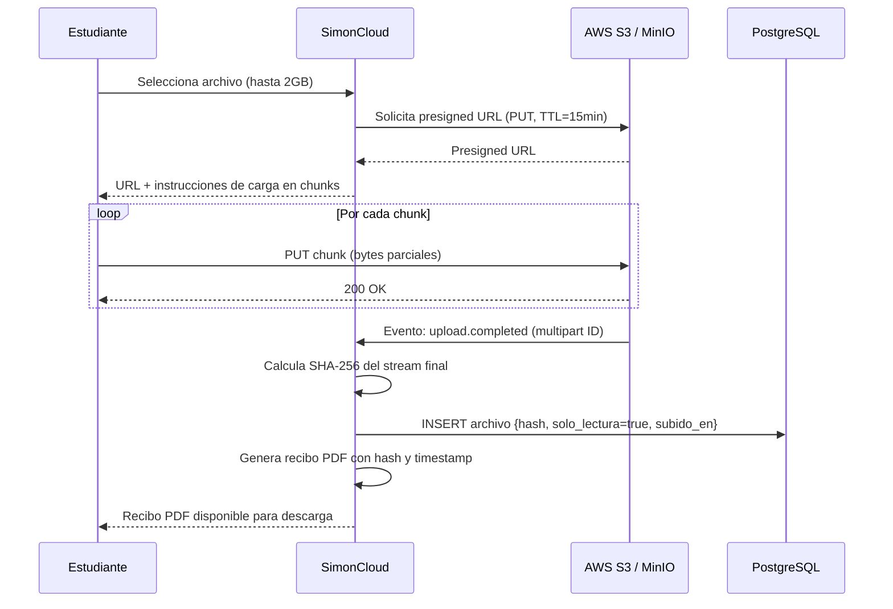
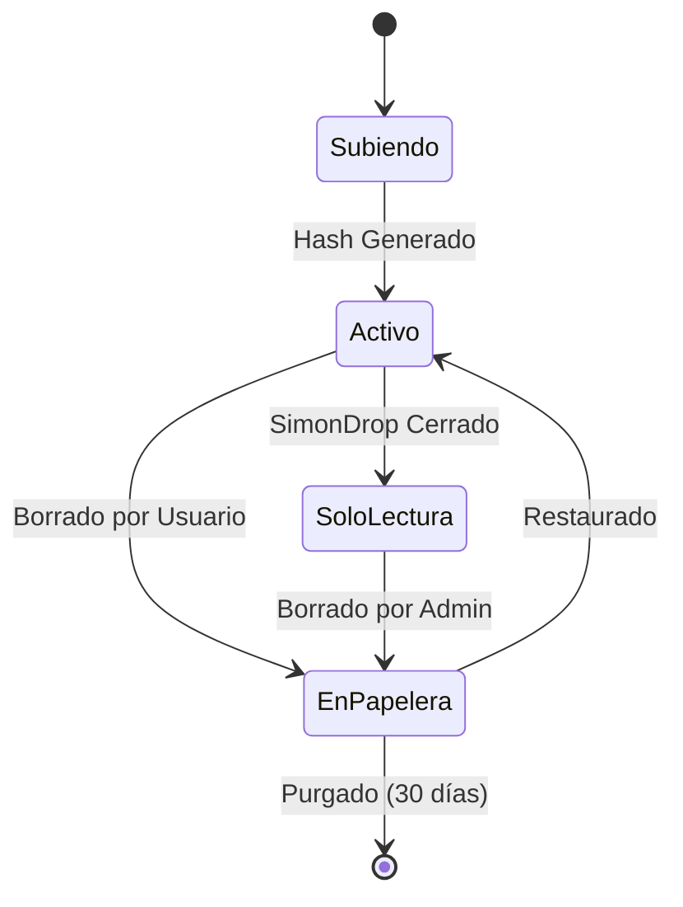
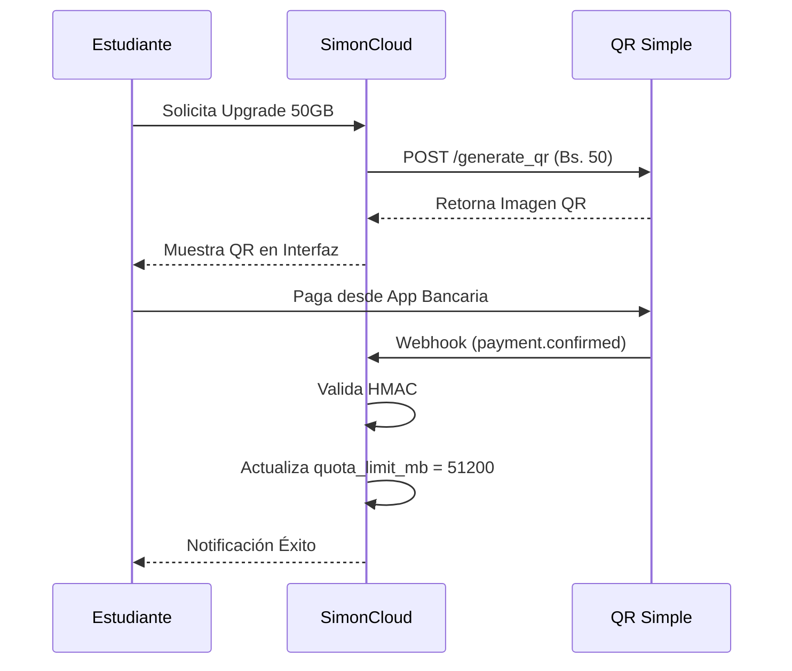
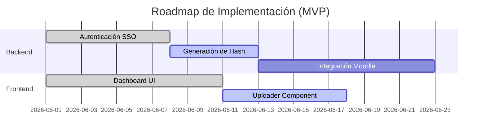
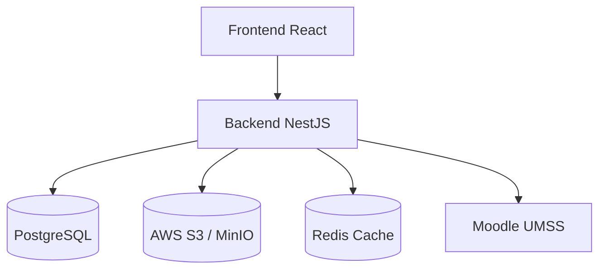
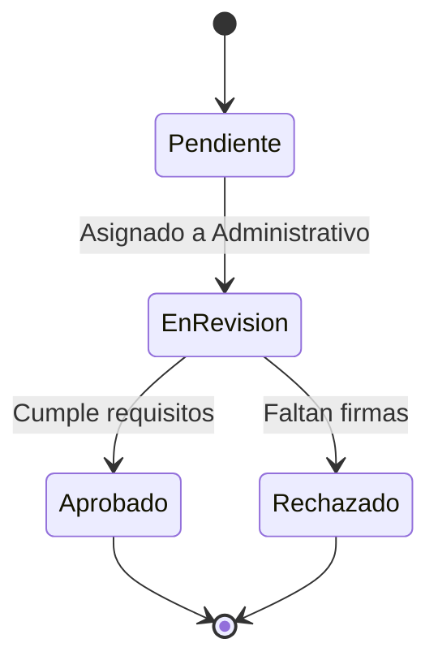
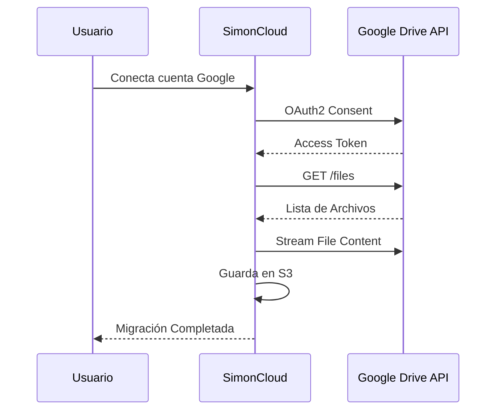
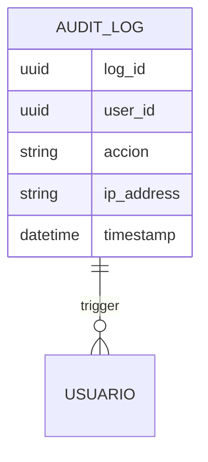

# Functional Specification Document (FSD) – SimonCloud

## 0. Metadatos ⚡🔧

| Campo | Valor |
|-------|-------|
| Producto | SimonCloud |
| Grupo | G01 |
| Versión del documento | v1.0 |
| Fecha | 11/05/2026 |
| Autores | Equipo SimonCloud |
| Revisores | Docente + 1 grupo par |
| Estado | Borrador |
| **Modo elegido** | **FSD clásico 🔧** |
| Trazabilidad a PRD | `PRD_v1.md` |
| Insumos M2 (UI/UX) | `old-docs/definicion_pantallas_simoncloud.md` |
| Fase Spec Kit cubierta | Specify ✅ |
| Prompts utilizados | `PR-FSD-001` |

## 1. Resumen ejecutivo ⚡🔧
SimonCloud es una plataforma que proporciona soberanía digital a la UMSS. Funciona como un hub que centraliza la entrega de trabajos mediante buzones seguros (generando comprobantes Hash inmutables) y unifica la gestión académica permitiendo a los docentes homologar automáticamente calificaciones desde Moodle y Google Classroom, resolviendo conflictos de escalas y duplicidad de estudiantes.

## 2. Alcance ⚡🔧

### 2.1 Dentro del alcance
- Sincronización bidireccional y homologación de notas desde Moodle y Classroom.
- Sistema de subida de archivos con generación de Hash SHA-256.
- Integración de pasarela de pago QR Simple para upgrade de cuotas.

### 2.2 Fuera del alcance (explícito)
- Visualización en línea de documentos complejos (ej. AutoCAD, PSD).
- Chat en tiempo real.

### 2.4 Plan técnico (Spec Kit fase Plan) 🔧

| Bloque | Contenido |
|--------|-----------|
| **Stack tecnológico** | React (Frontend), Node.js/NestJS (Backend), PostgreSQL (DB), Redis (Cache). |
| **Arquitectura prevista** | Arquitectura Hexagonal y basada en Eventos para subidas pesadas. |
| **Project structure** | `apps/backend`, `apps/frontend`, `packages/shared`. |
| **Decisiones técnicas anticipadas** | Se usará JWT para autenticación; subidas mediante presigned URLs de S3 o MinIO. |
| **Restricciones técnicas** | Prohibido modificar datos directamente en Moodle (solo lectura de notas para homologar, no escritura de vuelta a Moodle por seguridad). |

### 2.5 Descomposición en Tasks (Spec Kit) ⚡🔧
| Task ID | Descripción | Caso de uso (FSD-UC) | Prompt asociado | Estado |
|---------|-------------|----------------------|-----------------|--------|
| `T-001` | Implementar endpoint POST /homologate | `FSD-UC-001` | `PR-UC-001` | pendiente |
| `T-002` | Servicio de generación SHA-256 en upload | `FSD-UC-002` | `PR-UC-002` | pendiente |

## 3. Actores y roles del sistema ⚡🔧

| Actor | Tipo | Responsabilidad principal | Permisos clave |
|-------|------|---------------------------|----------------|
| Docente | humano | Gestionar buzones y homologar actas | Lectura LMS, CRUD Buzones |
| Estudiante | humano | Subir archivos y ver sus notas | Escritura en buzón abierto |

## 4. Casos de uso funcionales ⚡🔧

### 4.1 FSD-UC-001 – Creación de SimonDrop desde contexto LMS (LTI)

> **[MÓDULO 5 — Planificado]** Depende de credenciales LTI emitidas por la DTIC-UMSS para Moodle y del programa de Add-ons de Google para Classroom. Ver `docs/adr/0006-integracion-lms-lti.md` y `docs/roadmap.md §Hito 2`.

- **Trazabilidad**: PRD-REQ-001, PRD-REQ-003 → BRD: BR-001, BR-008
- **Actor principal**: Docente
- **Precondiciones**:
  1. Docente autenticado vía SSO WebSISS en SimonCloud.
  2. SimonCloud registrado como LTI External Tool en el LMS (configuración DTIC, una sola vez).
  3. Docente tiene al menos un curso activo en Moodle o Google Classroom.
- **Disparador**: Docente va a SimonCloud → sección "Mis clases LMS" → presiona "Sincronizar cursos".
- **Flujo principal**:
  1. Docente autoriza SimonCloud a leer sus cursos vía OAuth2 (Classroom) o token LTI (Moodle).
  2. SimonCloud recupera lista de cursos y tareas activas del LMS.
  3. Docente selecciona una tarea y presiona "Crear SimonDrop vinculado".
  4. SimonCloud crea un SimonDrop con fecha de cierre = fecha límite de la tarea LMS.
  5. SimonCloud genera un deep link LTI que el LMS usa para mostrar "Entregar en SimonDrop" como opción de entrega.
  6. Docente copia/pega el deep link en la tarea del LMS (o SimonCloud lo registra vía LTI Assignment and Grade Services).
- **Flujos alternativos / excepciones**:
  - **A1 – LMS no accesible**: SimonCloud muestra error y permite crear el SimonDrop manualmente sin vinculación LMS.
  - **A2 – Tarea ya tiene SimonDrop**: Sistema advierte e impide crear duplicado para el mismo `lms_assignment_id`.
  - **A3 – Token OAuth2 expirado**: SimonCloud redirige al docente a re-autorizar; el SimonDrop ya creado permanece activo.
- **Postcondiciones**:
  1. SimonDrop creado con `lms_assignment_id` y `lms_course_id` almacenados para trazabilidad.
  2. Deep link LTI disponible para que el docente lo adjunte en su tarea LMS.
  3. Estudiantes del curso verán "Entregar en SimonDrop" como opción al abrir la tarea en el LMS.
- **Flujo del estudiante** (disparado por el deep link):
  1. Estudiante abre tarea en Moodle/Classroom → selecciona "Entregar en SimonDrop".
  2. LMS lanza SimonCloud vía LTI con contexto: `user_id`, `course_id`, `assignment_id`.
  3. SimonCloud autentica al estudiante (SSO WebSISS o token LTI), muestra el SimonDrop.
  4. Estudiante sube archivo → SHA-256 → recibo de entrega.
  5. SimonCloud notifica al LMS vía LTI AGS (Assignment and Grade Services): entrega recibida.
  6. LMS marca la tarea como "entregada" automáticamente.
- **Datos de entrada**: `{ lms_provider: 'moodle'|'classroom', lms_course_id, lms_assignment_id, fecha_cierre }`
- **Datos de salida**: `{ simondrop_id, lti_deep_link_url, lms_assignment_id }`
- **Criterios de aceptación**:
```gherkin
Escenario: Docente vincula tarea Moodle a SimonDrop
  Dado un docente autenticado con Moodle configurado
  Cuando sincroniza cursos y selecciona "Proyecto Final - MAT101"
  Y presiona "Crear SimonDrop vinculado"
  Entonces SimonCloud crea un SimonDrop con fecha_cierre = fecha_límite de la tarea
  Y genera un deep link LTI para adjuntar en Moodle

Escenario: Estudiante entrega desde contexto LMS
  Dado un estudiante que abre "Proyecto Final" en Moodle
  Cuando selecciona "Entregar en SimonDrop" y sube "proyecto.pdf"
  Entonces SimonCloud genera el hash SHA-256 del archivo
  Y emite recibo de entrega al estudiante
  Y notifica a Moodle que la entrega fue recibida (LTI AGS)
  Y Moodle marca la tarea como "Entregada"

Escenario: LMS no disponible al crear SimonDrop
  Dado que la API de Moodle no responde
  Cuando el docente intenta sincronizar cursos
  Entonces SimonCloud muestra "LMS no disponible"
  Y ofrece crear el SimonDrop manualmente sin vinculación LMS
```

### 4.2 FSD-UC-002 – Subida segura y Comprobante Hash
- **Trazabilidad**: PRD-REQ-002 → BRD: BR-007 (hash SHA-256), BR-005 (inmutabilidad de actas)
- **Actor principal**: Estudiante
- **Precondiciones**:
  1. El SimonDrop está activo (fecha de cierre futura).
  2. El estudiante está autenticado.
- **Disparador**: El estudiante arrastra o selecciona un archivo en la pantalla del buzón.
- **Flujo principal**:
  1. Estudiante selecciona archivo (hasta 2GB).
  2. Sistema inicia subida en chunks via presigned URL a S3/MinIO.
  3. Sistema muestra barra de progreso y velocidad (KB/s).
  4. Al completarse, sistema calcula SHA-256 del buffer.
  5. Sistema cambia estado del archivo a `solo_lectura = true` en BD.
  6. Sistema genera recibo PDF con hash y timestamps.
- **Flujos alternativos / excepciones**:
  - **A1 – Corte de conexión**: la subida se pausa; al reconectar, el sistema reanuda desde el último chunk guardado.
  - **A2 – Archivo supera límite de cuota**: el sistema bloquea la subida y redirige a FSD-UC-003.
  - **A3 – SimonDrop cerrado**: el sistema rechaza la solicitud con mensaje "El plazo de entrega ha vencido."
- **Postcondiciones**:
  1. El archivo existe en S3 en estado inmutable.
  2. La BD tiene registro del hash y timestamps.
  3. El estudiante puede descargar su recibo PDF.
- **Datos de entrada**: `{ simondropId, fileBuffer: Buffer, estudianteId }`
- **Datos de salida**: `{ fileId, hash_sha256, solo_lectura: true, recibo_url }`
- **Criterios de aceptación**:
```gherkin
Escenario: Subida exitosa y generación de hash
  Dado un estudiante autenticado y un SimonDrop activo
  Cuando sube el archivo "proyecto_final.pdf" (50MB)
  Entonces el sistema genera el hash SHA-256 del archivo
  Y cambia el archivo a Solo Lectura
  Y muestra un recibo con el hash y la fecha/hora de entrega

Escenario: Reconexión durante subida
  Dado una subida en progreso al 60%
  Cuando se corta la conexión a internet
  Entonces el sistema muestra "Pausado. Reconectando..."
  Y al recuperar la conexión, reanuda desde el byte 60% sin reiniciar
```

### 4.3 FSD-UC-003 – Upgrade de Cuota por QR
- **Trazabilidad**: PRD-REQ-004 → BRD: BR-010 (QR Simple), BR-006 (RBAC)
- **Actor principal**: Estudiante
- **Precondiciones**:
  1. El estudiante está autenticado y en plan Freemium (15GB).
- **Disparador**: Estudiante presiona "Ampliar a 50GB" en el panel de cuotas.
- **Flujo principal**:
  1. Sistema solicita a QR Simple la generación de un cobro de Bs. 50.
  2. Sistema muestra el QR generado con contador de 5 minutos.
  3. Estudiante escanea y confirma el pago en su app bancaria.
  4. Pasarela envía Webhook `payment.confirmed` con firma HMAC.
  5. Sistema valida la firma HMAC del Webhook.
  6. Sistema actualiza `quota_limit_mb = 51200` en BD.
  7. Sistema muestra confirmación "¡Cuota ampliada a 50GB con éxito!".
- **Flujos alternativos / excepciones**:
  - **A1 – QR expirado (> 5 min)**: el sistema invalida el QR y ofrece generar uno nuevo.
  - **A2 – Webhook con firma inválida**: el sistema descarta el evento sin actualizar la cuota.
  - **A3 – Pasarela no disponible**: el sistema muestra error y sugiere reintentar más tarde.
- **Postcondiciones**:
  1. `quota_limit_mb` del usuario actualizado a 51200 en BD.
  2. Registro de la transacción creado con ID de pago.
- **Criterios de aceptación**:
```gherkin
Escenario: Pago exitoso
  Dado un estudiante con cuota de 15GB
  Cuando paga correctamente el QR de Bs. 50
  Y la pasarela envía el webhook con firma HMAC válida
  Entonces el sistema actualiza su cuota a 50GB en menos de 5 segundos

Escenario: Webhook con firma inválida
  Dado un webhook entrante con firma HMAC incorrecta
  Cuando el sistema lo recibe
  Entonces rechaza el evento sin actualizar la cuota
  Y registra el intento en los logs de seguridad
```

### 4.4 FSD-UC-004 – Autenticación SSO WebSISS
- **Trazabilidad**: PRD-US-012 → BRD: BR-006 (RBAC)
- **Actor principal**: Cualquier usuario (Estudiante / Docente / Administrativo)
- **Precondiciones**: Cuenta activa en el sistema WebSISS de la UMSS.
- **Disparador**: Usuario hace clic en "Ingresar con WebSISS" en la pantalla de login.
- **Flujo principal**:
  1. El sistema redirige al usuario al portal SSO WebSISS de la UMSS.
  2. El usuario ingresa sus credenciales institucionales (código SIS + contraseña).
  3. WebSISS valida las credenciales y retorna un token de autorización.
  4. SimonCloud intercambia el token por un JWT propio con duración de 8 horas.
  5. El sistema asigna el rol correspondiente (Docente/Estudiante/Administrativo) basado en atributos del SSO.
  6. El usuario es redirigido al Dashboard Unificado según su rol.
- **Flujos alternativos**:
  - **A1 – Credenciales inválidas**: WebSISS retorna `401`; SimonCloud muestra "Credenciales incorrectas. Verifica tu código SIS." y permite reintentar.
  - **A2 – WebSISS no disponible**: El sistema muestra "El servicio de autenticación está temporalmente no disponible. Intenta en unos minutos." con código de error rastreable.
  - **A3 – Sesión expirada**: Al detectar JWT vencido, el sistema redirige silenciosamente a re-login sin perder la URL de destino.
- **Postcondiciones**:
  1. El usuario tiene un JWT válido almacenado en cookie HttpOnly.
  2. El audit log registra: usuario, IP, timestamp y rol asignado.
- **Datos de entrada**: `{ codigo_sis: string, password: string }`
- **Datos de salida**: `{ jwt_token, rol, nombre_completo, expires_at }`
- **Criterios de aceptación**:
```gherkin
Escenario: Login exitoso con credenciales WebSISS válidas
  Dado un usuario con código SIS "20220001" y contraseña activa
  Cuando selecciona "Ingresar con WebSISS"
  Entonces el sistema autentica al usuario en menos de 3 segundos
  Y le asigna el rol "Estudiante"
  Y lo redirige al Dashboard sin pedir datos adicionales

Escenario: Login fallido por contraseña incorrecta
  Dado un usuario con código SIS "20220001" y contraseña incorrecta
  Cuando selecciona "Ingresar con WebSISS"
  Entonces el sistema muestra "Credenciales incorrectas"
  Y no genera ningún JWT
  Y registra el intento fallido en el log de auditoría
```

### 4.5 FSD-UC-005 – Control de Versiones de Documentos
- **Trazabilidad**: PRD-US-018 → BRD: BR-005 (inmutabilidad)
- **Actor principal**: Administrativo
- **Precondiciones**: Usuario autenticado con rol Administrativo. Documento con al menos 2 versiones.
- **Disparador**: El administrativo hace clic en "Ver Historial" en el panel de detalles de un documento.
- **Flujo principal**:
  1. El sistema recupera la cadena de versiones del documento ordenada por fecha descendente.
  2. Se muestra una lista: V3 (actual), V2, V1 con fecha, autor y tamaño.
  3. El administrativo selecciona una versión anterior (ej. V1).
  4. El sistema muestra una vista previa de V1 en modo solo lectura.
  5. El administrativo hace clic en "Restaurar esta versión".
  6. El sistema crea una nueva entrada V4 con el contenido de V1 y SHA-256 recalculado, preservando V1, V2, V3 intactas.
- **Flujos alternativos**:
  - **A1 – Solo existe 1 versión**: El botón "Ver Historial" aparece deshabilitado con tooltip "Sin versiones anteriores".
  - **A2 – Restauración de versión firmada**: Si V1 tiene firma digital, el sistema advierte "Esta versión está firmada. Restaurarla creará una copia sin firma."
- **Postcondiciones**:
  1. La nueva versión queda registrada con `parent_id` apuntando al documento original.
  2. Ninguna versión anterior es eliminada (soft-immutability).
- **Criterios de aceptación**:
```gherkin
Escenario: Administrativo restaura versión anterior
  Dado un documento "Resolución-001" con versiones V1, V2 y V3
  Cuando el administrativo selecciona V1 y confirma restaurar
  Entonces el sistema crea V4 con el contenido de V1
  Y el hash SHA-256 de V4 es recalculado
  Y las versiones V1, V2 y V3 permanecen sin cambios

Escenario: Documento con una sola versión
  Dado un documento con solo la versión V1
  Cuando el administrativo abre el historial
  Entonces el botón "Restaurar" aparece deshabilitado
  Y el sistema muestra "Sin versiones anteriores"
```

### 4.6 FSD-UC-006 – Aprobación y Rechazo de Documentos
- **Trazabilidad**: PRD-US-017 → BRD: BR-005 (inmutabilidad de actas)
- **Actor principal**: Administrativo
- **Precondiciones**: Documento en estado `PENDIENTE`. Usuario con rol Administrativo.
- **Disparador**: El administrativo abre un documento en la bandeja de entrada de trámites.
- **Flujo principal**:
  1. El administrativo visualiza el documento y sus metadatos (solicitante, fecha, tipo de trámite).
  2. Selecciona la etiqueta "Aprobar" del menú de acciones.
  3. El sistema solicita confirmación: "¿Confirma la aprobación del documento?"
  4. Al confirmar, el estado cambia a `APROBADO` y el documento pasa a solo lectura.
  5. El sistema notifica al solicitante original vía email institucional.
  6. El sistema registra: administrativo responsable, timestamp y justificación.
- **Flujos alternativos**:
  - **A1 – Rechazo**: El administrativo selecciona "Rechazar" e ingresa obligatoriamente una justificación de mínimo 20 caracteres. El estado pasa a `RECHAZADO`.
  - **A2 – Solicitar corrección**: Nuevo estado intermedio `EN_CORRECCION`; el solicitante puede subir una versión corregida sin perder el historial.
- **Postcondiciones**:
  1. El documento tiene estado final `APROBADO` o `RECHAZADO` inmutable.
  2. El solicitante recibe notificación del resultado.
- **Criterios de aceptación**:
```gherkin
Escenario: Administrativo aprueba un documento
  Dado un documento "Acta-Final-2026" en estado PENDIENTE
  Cuando el administrativo selecciona "Aprobar" y confirma
  Entonces el estado del documento cambia a APROBADO
  Y el documento queda en solo lectura
  Y el solicitante recibe notificación de aprobación

Escenario: Rechazo sin justificación
  Dado un documento en estado PENDIENTE
  Cuando el administrativo selecciona "Rechazar" sin ingresar justificación
  Entonces el sistema bloquea la acción
  Y muestra "Debes ingresar una justificación de al menos 20 caracteres"
```

### 4.7 FSD-UC-007 – Notificaciones al Docente por Nueva Entrega
- **Trazabilidad**: PRD-US-015 → BRD: BR-006 (RBAC)
- **Actor principal**: Sistema (evento), Docente (receptor)
- **Precondiciones**: El SimonDrop está activo. El docente tiene notificaciones habilitadas en su perfil.
- **Disparador**: Un estudiante completa exitosamente la subida de un archivo a un SimonDrop del docente.
- **Flujo principal**:
  1. Al completarse la subida (FSD-UC-002), el sistema emite un evento interno `file.uploaded`.
  2. El worker de notificaciones consume el evento desde la cola.
  3. El worker consulta el propietario del SimonDrop y sus preferencias de notificación.
  4. El sistema envía email institucional al docente con: nombre del estudiante, nombre del archivo, hash SHA-256 y timestamp.
  5. Si el docente tiene la app abierta, recibe también notificación push en tiempo real.
- **Flujos alternativos**:
  - **A1 – Notificaciones deshabilitadas**: Si el docente deshabilitó las alertas, el sistema solo registra el evento en el log sin enviar notificación.
  - **A2 – Error de envío de email**: El sistema reintenta 3 veces con back-off exponencial. Si falla, registra en Dead Letter Queue.
- **Postcondiciones**:
  1. El docente conoce la entrega sin necesidad de revisar manualmente el buzón.
  2. Evento notificación registrado en audit_log.
- **Criterios de aceptación**:
```gherkin
Escenario: Docente recibe notificación de nueva entrega
  Dado un SimonDrop activo del docente "Prof. Lic. Mamani"
  Cuando el estudiante "Juan Pérez" sube exitosamente "proyecto.pdf"
  Entonces el docente recibe un email con el nombre del archivo y su hash SHA-256
  Y el evento queda registrado en el log de auditoría

Escenario: Notificaciones deshabilitadas
  Dado un docente con notificaciones deshabilitadas en su perfil
  Cuando un estudiante realiza una entrega en su SimonDrop
  Entonces el sistema NO envía email ni push
  Y el evento se registra silenciosamente en el log
```

### 4.8 FSD-UC-008 – Compartir Archivo con Correo @umss.edu.bo
- **Trazabilidad**: PRD-US-013 → BRD: BR-006 (RBAC)
- **Actor principal**: Docente / Administrativo
- **Precondiciones**: Usuario autenticado con un archivo propio en Mi Nube.
- **Disparador**: El usuario selecciona "Compartir" en el menú de acciones de un archivo.
- **Flujo principal**:
  1. El sistema abre el modal de compartir con un campo de texto para correos.
  2. El usuario ingresa el correo destino (ej. `estudiante@umss.edu.bo`).
  3. El sistema valida que el dominio sea `@umss.edu.bo` o `@est.umss.edu.bo`.
  4. El sistema genera un enlace de acceso único con expiración de 7 días.
  5. El sistema envía el enlace al correo destino y notifica al propietario.
- **Flujos alternativos**:
  - **A1 – Correo externo no institucional**: El sistema rechaza con "Solo se puede compartir con correos @umss.edu.bo".
  - **A2 – Enlace expirado**: Al intentar acceder, el sistema muestra "Este enlace ha expirado. Solicita uno nuevo al propietario."
- **Postcondiciones**:
  1. El destinatario recibe acceso de solo lectura al archivo durante 7 días.
  2. El acceso queda registrado en el panel de detalles del archivo.
- **Criterios de aceptación**:
```gherkin
Escenario: Compartir archivo con correo institucional válido
  Dado un docente con el archivo "Guia-Practica.pdf" en Mi Nube
  Cuando ingresa "alumno@est.umss.edu.bo" en el modal de compartir
  Entonces el sistema genera un enlace con expiración de 7 días
  Y envía el enlace al correo destino
  Y registra el evento de compartir en el historial del archivo

Escenario: Intento de compartir con correo externo
  Dado un docente intentando compartir un archivo
  Cuando ingresa "personal@gmail.com" en el modal de compartir
  Entonces el sistema rechaza la operación
  Y muestra "Solo se puede compartir con correos @umss.edu.bo"
```

### 4.9 FSD-UC-009 – Papelera de Reciclaje (Retención 30 Días)
- **Trazabilidad**: PRD-US-019 → BRD: BR-005 (soft delete)
- **Actor principal**: Estudiante / Docente / Administrativo
- **Precondiciones**: Usuario autenticado. Archivo en estado `ACTIVO`.
- **Disparador**: El usuario selecciona "Eliminar" en el menú de acciones de un archivo.
- **Flujo principal**:
  1. El sistema solicita confirmación: "¿Mover a la papelera? Podrás restaurarlo en 30 días."
  2. Al confirmar, el archivo cambia a estado `EN_PAPELERA` con `deleted_at = NOW()`.
  3. El archivo desaparece de Mi Nube pero es visible en la sección Papelera.
  4. Un cronjob diario purga archivos con `deleted_at < NOW() - 30 días`, eliminándolos de S3 y la BD.
- **Flujos alternativos**:
  - **A1 – Restaurar desde papelera**: El usuario entra a Papelera, selecciona el archivo y hace clic en "Restaurar". El archivo vuelve a estado `ACTIVO` en su ubicación original.
  - **A2 – Archivo en buzón cerrado**: Los archivos en SimonDrops cerrados no pueden ser eliminados por el estudiante (solo por Admin).
- **Postcondiciones**:
  1. El archivo no es eliminado físicamente durante 30 días.
  2. Transcurridos 30 días, el sistema lo purga irreversiblemente.
- **Criterios de aceptación**:
```gherkin
Escenario: Archivo movido a papelera y restaurado
  Dado un estudiante con el archivo "tesis-draft.docx" en Mi Nube
  Cuando selecciona "Eliminar" y confirma
  Entonces el archivo desaparece de Mi Nube
  Y aparece en la sección Papelera con un contador de "30 días restantes"
  Cuando el estudiante selecciona "Restaurar"
  Entonces el archivo vuelve a Mi Nube en su ubicación original

Escenario: Purga automática a los 30 días
  Dado un archivo en la papelera con deleted_at hace 30 días
  Cuando el cronjob nocturno se ejecuta
  Entonces el archivo es eliminado de S3 y de la base de datos
  Y no puede ser recuperado
```

### 4.10 FSD-UC-010 – Panel de Administrador (Métricas Globales)
- **Trazabilidad**: PRD-US-020, PRD-US-011 → BRD: BR-006 (RBAC Admin)
- **Actor principal**: Administrador del Sistema
- **Precondiciones**: Usuario autenticado con rol `Admin`.
- **Disparador**: El administrador accede a la sección "Panel de Control" desde el sidebar.
- **Flujo principal**:
  1. El sistema calcula en tiempo real: almacenamiento total usado, usuarios activos en las últimas 24h, subidas en las últimas 24h, y top 5 de archivos más pesados.
  2. El panel muestra tarjetas con métricas clave y un gráfico de uso histórico (últimos 30 días).
  3. El administrador puede ajustar la cuota individual de un usuario desde el panel de gestión de usuarios.
  4. Al cambiar la cuota, el sistema actualiza `quota_limit_mb` y notifica al usuario afectado.
- **Flujos alternativos**:
  - **A1 – Servidor por encima del 80% de capacidad**: El panel muestra alerta visual roja "Almacenamiento crítico" y envía email automático al administrador.
  - **A2 – Exportar reporte**: El administrador puede exportar el reporte de uso como CSV o PDF.
- **Postcondiciones**:
  1. El administrador tiene visibilidad completa del estado del sistema.
  2. Cambios de cuota quedan en audit_log con usuario responsable.
- **Criterios de aceptación**:
```gherkin
Escenario: Administrador ajusta cuota de un usuario
  Dado un administrador en el Panel de Control
  Cuando localiza al usuario "jperez@umss.edu.bo" y cambia su cuota a 100GB
  Entonces el sistema actualiza quota_limit_mb a 102400
  Y notifica al usuario del cambio
  Y registra la acción en el log de auditoría con el nombre del admin

Escenario: Alerta de almacenamiento crítico
  Dado que el uso global supera el 80% de la capacidad total
  Cuando el panel se actualiza
  Entonces muestra una alerta visual roja "Almacenamiento crítico"
  Y envía un email automático al administrador del sistema
```

## 5. Reglas de negocio ⚡🔧

| ID (BRD_v2) | Regla | Tipo | Origen | Casos de uso afectados |
|-------------|-------|------|--------|------------------------|
| BR-003 | Identificar y deduplicar estudiantes por correo o ID institucional | validación | BRD_v2 §11 | FSD-UC-001 |
| BR-004 | Mantener trazabilidad de la fuente original de cada calificación (`lms_origen`) | auditoría | BRD_v2 §11 | FSD-UC-001 |
| BR-005 | Actas finales cerradas son inmutables sin autorización Administrativo | normativa | BRD_v2 §11 | FSD-UC-002 |
| BR-006 | Control de acceso por roles RBAC (Docente / Estudiante / Admin) | seguridad | BRD_v2 §11 | FSD-UC-001, FSD-UC-002, FSD-UC-003 |
| BR-007 | Comprobante de entrega con hash SHA-256 para archivos en buzones | seguridad | BRD_v2 §11 | FSD-UC-002 |
| BR-010 | Integración con pasarela QR Simple para licencias Pro | negocio | BRD_v2 §11 | FSD-UC-003 |

## 6. Modelo de datos funcional ⚡🔧

### 6.1 Diagrama ER (Mermaid)


### 6.2 Diccionario de datos

| Entidad | Atributo | Tipo | Obligatorio | Validaciones | Origen |
|---------|----------|------|-------------|--------------|--------|
| `USUARIO` | `id` | UUID | sí | UUIDv4 | sistema |
| `USUARIO` | `email` | string(120) | sí | dominio @umss.edu.bo | WebSISS SSO |
| `USUARIO` | `rol` | enum | sí | Docente / Estudiante / Administrativo / Admin | WebSISS SSO |
| `USUARIO` | `quota_used_mb` | int | sí | ≥ 0 | sistema |
| `USUARIO` | `quota_limit_mb` | int | sí | 15360 (free) o 51200 (pro) | sistema / pago |
| `ARCHIVO` | `hash_sha256` | string(64) | sí | hex lowercase de 64 chars | sistema al subir |
| `ARCHIVO` | `solo_lectura` | boolean | sí | true si el SimonDrop está cerrado o el periodo académico cerró | sistema |
| `ARCHIVO` | `lms_origen` | enum / null | no | Moodle / Classroom / null (si es subida directa) | sistema |
| `SIMONDROP` | `cierre_en` | datetime | sí | debe ser fecha futura al crear | usuario (Docente) |
| `SIMONDROP` | `activo` | boolean | sí | false automáticamente al pasar `cierre_en` | sistema (job) |
| `NOTA_ALUMNO` | `nota_original` | float | sí | 0 ≤ x ≤ escala máxima de origen | API LMS |
| `NOTA_ALUMNO` | `nota_homologada_100` | float | sí | 0.0 ≤ x ≤ 100.0 | sistema (algoritmo) |
| `NOTA_ALUMNO` | `lms_origen` | enum | sí | Moodle / Classroom | sistema |

### 6.10 Diagrama de Secuencia: UC-001 Homologación de Calificaciones


### 6.11 Diagrama de Secuencia: UC-002 Subida Segura y Hash


## 7. Prompt como Contrato Funcional

### 6.3 Diagrama de Estado: Ciclo de vida de Archivo


### 6.4 Diagrama de Secuencia: Upgrade de Cuota QR Simple


### 6.5 Diagrama Gantt: Release v1.0


### 6.6 Diagrama de Componentes C4


### 6.7 Diagrama de Estado: Trámite Administrativo


### 6.8 Diagrama de Secuencia: Migración Google Drive


### 6.9 Diagrama ER: Logs de Auditoría

 ⚡🔧

### 7.1 Prompt-contrato para FSD-UC-001 (Homologación)
*(Ver archivo `docs/PROMPT_MAPPING.md` para detalle completo)*

## 8. Integraciones externas 🔧

| Sistema | Tipo | Protocolo | Operaciones | Autenticación |
|---------|------|-----------|-------------|---------------|
| Moodle UMSS | síncrono | HTTPS/REST | GET /grades | Token LTI |
| QR Simple | asíncrono | Webhook | POST /webhook | Firma HMAC |

## 9. Interfaces de usuario (referencia) ⚡🔧

| Pantalla | Caso de uso cubierto |
|----------|----------------------|
| `/login` — SSO WebSISS | FSD-UC-001, FSD-UC-002, FSD-UC-003 (precondición) |
| `/dashboard` — Dashboard Unificado por rol | todos los UCs |
| `/docente/homologador` — Módulo de consolidación | FSD-UC-001 |
| `/simondrop/:id/upload` — Buzón de entrega | FSD-UC-002 |
| `/cuenta/cuota` — Panel de almacenamiento | FSD-UC-003 |

### 9.1 Trazabilidad con M2 (UI/UX) ⚡🔧

> Los wireframes, mockups y Journeys del Módulo 2 son insumo directo. Las capturas en `old-docs/Journeys/` (20 screenshots de Figma) y los documentos de Auditoría son evidencia de validación de campo.

| Wireframe / Mockup M2 | Pantalla FSD | Caso de uso (FSD-UC) | Estado |
|-----------------------|--------------|----------------------|--------|
| `Pantalla de Login Institucional` (Balsamiq, Auditoría M2 §4) | `/login` | FSD-UC-001..003 precondición | ✅ cubierto |
| `Dashboard Principal con cuota` (Balsamiq, Auditoría M2 §4) | `/dashboard` | todos | ✅ cubierto |
| `Modal de Buzón de Tareas / SimonDrop` (Balsamiq, Auditoría M2 §4) | `/simondrop/nuevo` | FSD-UC-002 | ✅ cubierto |
| `Pantalla de Estado de Subida` con barra de progreso (Balsamiq, Auditoría M2 §4) | `/simondrop/:id/upload` | FSD-UC-002 | ✅ cubierto |
| Journey As-Is: Estudiante Sebastián entrega video 2GB (Auditoría M2 §6) | `/simondrop/:id/upload` | FSD-UC-002 | ✅ cubierto |
| Journey As-Is: Docente Lic. Alejandro recibe 80 trabajos (Auditoría M2 §7) | `/simondrop/nuevo` | FSD-UC-002 | ✅ cubierto |
| Journey As-Is: Administrativa Silvia envío confidencial (Auditoría M2 §8) | `/cuenta/compartir` | fuera de alcance v1.0 | ⚠️ backlog |
| Capturas incidentes críticos (`old-docs/Journeys/Screenshot*.png`, 20 imgs) | NFRs permisos automáticos | FSD-UC-002 (BR-002) | ✅ referenciado |
| Figma Board 20 Happy Paths `https://www.figma.com/board/8b3BCvbLJ0gyO0pyJYXFZd` | todos los flujos | FSD-UC-001..003 | ✅ referenciado |

## 10. Requerimientos No Funcionales (NFR) ⚡🔧

| ID | Requisito | Métrica | Umbral | Cómo se verifica |
|----|-----------|---------|--------|------------------|
| NFR-001 | Tiempo de homologación | p95 | < 5 s | Test de carga k6 |
| NFR-002 | Integridad de entrega | Inmutabilidad | 100% | Auditoría BD |

| NFR-003 | Seguridad | Acceso bloqueado a archivos no públicos sin JWT válido. | 100% | Pentest / Token fuzzing |
| NFR-004 | Usabilidad | La interfaz de 'Mi Nube' debe ser responsive (móvil y escritorio). | 100% | Test en 4 breakpoints |
| NFR-005 | Escalabilidad | Soportar 10,000 subidas simultáneas en periodo de exámenes. | 10k ops | Pruebas JMeter |
| NFR-006 | Disponibilidad | Uptime garantizado para el servicio de validación de Hash. | 99.9% | Monitoreo externo |
| NFR-007 | Retención | Archivos en papelera se purgan automáticamente tras 30 días exactos. | 30 días | Test de cronjob |
| NFR-008 | Mantenibilidad | Cobertura de código unitario para el algoritmo de homologación. | > 90% | SonarQube / Jest |


## 15. Registro de cambios ⚡🔧
| Versión | Fecha | Autor | Cambio |
|---------|-------|-------|--------|
| v1.0 | 11/05/2026 | Equipo | Versión inicial FSD |

## 11. Glosario de Términos

| Término | Definición |
|---------|------------|
| **SimonDrop** | Buzón de recepción de archivos creado por un docente con fecha límite y restricciones de formato. |
| **Hash SHA-256** | Identificador criptográfico de 64 caracteres hexadecimales que garantiza la integridad de un archivo. Si el archivo cambia un solo byte, el hash cambia. |
| **SSO WebSISS** | Sistema de autenticación única (Single Sign-On) de la UMSS. Permite ingresar con las mismas credenciales del sistema académico sin crear cuentas adicionales. |
| **Homologación** | Proceso de convertir calificaciones de distintas escalas (0-50 Moodle, letras Classroom) a una escala unificada de 0-100. |
| **lms_origen** | Atributo de trazabilidad que indica si una nota proviene de Moodle, Classroom o de ambas fuentes. |
| **Cuota** | Límite de almacenamiento asignado a un usuario. Plan Gratuito: 15 GB. Plan Pro: 50 GB. |
| **Solo Lectura** | Estado de un archivo que impide su modificación o eliminación. Se aplica automáticamente al cerrar un SimonDrop o al aprobar un documento. |
| **RBAC** | Role-Based Access Control. Sistema de permisos basado en roles (Estudiante, Docente, Administrativo, Admin). |
| **Presigned URL** | URL temporal generada por S3/MinIO que permite subir o descargar un archivo directamente sin pasar por el servidor de SimonCloud. |
| **Audit Log** | Registro inmutable de todas las acciones realizadas en el sistema (quién, qué, cuándo, desde qué IP). |

## 12. Contratos de API (Endpoints Críticos)

### 12.1 POST /homologate — Consolidar Calificaciones (FSD-UC-001)

**Request:**
```json
{
  "materiaId": "MAT-2026-FCyT-001",
  "docenteToken": "eyJhbGciOiJIUzI1NiJ9...",
  "moodleToken": "token_moodle_opcional",
  "classroomToken": "token_classroom_opcional"
}
```

**Response 200 OK:**
```json
{
  "acta_id": "ACT-2026-001",
  "estado": "BORRADOR",
  "estudiantes": [
    {
      "email": "jperez@umss.edu.bo",
      "nombre": "Juan Pérez",
      "moodleGrade": 90,
      "classroomGrade": 85,
      "lms_origen": "Ambos"
    }
  ],
  "generado_en": "2026-05-17T14:00:00-04:00"
}
```

**Error 503:** `{ "error": "MOODLE_UNAVAILABLE", "retry_after": 30 }`

### 12.2 POST /simondrop/:id/upload — Subir Archivo (FSD-UC-002)

**Request (multipart/form-data):**
```
file: [binary]
estudianteId: "20220001"
```

**Response 201 Created:**
```json
{
  "fileId": "uuid-v4",
  "nombre": "proyecto_final.pdf",
  "hash_sha256": "e3b0c44298fc1c149afb...64 chars",
  "solo_lectura": true,
  "recibo_url": "https://simoncloud.umss.edu.bo/recibos/uuid.pdf",
  "subido_en": "2026-05-17T14:00:00-04:00"
}
```

**Error 403:** `{ "error": "SIMONDROP_CLOSED", "cerrado_en": "2026-05-10T23:59:00-04:00" }`
**Error 413:** `{ "error": "QUOTA_EXCEEDED", "usado_mb": 15360, "limite_mb": 15360 }`
