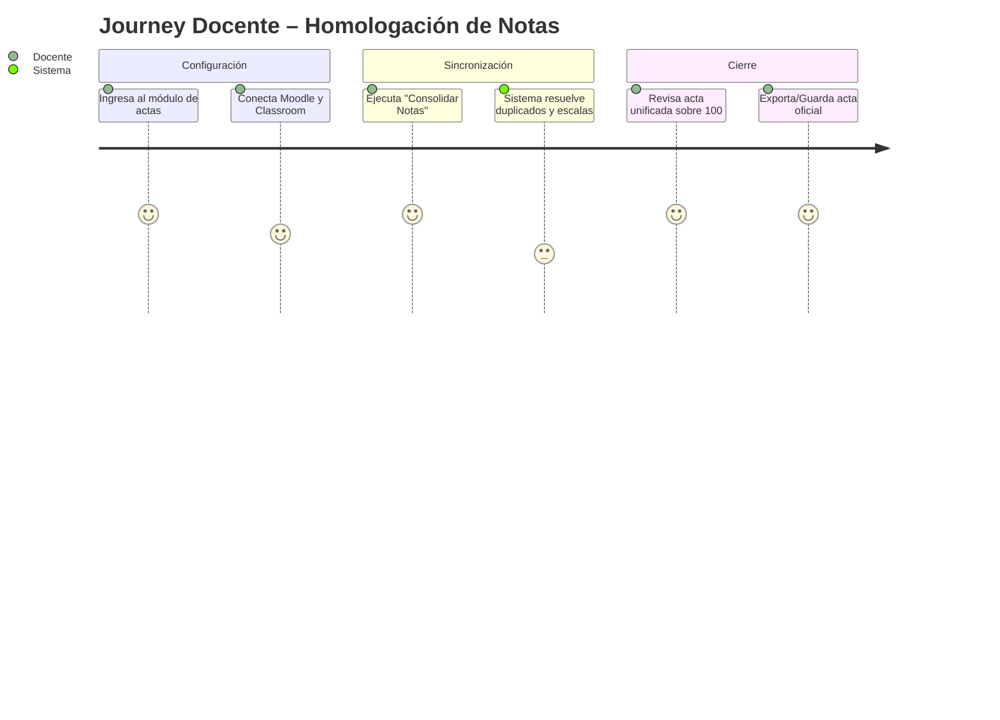
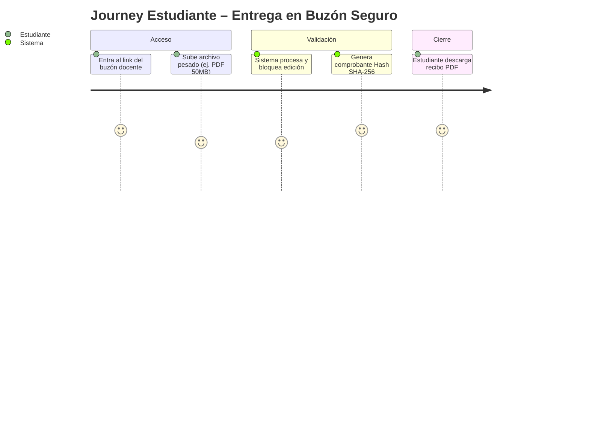

# Product Requirements Document (PRD) – SimonCloud

## 0. Metadatos

| Campo | Valor |
|-------|-------|
| Producto | SimonCloud |
| Grupo | G01 |
| Versión | v1.0 |
| Fecha | 11/05/2026 |
| Product Manager | Equipo SimonCloud |
| Revisores | Docente + Tech Lead + QA |
| Estado | Borrador |
| BRD de referencia | `BRD_vFinal.md` |
| Insumos M2 (UI/UX) | `old-docs/definicion_pantallas_simoncloud.md`, mockups previos |
| Fase Spec Kit cubierta | Specify ✅ |
| Prompts utilizados | `PR-PRD-001` |

## 1. Resumen del producto
SimonCloud es un ecosistema universitario unificado que soluciona dos grandes problemas: el almacenamiento y entrega segura de archivos académicos, y la fragmentación de calificaciones. Actúa como un hub central donde los estudiantes pueden subir trabajos pesados obteniendo un comprobante legal (Hash SHA-256), y los docentes pueden homologar automáticamente las notas provenientes de múltiples plataformas (Moodle, Classroom) en una sola escala oficial de 100 puntos, sin duplicación de estudiantes.

## 2. Objetivos del producto

| ID | Objetivo del producto | BRD vinculado | Métrica | Meta |
|----|------------------------|----------------|---------|------|
| OP-01 | Consolidar notas de múltiples LMS en 1 clic | BR-001, BR-002 | Tiempo de ejecución | < 5s por materia |
| OP-02 | Generar recibos Hash inmutables en subidas | BR-007 | Tasa de éxito | 100% |
| OP-03 | Ampliar cuotas vía pago QR | BR-010 | Tiempos de activación | < 1 min |

## 3. Alcance (*Scope*)

### 3.1 Dentro del alcance (release v1.0)
- Autenticación institucional por roles (Docente, Estudiante).
- Dashboard "Mi Nube" con gestión de cuotas y archivos.
- Buzones de tareas con bloqueo post-entrega y generación de Hash.
- Módulo de Sincronización y Homologación de notas (Google Classroom y Moodle).
- Integración QR Simple para upgrade de 15GB a 50GB.

### 3.2 Fuera del alcance (backlog)
- Migración masiva desde Google Drive vía API (v2.0).
- Chat bidireccional en tiempo real (fuera de foco actual).

### 3.3 Roadmap de versiones
| Versión | Contenido | Fecha objetivo |
|---------|-----------|----------------|
| v1.0 | MVP completo: Buzones Hash + Integración LMS LTI 1.3 + Pago QR + Usuario Externo | Q4 2026 |
| v2.0 | LTI AGS grade passback + Búsqueda avanzada + Migración Google Drive API | Q2 2027 |

## 4. Personas y *user journeys*

### 4.1 Personas
- **Docente:** Necesita recolectar tareas sin que colapse su correo y homologar notas rápidamente.
- **Estudiante:** Necesita subir trabajos pesados y tener constancia irrefutable de la entrega.

### 4.2 *User journeys* principales





## 5. *User stories* y criterios de aceptación

### 5.1 Épica 1: Gestión de Archivos y Buzones Seguros
| ID | Historia | Prioridad | Valor | Criterios Gherkin |
|----|----------|-----------|-------|-------------------|
| PRD-US-001 | Como docente, quiero crear un buzón de recepción con fecha límite. | Must | 8 | Ver §5.1.1 |
| PRD-US-002 | Como estudiante, quiero subir un archivo al buzón para cumplir mi tarea. | Must | 9 | ... |
| PRD-US-003 | Como estudiante, quiero obtener un hash SHA-256 de mi archivo subido para tener prueba de entrega inmutable. | Must | 9 | ... |
| PRD-US-004 | Como estudiante, quiero pagar por QR para aumentar mi cuota de 15GB a 50GB. | Should | 6 | ... |

#### 5.1.0 Criterios PRD-US-002
```gherkin
Escenario: Estudiante sube archivo antes del cierre del buzón
  Dado un SimonDrop activo con fecha de cierre futura
  Cuando el estudiante sube el archivo "informe.pdf" (20MB)
  Entonces el sistema acepta la subida y muestra confirmación
  Y el archivo aparece en la lista de entregas del docente

Escenario: Intento de subida en buzón cerrado
  Dado un SimonDrop con fecha de cierre pasada
  Cuando el estudiante intenta subir un archivo
  Entonces el sistema rechaza la subida
  Y muestra "El plazo de entrega ha vencido"
```

#### 5.1.1 Criterios PRD-US-003
```gherkin
Escenario: Estudiante sube archivo a buzón
  Dado un estudiante autenticado en el buzón de la materia
  Cuando sube el archivo "trabajo_final.pdf" exitosamente
  Entonces el sistema marca el archivo como Solo Lectura
   Y genera un recibo digital con el hash SHA-256 del documento
```

### 5.2 Épica 2: Homologación de Calificaciones
| ID | Historia | Prioridad | Valor | Criterios Gherkin |
|----|----------|-----------|-------|-------------------|
| PRD-US-005 | Como docente, quiero importar notas desde Moodle y Classroom simultáneamente. | Must | 10 | Ver §5.2.1 |
| PRD-US-006 | Como docente, quiero que el sistema convierta notas de letras (A,B,C) a valores numéricos sobre 100. | Must | 9 | ... |
| PRD-US-007 | Como sistema, quiero fusionar cuentas de alumnos por correo institucional para evitar duplicados en el acta. | Must | 10 | ... |

#### 5.2.1 Criterios PRD-US-005 y PRD-US-007
```gherkin
Escenario: Homologación de alumno en dos plataformas
  Dado un docente que importa datos de "jperez@umss.edu" desde Moodle (45/50) y Classroom (A=90/100)
  Cuando el sistema procesa la sincronización
  Entonces el sistema identifica que es el mismo estudiante
   Y convierte la nota de Moodle a 90/100
   Y presenta una fila única: "Juan Pérez | Tarea 1: 90/100 | Tarea 2: 90/100"
```

*(Más historias se detallarán en el backlog ágil)*

### 5.5 Épica 5: Gestión Documental y Administrativa (Basado en old-docs)
| ID | Historia | Prioridad | Valor | Criterios Gherkin |
|----|----------|-----------|-------|-------------------|
| PRD-US-017 | Como administrativo, quiero aprobar o rechazar documentos usando etiquetas de estado visuales para agilizar el flujo de trámites. | Must | 9 | Ver §5.5.1 |
| PRD-US-018 | Como administrativo, quiero ver el historial de versiones (V1, V2) de un archivo para restaurar una versión anterior en caso de error. | Must | 10 | ... |
| PRD-US-019 | Como estudiante, quiero que los archivos borrados vayan a una papelera de reciclaje retenida por 30 días para evitar pérdida accidental. | Must | 8 | ... |
| PRD-US-020 | Como administrador, quiero ver un panel de métricas globales (salud, tráfico, almacenamiento) para monitorear el servidor. | Should | 7 | ... |
| PRD-US-021 | Como estudiante, quiero importar archivos directamente desde Google Drive usando su API para no tener que descargar y volver a subir. | Could | 6 | ... |

#### 5.5.1 Criterios PRD-US-017
```gherkin
Escenario: Administrativo etiqueta un documento
  Dado un administrativo autenticado visualizando el detalle de un archivo
  Cuando selecciona la etiqueta "Aprobado"
  Entonces el sistema actualiza el estado del documento
  Y notifica al propietario original del archivo
  Y bloquea la edición del documento para prevenir alteraciones post-aprobación
```


#### 5.2.2 Criterios PRD-US-006
```gherkin
Escenario: Docente convierte nota letra A a numérico
  Dado un docente que importa la nota "A" de Classroom para "maria@umss.edu.bo"
  Cuando el sistema aplica la tabla de equivalencias
  Entonces la nota homologada es 90/100
  Y el campo lms_origen tiene valor "Classroom"

Escenario: Letra desconocida bloquea el cierre del acta
  Dado una nota con valor "E+" importada desde Classroom
  Cuando el sistema intenta homologar
  Entonces marca la celda en rojo
  Y el botón "Guardar Acta" queda deshabilitado hasta resolver la discrepancia
```

### 5.3 Épica 3: Almacenamiento y Cuotas
| ID | Historia | Prioridad | Valor | Criterios Gherkin |
|----|----------|-----------|-------|-------------------|
| PRD-US-008 | Como estudiante, quiero subir un archivo de hasta 2GB sin que la carga se cancele si se corta el internet. | Must | 10 | Ver §5.3.1 |
| PRD-US-009 | Como docente, quiero crear un buzón (SimonDrop) con fecha y hora de cierre automático. | Must | 9 | ... |
| PRD-US-010 | Como estudiante, quiero ver una barra de progreso en tiempo real mientras subo un archivo pesado. | Should | 7 | ... |
| PRD-US-011 | Como administrador, quiero ver el uso de almacenamiento de toda la institución en un panel. | Could | 5 | ... |

#### 5.3.1 Criterios PRD-US-008
```gherkin
Escenario: Subida interrumpida se reanuda correctamente
  Dado un estudiante que está subiendo un archivo de 1.5GB al 60%
  Cuando se interrumpe la conexión a internet
  Entonces el sistema pausa la subida y muestra "Conexión perdida. Pausado."
   Y cuando la conexión se restablece, la subida continúa desde el byte 60%
   Y el archivo final es idéntico al original (verificado por hash)
```

### 5.4 Épica 4: Autenticación y Seguridad
| ID | Historia | Prioridad | Valor | Criterios Gherkin |
|----|----------|-----------|-------|-------------------|
| PRD-US-012 | Como cualquier usuario, quiero autenticarme con mis credenciales del WebSISS (SSO) sin crear una cuenta nueva. | Must | 10 | Ver §5.4.1 |
| PRD-US-013 | Como docente, quiero compartir un archivo de resolución solo con un correo @umss.edu.bo específico. | Must | 8 | ... |
| PRD-US-014 | Como estudiante, quiero que mis archivos subidos a un buzón sean de solo lectura automáticamente (sin configuración manual de permisos). | Must | 9 | ... |
| PRD-US-015 | Como docente, quiero recibir una notificación cuando un estudiante sube un archivo a mi SimonDrop. | Should | 6 | ... |
| PRD-US-016 | Como administrativo, quiero ver el historial de versiones de un documento para recuperar la última versión aprobada. | Could | 5 | ... |

#### 5.4.1 Criterios PRD-US-012
```gherkin
Escenario: Login con credenciales WebSISS
  Dado un usuario con código SIS válido y contraseña activa
  Cuando selecciona "Ingresar con WebSISS"
  Entonces el sistema autentica al usuario en menos de 3 segundos
   Y le asigna el rol correspondiente (Docente / Estudiante / Administrativo)
   Y lo redirige al Dashboard Unificado sin pedir datos adicionales
```

## 6. Priorización (MoSCoW + RICE)
- **Must:** Homologación de notas, Cruce de identidad, Buzones SimonDrop, Generación de Hash, SSO WebSISS, Subida reanudable 2GB.
- **Should:** Pasarela de pago QR para cuotas extra, Notificaciones, Permisos automáticos.
- **Could:** Migración directa de Google Drive, Panel de administrador.
- **Won't:** Videollamadas integradas, Editor de video en la nube.

### Tabla RICE (top-10 historias)
| ID | Reach | Impact (0.25–3) | Confidence (%) | Effort | RICE |
|----|-------|-----------------|----------------|--------|------|
| PRD-US-012 (SSO WebSISS) | 30000 | 3 | 90 | 3 | 27000 |
| PRD-US-005 (Importar notas LMS) | 5000 | 3 | 85 | 8 | 1594 |
| PRD-US-007 (Cruce identidad) | 5000 | 3 | 90 | 5 | 2700 |
| PRD-US-008 (Subida 2GB reanudable) | 20000 | 3 | 80 | 6 | 8000 |
| PRD-US-009 (SimonDrop con cierre) | 8000 | 2 | 85 | 4 | 3400 |
| PRD-US-003 (Hash inmutable) | 8000 | 2 | 90 | 3 | 4800 |
| PRD-US-006 (Letras a números) | 5000 | 2 | 85 | 3 | 2833 |
| PRD-US-014 (Permisos auto) | 20000 | 2 | 85 | 2 | 17000 |
| PRD-US-004 (Pago QR) | 10000 | 1 | 70 | 5 | 1400 |
| PRD-US-013 (Compartir @umss) | 5000 | 1 | 80 | 2 | 2000 |

## 7. Requerimientos funcionales (alto nivel)

| ID | Requisito | Historia(s) | BRD | Prioridad |
|----|-----------|-------------|-----|----------|
| PRD-REQ-001 | Motor de consolidación de IDs por correo institucional (deduplicación). | PRD-US-007 | BR-003 | Must |
| PRD-REQ-002 | Generador de Hash criptográfico SHA-256 en subida de archivos. | PRD-US-003 | BR-007 | Must |
| PRD-REQ-003 | Integración con APIs REST de Moodle y Google Classroom + homologación de escalas. | PRD-US-005, PRD-US-006 | BR-001, BR-002 | Must |
| PRD-REQ-004 | Pasarela de generación y validación de QR Simple para cuota Pro. | PRD-US-004 | BR-010 | Could |
| PRD-REQ-005 | Trazabilidad de fuente (lms_origen) en cada nota importada. | PRD-US-005 | BR-004 | Must |
| PRD-REQ-006 | Control de acceso por roles RBAC (Docente, Estudiante, Administrativo, Admin). | PRD-US-012 | BR-006 | Must |

## 8. Requerimientos no funcionales (alto nivel)

| ID | Categoría | Requerimiento | Umbral |
|----|-----------|---------------|--------|
| PRD-NFR-001 | Integridad | Los archivos en buzones cerrados no deben poder modificarse (Inmutabilidad). | 100% |
| PRD-NFR-002 | Rendimiento | La homologación de un curso de 100 alumnos debe tardar menos de 5 segundos. | < 5s |
| PRD-NFR-003 | Almacenamiento | Soporte de subidas de hasta 500MB en segundo plano (chunking). | 500MB |

## 9. Dependencias e integraciones

| Sistema | Tipo | Propósito | Riesgo |
|---------|------|-----------|--------|
| Moodle API | consumo | Extraer notas de tareas | Medio |
| Google Classroom API | consumo | Extraer notas de tareas | Medio |
| Gateway QR Simple | consumo | Pagos de cuota Pro | Alto |

## 10. Trazabilidad

| PRD ID | BRD (BRD_vFinal.md) | FSD |
|--------|-----------------|-----|
| PRD-REQ-001 | BR-003 (deduplicar alumnos) | FSD-UC-001 |
| PRD-REQ-002 | BR-007 (hash SHA-256) | FSD-UC-002 |
| PRD-REQ-003 | BR-001 (importar LMS) + BR-002 (homologar escala) | FSD-UC-001 |
| PRD-REQ-004 | BR-010 (QR Simple) | FSD-UC-003 |
| PRD-REQ-005 | BR-004 (trazabilidad fuente) | FSD-UC-001 |
| PRD-REQ-006 | BR-006 (RBAC) | FSD-UC-001, FSD-UC-002, FSD-UC-003 |

## 11. Trazabilidad con M2 (UI/UX)

> Los wireframes, mockups, Journeys y casos de uso del Módulo 2 son el insumo directo de este PRD. El trabajo de UX/UI no se pierde.

### Use Cases del M2 ↔ User Stories del PRD

| Artefacto M2 | User Story PRD | Estado |
|-------------|----------------|--------|
| Flujo 1 (Auditoría M2): Estudiante – Entrega de Proyecto Pesado (2GB) | PRD-US-002, PRD-US-008 | ✅ cubierto |
| Flujo 2 (Auditoría M2): Docente – Creación de Buzón de Tareas (File Drop) | PRD-US-001, PRD-US-009 | ✅ cubierto |
| Flujo 3 (Auditoría M2): Administrativo – Envío Confidencial | PRD-US-013 | ✅ cubierto |
| Happy Path: SSO con credenciales WebSISS (`definicion_pantallas_simoncloud.md §1.2`) | PRD-US-012 | ✅ cubierto |
| Dashboard Unificado con Cards por rol (`definicion_pantallas_simoncloud.md §2`) | PRD-US-010, PRD-US-011 | ⚠️ parcial (v2.0) |
| Journey Map As-Is: Enlace caducado de WeTransfer | PRD-US-003 (hash inmutable) | ✅ cubierto |

### Wireframes / Mockups M2 ↔ Pantallas del PRD

| Wireframe / Mockup M2 | Pantalla / flujo PRD | Estado |
|----------------------|----------------------|--------|
| `Pantalla de Login Institucional` (Balsamiq, Auditoría M2) | Flujo SSO §4.2 | ✅ validado |
| `Dashboard Principal` (Balsamiq, Auditoría M2) | Dashboard §4.2 Journey Estudiante | ✅ validado |
| `Modal de Buzón de Tareas` (Balsamiq, Auditoría M2) | `/simondrop/nuevo` | ✅ validado |
| `Pantalla de Estado de Subida` (Balsamiq, Auditoría M2) | Subida reanudable §4.2 | ✅ validado |
| Capturas de incidentes críticos (`old-docs/Journeys/*.png`) | NFRs de permisos automáticos | ✅ validado |
| Figma Completo (20 Happy Paths): `https://www.figma.com/board/8b3BCvbLJ0gyO0pyJYXFZd/SimonCloud` | Todos los flujos | ✅ referenciado |

## 11. Registro de cambios

| Versión | Fecha | Autor | Cambio |
|---------|-------|-------|--------|
| v1.0 | 11/05/2026 | Equipo | Versión inicial del PRD |
