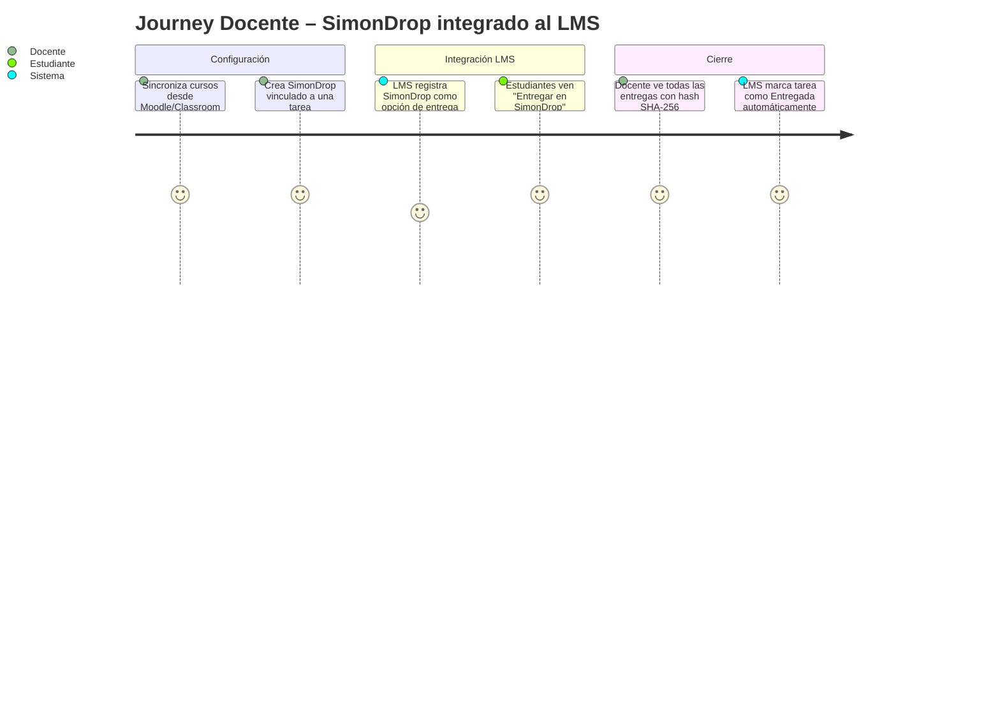
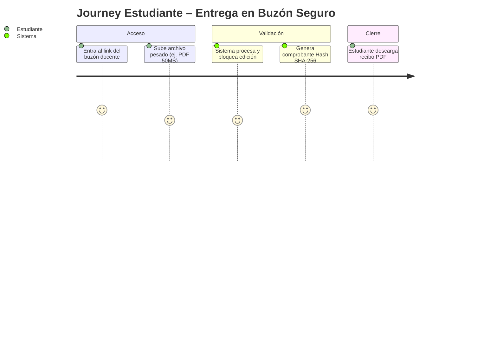
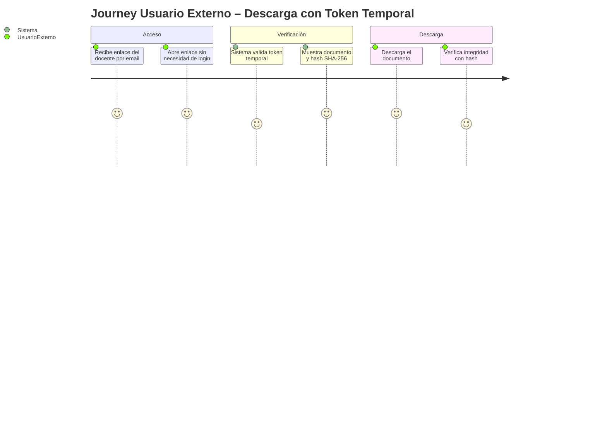

# Product Requirements Document (PRD) – SimonCloud

## 0. Metadatos

| Campo | Valor |
|-------|-------|
| Producto | SimonCloud |
| Grupo | G01 |
| Versión | v1.0 |
| Fecha | 11/05/2026 |
| Product Manager | Equipo SimonCloud |
| Revisores | Docente + Tech Lead + QA |
| Estado | Borrador |
| BRD de referencia | `BRD_vFinal.md` |
| Insumos M2 (UI/UX) | `old-docs/definicion_pantallas_simoncloud.md`, mockups previos |
| Fase Spec Kit cubierta | Specify ✅ |
| Prompts utilizados | `PR-PRD-001` |

## 1. Resumen del producto
SimonCloud es un ecosistema universitario de almacenamiento institucional y entrega segura de archivos académicos. Actúa como hub central donde los estudiantes suben trabajos obteniendo un comprobante legal (Hash SHA-256), y los docentes crean buzones de entrega (SimonDrop) que aparecen como opción nativa dentro de Moodle y Google Classroom vía integración LTI 1.3 — al nivel de "Archivo" o "Google Doc". El docente califica en su LMS; SimonCloud garantiza la integridad de la entrega.

## 2. Objetivos del producto

| ID | Objetivo del producto | BRD vinculado | Métrica | Meta |
|----|------------------------|----------------|---------|------|
| OP-01 | Aparecer como opción de entrega nativa en Moodle y Classroom (LTI 1.3) | BR-001, BR-002 | SimonDrops vinculados a tareas LMS creados | ≥ 1 por materia activa |
| OP-02 | Generar recibos Hash inmutables en subidas | BR-007 | Tasa de éxito | 100% |
| OP-03 | Ampliar cuotas vía pago QR | BR-010 | Tiempos de activación | < 1 min |

## 3. Alcance (*Scope*)

### 3.1 Dentro del alcance (release v1.0)
- Autenticación institucional por roles (Docente, Estudiante).
- Dashboard "Mi Nube" con gestión de cuotas y archivos.
- Buzones de tareas con bloqueo post-entrega y generación de Hash.
- Integración LMS vía LTI 1.3 (Moodle) y OAuth2 (Google Classroom): SimonDrop como opción de entrega nativa dentro del LMS, incluyendo aprobación Google Workspace Marketplace.
- Integración QR Simple para upgrade de 15GB a 50GB.
- Acceso para Usuario Externo: descarga de documentos mediante token temporal firmado, sin necesidad de cuenta institucional (ej. miembro de tribunal de tesis).

### 3.2 Fuera del alcance (backlog)
- Migración masiva desde Google Drive vía API (v2.0).
- Chat bidireccional en tiempo real (fuera de foco actual).
- Búsqueda avanzada y filtrado por metadatos (v2.0).

### 3.3 Roadmap de versiones
| Versión | Contenido | Fecha objetivo |
|---------|-----------|----------------|
| v1.0 | MVP completo: Buzones Hash + Integración LMS LTI 1.3 + Google Classroom Marketplace + Pago QR + Acceso Usuario Externo | Q4 2026 |
| v2.0 | Diferenciadores: LTI AGS grade passback + Búsqueda avanzada + Migración Google Drive API + SDK móvil | Q2 2027 |

## 4. Personas y *user journeys*

### 4.1 Personas
- **Docente:** Necesita recolectar tareas sin que colapse su correo, con entrega integrada directamente en su LMS (Moodle/Classroom) y comprobante de integridad automático.
- **Estudiante:** Necesita subir trabajos pesados y tener constancia irrefutable de la entrega.
- **Usuario Externo:** Miembro de tribunal de tesis, investigador visitante u otro evaluador ajeno a la UMSS que necesita descargar documentos específicos mediante un enlace seguro con token temporal, sin crear una cuenta institucional.
- **Docente Investigador:** Docente que además de gestionar buzones de tareas, necesita localizar versiones históricas de documentos, filtrar por metadatos (autor, fecha, SHA-256) y exportar listados para publicaciones académicas.

### 4.2 *User journeys* principales







## 5. *User stories* y criterios de aceptación

### 5.1 Épica 1: Gestión de Archivos y Buzones Seguros
| ID | Historia | Prioridad | Valor | Criterios Gherkin |
|----|----------|-----------|-------|-------------------|
| PRD-US-001 | Como docente, quiero crear un buzón de recepción con fecha límite. | Must | 8 | Ver §5.1.1 |
| PRD-US-002 | Como estudiante, quiero subir un archivo al buzón para cumplir mi tarea. | Must | 9 | ... |
| PRD-US-003 | Como estudiante, quiero obtener un hash SHA-256 de mi archivo subido para tener prueba de entrega inmutable. | Must | 9 | ... |
| PRD-US-004 | Como estudiante, quiero pagar por QR para aumentar mi cuota de 15GB a 50GB. | Should | 6 | ... |

#### 5.1.0 Criterios PRD-US-002
```gherkin
Escenario: Estudiante sube archivo antes del cierre del buzón
  Dado un SimonDrop activo con fecha de cierre futura
  Cuando el estudiante sube el archivo "informe.pdf" (20MB)
  Entonces el sistema acepta la subida y muestra confirmación
  Y el archivo aparece en la lista de entregas del docente

Escenario: Intento de subida en buzón cerrado
  Dado un SimonDrop con fecha de cierre pasada
  Cuando el estudiante intenta subir un archivo
  Entonces el sistema rechaza la subida
  Y muestra "El plazo de entrega ha vencido"
```

#### 5.1.1 Criterios PRD-US-003
```gherkin
Escenario: Estudiante sube archivo a buzón
  Dado un estudiante autenticado en el buzón de la materia
  Cuando sube el archivo "trabajo_final.pdf" exitosamente
  Entonces el sistema marca el archivo como Solo Lectura
   Y genera un recibo digital con el hash SHA-256 del documento
```

### 5.2 Épica 2: Integración LMS vía SimonDrop (LTI 1.3)
| ID | Historia | Prioridad | Valor | Criterios Gherkin |
|----|----------|-----------|-------|-------------------|
| PRD-US-005 | Como docente, quiero sincronizar mis cursos y tareas desde Moodle para crear SimonDrops vinculados sin copiar datos manualmente. | Must | 10 | Ver §5.2.1 |
| PRD-US-006 | Como docente, quiero que el SimonDrop aparezca como opción de entrega en Moodle al nivel de "Archivo" o "Enlace". | Must | 9 | Ver §5.2.2 |
| PRD-US-007 | Como estudiante, quiero ver "Entregar en SimonDrop" dentro de la tarea de mi LMS para subir mi trabajo sin salir del entorno académico. | Must | 10 | Ver §5.2.3 |

#### 5.2.1 Criterios PRD-US-005
```gherkin
Escenario: Docente sincroniza cursos desde Moodle
  Dado un docente autenticado con SSO WebSISS que tiene materias en Moodle
  Cuando selecciona "Sincronizar LMS" en SimonCloud
  Entonces el sistema lista sus cursos y tareas activas de Moodle
   Y permite crear un SimonDrop vinculado a una tarea con un clic
```

#### 5.2.2 Criterios PRD-US-006
```gherkin
Escenario: SimonDrop aparece como opción de entrega en Moodle
  Dado un SimonDrop vinculado a la tarea "Proyecto Final" de Moodle
  Cuando el docente guarda la configuración
  Entonces Moodle registra el deep link de SimonCloud
   Y los estudiantes ven "Entregar en SimonDrop" junto a "Archivo" y "Enlace"
```

#### 5.2.3 Criterios PRD-US-007
```gherkin
Escenario: Estudiante entrega desde el LMS
  Dado un estudiante que ve la tarea "Proyecto Final" en Moodle
  Cuando selecciona "Entregar en SimonDrop" y sube su archivo
  Entonces SimonCloud genera el hash SHA-256 del archivo
   Y emite el comprobante de entrega al estudiante
   Y notifica a Moodle via LTI AGS que la tarea fue entregada
```

*(Más historias se detallarán en el backlog ágil)*

### 5.3b Épica 2b: Acceso para Usuario Externo
| ID | Historia | Prioridad | Valor | Criterios Gherkin |
|----|----------|-----------|-------|-------------------|
| PRD-US-022 | Como usuario externo (miembro de tribunal / evaluador invitado), quiero acceder a los documentos de defensa mediante un enlace único y temporal sin crear una cuenta institucional, para revisar y descargar archivos de forma segura. | Must | 9 | Ver §5.3b.1 |

#### 5.3b.1 Criterios PRD-US-022
```gherkin
Escenario: Evaluador externo descarga documento con token válido
  Dado un enlace con token temporal generado por el docente para "tesis_final.pdf"
  Cuando el evaluador externo abre el enlace desde cualquier navegador
  Entonces el sistema valida el token y presenta el documento para descarga
  Y muestra el hash SHA-256 del archivo para verificación de integridad
  Y registra el acceso en el audit log con IP y timestamp

Escenario: Intento de acceso con token expirado
  Dado un enlace cuyo token temporal ha superado su fecha de expiración
  Cuando el evaluador externo intenta acceder al enlace
  Entonces el sistema rechaza el acceso con mensaje "Enlace expirado"
  Y no muestra ningún contenido del documento
```

### 5.5 Épica 5: Gestión Documental y Administrativa (Basado en old-docs)
| ID | Historia | Prioridad | Valor | Criterios Gherkin |
|----|----------|-----------|-------|-------------------|
| PRD-US-017 | Como administrativo, quiero aprobar o rechazar documentos usando etiquetas de estado visuales para agilizar el flujo de trámites. | Must | 9 | Ver §5.5.1 |
| PRD-US-018 | Como administrativo, quiero ver el historial de versiones (V1, V2) de un archivo para restaurar una versión anterior en caso de error. | Must | 10 | ... |
| PRD-US-019 | Como estudiante, quiero que los archivos borrados vayan a una papelera de reciclaje retenida por 30 días para evitar pérdida accidental. | Must | 8 | ... |
| PRD-US-020 | Como administrador, quiero ver un panel de métricas globales (salud, tráfico, almacenamiento) para monitorear el servidor. | Should | 7 | ... |
| PRD-US-021 | Como estudiante, quiero importar archivos directamente desde Google Drive usando su API para no tener que descargar y volver a subir. | Could | 6 | ... |

#### 5.5.1 Criterios PRD-US-017
```gherkin
Escenario: Administrativo etiqueta un documento
  Dado un administrativo autenticado visualizando el detalle de un archivo
  Cuando selecciona la etiqueta "Aprobado"
  Entonces el sistema actualiza el estado del documento
  Y notifica al propietario original del archivo
  Y bloquea la edición del documento para prevenir alteraciones post-aprobación
```


### 5.3 Épica 3: Almacenamiento y Cuotas
| ID | Historia | Prioridad | Valor | Criterios Gherkin |
|----|----------|-----------|-------|-------------------|
| PRD-US-008 | Como estudiante, quiero subir un archivo de hasta 2GB sin que la carga se cancele si se corta el internet. | Must | 10 | Ver §5.3.1 |
| PRD-US-009 | Como docente, quiero crear un buzón (SimonDrop) con fecha y hora de cierre automático. | Must | 9 | ... |
| PRD-US-010 | Como estudiante, quiero ver una barra de progreso en tiempo real mientras subo un archivo pesado. | Should | 7 | ... |
| PRD-US-011 | Como administrador, quiero ver el uso de almacenamiento de toda la institución en un panel. | Could | 5 | ... |

#### 5.3.1 Criterios PRD-US-008
```gherkin
Escenario: Subida interrumpida se reanuda correctamente
  Dado un estudiante que está subiendo un archivo de 1.5GB al 60%
  Cuando se interrumpe la conexión a internet
  Entonces el sistema pausa la subida y muestra "Conexión perdida. Pausado."
   Y cuando la conexión se restablece, la subida continúa desde el byte 60%
   Y el archivo final es idéntico al original (verificado por hash)
```

### 5.4 Épica 4: Autenticación y Seguridad
| ID | Historia | Prioridad | Valor | Criterios Gherkin |
|----|----------|-----------|-------|-------------------|
| PRD-US-012 | Como cualquier usuario, quiero autenticarme con mis credenciales del WebSISS (SSO) sin crear una cuenta nueva. | Must | 10 | Ver §5.4.1 |
| PRD-US-013 | Como docente, quiero compartir un archivo de resolución solo con un correo @umss.edu.bo específico. | Must | 8 | ... |
| PRD-US-014 | Como estudiante, quiero que mis archivos subidos a un buzón sean de solo lectura automáticamente (sin configuración manual de permisos). | Must | 9 | ... |
| PRD-US-015 | Como docente, quiero recibir una notificación cuando un estudiante sube un archivo a mi SimonDrop. | Should | 6 | ... |
| PRD-US-016 | Como administrativo, quiero ver el historial de versiones de un documento para recuperar la última versión aprobada. | Could | 5 | ... |

#### 5.4.1 Criterios PRD-US-012
```gherkin
Escenario: Login con credenciales WebSISS
  Dado un usuario con código SIS válido y contraseña activa
  Cuando selecciona "Ingresar con WebSISS"
  Entonces el sistema autentica al usuario en menos de 3 segundos
   Y le asigna el rol correspondiente (Docente / Estudiante / Administrativo)
   Y lo redirige al Dashboard Unificado sin pedir datos adicionales
```

## 6. Priorización (MoSCoW + RICE)
- **Must:** Integración LMS LTI 1.3 (SimonDrop como opción de entrega), Buzones SimonDrop, Generación de Hash SHA-256, SSO WebSISS, Subida reanudable 2GB.
- **Should:** Pasarela de pago QR para cuotas extra, Notificaciones, Permisos automáticos.
- **Could:** Migración directa de Google Drive, Panel de administrador.
- **Won't:** Videollamadas integradas, Editor de video en la nube.

### Tabla RICE (top-10 historias)
| ID | Reach | Impact (0.25–3) | Confidence (%) | Effort | RICE |
|----|-------|-----------------|----------------|--------|------|
| PRD-US-012 (SSO WebSISS) | 30000 | 3 | 90 | 3 | 27000 |
| PRD-US-005 (Sincronizar cursos LMS + crear SimonDrop vinculado) | 5000 | 3 | 85 | 6 | 2125 |
| PRD-US-007 (Entregar en SimonDrop desde el LMS) | 20000 | 3 | 90 | 4 | 13500 |
| PRD-US-008 (Subida 2GB reanudable) | 20000 | 3 | 80 | 6 | 8000 |
| PRD-US-009 (SimonDrop con cierre) | 8000 | 2 | 85 | 4 | 3400 |
| PRD-US-003 (Hash inmutable) | 8000 | 2 | 90 | 3 | 4800 |
| PRD-US-006 (Letras a números) | 5000 | 2 | 85 | 3 | 2833 |
| PRD-US-014 (Permisos auto) | 20000 | 2 | 85 | 2 | 17000 |
| PRD-US-004 (Pago QR) | 10000 | 1 | 70 | 5 | 1400 |
| PRD-US-013 (Compartir @umss) | 5000 | 1 | 80 | 2 | 2000 |

## 7. Requerimientos funcionales (alto nivel)

| ID | Requisito | Historia(s) | BRD | Prioridad |
|----|-----------|-------------|-----|----------|
| PRD-REQ-001 | Integración LMS vía LTI 1.3 (Moodle) y OAuth2 (Classroom): sincronización de cursos y creación de SimonDrops vinculados. | PRD-US-005, PRD-US-006 | BR-001 | Must |
| PRD-REQ-002 | Generador de Hash criptográfico SHA-256 en subida de archivos. | PRD-US-003 | BR-007 | Must |
| PRD-REQ-003 | SimonDrop como opción de entrega nativa en LMS (deep link LTI) + notificación básica de entrega al LMS (v1.0). Grade passback completo vía LTI AGS es v2.0 (ver roadmap §Hito 4). | PRD-US-006, PRD-US-007 | BR-002 | Must |
| PRD-REQ-004 | Pasarela de generación y validación de QR Simple para cuota Pro. | PRD-US-004 | BR-010 | Could |
| PRD-REQ-005 | Trazabilidad de entrega: `lms_assignment_id` + `lms_course_id` en cada SimonDrop vinculado. | PRD-US-005 | BR-004 | Must |
| PRD-REQ-006 | Control de acceso por roles RBAC (Docente, Estudiante, Administrativo, Admin). | PRD-US-012 | BR-006 | Must |
| PRD-REQ-007 | Subida reanudable multipart hasta 2GB con inmutabilidad post-cierre de buzón. | PRD-US-008, PRD-US-009 | BR-005, BR-007 | Must |
| PRD-REQ-008 | Autenticación SSO WebSISS con emisión de JWT por rol (Docente / Estudiante / Administrativo). | PRD-US-012 | BR-006 | Must |
| PRD-REQ-009 | Compartir archivos con destinatario @umss.edu.bo; permisos de solo lectura automáticos post-entrega. | PRD-US-013, PRD-US-014 | BR-005, BR-006 | Must |
| PRD-REQ-010 | Notificaciones push/email al docente ante nueva entrega en SimonDrop. | PRD-US-015 | BR-008 | Should |
| PRD-REQ-011 | Control de versiones de archivos + papelera de reciclaje con retención de 30 días antes de purga definitiva. | PRD-US-016, PRD-US-018, PRD-US-019 | BR-005 | Must |
| PRD-REQ-012 | Panel de aprobación/rechazo documental con audit log por administrativo y métricas globales para admin del sistema. | PRD-US-017, PRD-US-020 | BR-005, BR-006 | Should |
| PRD-REQ-013 | Acceso para Usuario Externo mediante token temporal firmado (descarga sin cuenta institucional, expiración configurable). | PRD-US-022 | BR-006 | Must |

## 8. Requerimientos no funcionales (alto nivel)

| ID | Categoría | Requerimiento | Umbral |
|----|-----------|---------------|--------|
| PRD-NFR-001 | Integridad | Los archivos en buzones cerrados no deben poder modificarse (Inmutabilidad). | 100% |
| PRD-NFR-002 | Rendimiento | La sincronización de cursos LMS y creación de SimonDrop vinculado deben completarse en menos de 3 segundos. | < 3s |
| PRD-NFR-003 | Almacenamiento | Soporte de subidas de hasta 500MB en segundo plano (chunking). | 500MB |

## 9. Dependencias e integraciones

| Sistema | Tipo | Propósito | Riesgo |
|---------|------|-----------|--------|
| Moodle LTI 1.3 | integración | SimonDrop como opción de entrega nativa; LTI AGS para notificación de entrega | Medio |
| Google Classroom API | consumo | Sincronización de cursos y tareas; deep link de SimonDrop como material | Medio |
| Gateway QR Simple | consumo | Pagos de cuota Pro | Alto |

## 10. Trazabilidad

| PRD ID | BRD (BRD_vFinal.md) | FSD |
|--------|---------------------|-----|
| PRD-REQ-001 | BR-001 (integración LMS LTI) | FSD-UC-001 |
| PRD-REQ-002 | BR-007 (hash SHA-256) | FSD-UC-002 |
| PRD-REQ-003 | BR-002 (SimonDrop como opción de entrega LMS) | FSD-UC-001 |
| PRD-REQ-004 | BR-010 (QR Simple) | FSD-UC-003 |
| PRD-REQ-005 | BR-004 (trazabilidad lms_assignment_id) | FSD-UC-001 |
| PRD-REQ-006 | BR-006 (RBAC) | FSD-UC-001, FSD-UC-002, FSD-UC-003 |
| PRD-REQ-007 | BR-005 (inmutabilidad), BR-007 (SHA-256) | FSD-UC-002, FSD-UC-005 |
| PRD-REQ-008 | BR-006 (RBAC) | FSD-UC-004 |
| PRD-REQ-009 | BR-005 (inmutabilidad), BR-006 (RBAC) | FSD-UC-008 |
| PRD-REQ-010 | BR-008 (notificaciones) | FSD-UC-007 |
| PRD-REQ-011 | BR-005 (inmutabilidad) | FSD-UC-005, FSD-UC-009 |
| PRD-REQ-012 | BR-005 (inmutabilidad), BR-006 (RBAC) | FSD-UC-006, FSD-UC-010 |
| PRD-REQ-013 | BR-006 (RBAC) | FSD-UC-001 (flujo alternativo token) |

## 11. Trazabilidad con M2 (UI/UX)

> Los wireframes, mockups, Journeys y casos de uso del Módulo 2 son el insumo directo de este PRD. El trabajo de UX/UI no se pierde.

### Use Cases del M2 ↔ User Stories del PRD

| Artefacto M2 | User Story PRD | Estado |
|-------------|----------------|--------|
| Flujo 1 (Auditoría M2): Estudiante – Entrega de Proyecto Pesado (2GB) | PRD-US-002, PRD-US-008 | ✅ cubierto |
| Flujo 2 (Auditoría M2): Docente – Creación de Buzón de Tareas (File Drop) | PRD-US-001, PRD-US-009 | ✅ cubierto |
| Flujo 3 (Auditoría M2): Administrativo – Envío Confidencial | PRD-US-013 | ✅ cubierto |
| Happy Path: SSO con credenciales WebSISS (`definicion_pantallas_simoncloud.md §1.2`) | PRD-US-012 | ✅ cubierto |
| Dashboard Unificado con Cards por rol (`definicion_pantallas_simoncloud.md §2`) | PRD-US-010, PRD-US-011 | ⚠️ parcial (v2.0) |
| Journey Map As-Is: Enlace caducado de WeTransfer | PRD-US-003 (hash inmutable) | ✅ cubierto |

### Wireframes / Mockups M2 ↔ Pantallas del PRD

| Wireframe / Mockup M2 | Pantalla / flujo PRD | Estado |
|----------------------|----------------------|--------|
| `Pantalla de Login Institucional` (Balsamiq, Auditoría M2) | Flujo SSO §4.2 | ✅ validado |
| `Dashboard Principal` (Balsamiq, Auditoría M2) | Dashboard §4.2 Journey Estudiante | ✅ validado |
| `Modal de Buzón de Tareas` (Balsamiq, Auditoría M2) | `/simondrop/nuevo` | ✅ validado |
| `Pantalla de Estado de Subida` (Balsamiq, Auditoría M2) | Subida reanudable §4.2 | ✅ validado |
| Capturas de incidentes críticos (`old-docs/Journeys/*.png`) | NFRs de permisos automáticos | ✅ validado |
| Figma Completo (20 Happy Paths): `https://www.figma.com/board/8b3BCvbLJ0gyO0pyJYXFZd/SimonCloud` | Todos los flujos | ✅ referenciado |

## 11. Registro de cambios

| Versión | Fecha | Autor | Cambio |
|---------|-------|-------|--------|
| v1.0 | 11/05/2026 | Equipo | Versión inicial del PRD |
