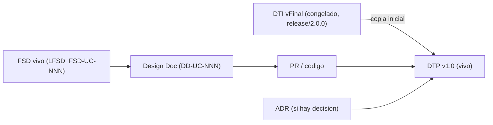

# Documento Técnico del Producto (DTP) — SimonCloud

> **Qué es**: el DTP es la **continuación viva del DTI**. El DTI vFinal fue "el plano"
> (foto técnica congelada al cierre de M4, `release/2.0.0`); el DTP es "el DTI que
> compila": el **contrato técnico vigente** mientras se implementa.
>
> **Regla de oro — cero divergencia silenciosa**: si el código necesita contradecir
> una decisión del DTI vFinal, primero se actualiza el ADR + el DTP + la spec viva;
> **nunca al revés**.
>
> **Qué NO es**: el DTP **no reescribe** el baseline congelado (`docs/baseline/`,
> recuperable por el tag `release/2.0.0`). El baseline permanece intacto.

## Cómo se origina

1. Se copia el **DTI vFinal** (`docs/baseline/DTI_vFinal.md`) como punto de partida.
2. Todo cambio técnico entra por el control de cambios (§A).
3. El baseline de M4 queda inmutable en `docs/baseline/` + tag `release/2.0.0`.

---

## A. Control de cambios (núcleo del DTP) `[humano+máquina]`

### A.1 Changelog de implementación

| Fecha | Cambio | Disparador (FSD-UC / DD / hallazgo) | ADR | PR / commit | Autor |
|-------|--------|-------------------------------------|-----|-------------|-------|
| 28/06/2026 | Transición M4→implementación: baseline congelado + capa viva (`docs/product`, `docs/design`, `docs/prompts/impl`) + DTP v1.0 | Modelo documental M4 | — | _(pendiente commit)_ | Carlos A. Gomez |
| 28/06/2026 | Absorción del Design System `supabase-ds` → `libs/design-system/` (components + tokens + 2 agentes de extracción; mhtml gitignored; tema Supabase dark) | DD-SHELL-001 | ADR-0007 | _(pendiente commit)_ | Carlos A. Gomez |
| 28/06/2026 | Definición del **primer feature oficial E2E** (subida + acceso externo): alcance real vs stub | FSD-UC-002 + FSD-UC-011 / DD-UC-002 | ADR-0008 | _(pendiente commit)_ | Carlos A. Gomez |

### A.2 Deltas respecto al DTI vFinal

> Diferencias **deliberadas** entre lo diseñado en M4 y lo construido. Cada delta
> significativo exige un ADR.

| # | Sección del DTI afectada | Qué decía el DTI vFinal | Qué dice ahora el DTP | Motivo | ADR |
|---|--------------------------|-------------------------|-----------------------|--------|-----|
| 1 | §9 Integración LMS (FSD-UC-001) | SimonDrop creado vía LTI 1.3 desde el LMS | v1: drop creado directo por el docente, **sin LTI** | Acotar el primer feature E2E | ADR-0008 |
| 2 | §17 / ADR-0003 (FSD-UC-002) | Subida reanudable por chunks (S3 multipart, 2GB) | v1: **subida en una sola operación** (presigned PUT), sin reanudación; recibo JSON | Acotar v1; reanudación diferida | ADR-0008 |
| 3 | §13.2 (FSD-UC-004) | SSO WebSISS real (OAuth2) | v1: **stub del IdP** que emite JWT real (RS256) con rol | No hay WebSISS accesible | ADR-0008 |

### A.3 Estado de implementación por FSD-UC

| FSD-UC | Design Doc | Estado | Release | Tests/Evals | Notas |
|--------|------------|--------|---------|-------------|-------|
| `FSD-UC-002` Subida + hash | `DD-UC-002` | en curso (E2E tramo 1) | `release/3.0.0` | objetivo ≥90% | **Feature oficial E2E** (no POC). Real: MinIO/SHA-256. ADR-0008. |
| `FSD-UC-011` Acceso usuario externo (token HMAC) | `DD-UC-011` | en curso (E2E tramo 2) | `release/3.0.0` | objetivo ≥90% | Token para el archivo de UC-002. ADR-0008. |
| `FSD-UC-001` Creación SimonDrop (simplificado) | _(notas en ADR-0008)_ | habilitante (sin LTI) | `release/3.0.0` | — | Drop básico directo. Delta #1. |
| `FSD-UC-004` Auth (stub WebSISS) | _(notas en ADR-0008)_ | habilitante (stub + JWT real) | `release/3.0.0` | — | Delta #3. |

### A.4 Trazabilidad código ↔ DTP

`BRD/MRD (baseline)` → `PRD/FSD vivo (FSD-UC-NNN)` → `Design Doc (DD-UC-NNN)` →
`Prompt (PR-IMPL-NNN)` → `PR/commit` → `Tests/Evals` → `ADR (si aplica)` → **DTP**.

---

## B. Contenido técnico vigente `[humano+máquina]`

> El DTP mantiene al día las mismas secciones que el DTI. Si una sección **no cambió**
> respecto al DTI vFinal, se referencia; si **cambió**, se reescribe aquí y se registra
> el delta en §A.2.

| Sección (espejo del DTI) | ¿Cambió vs DTI vFinal? | Dónde está la versión vigente |
|--------------------------|------------------------|-------------------------------|
| §1 Visión del producto | no | DTI vFinal §1 |
| §2 Contexto del sistema (C4 N1) | no | DTI vFinal §2 |
| §3 Arquitectura de alto nivel (C4 N2/N3) | no | DTI vFinal §3 |
| §4 Modelo de dominio | no | DTI vFinal §4 |
| §5 Arquitectura hexagonal del core | no | DTI vFinal §5 |
| §7 Asíncrona / event-driven | no | DTI vFinal §7 |
| §8 Despliegue (Docker Swarm DTIC) | no | DTI vFinal §8 |
| §10 Prompt mapping | sí (crece con `PR-IMPL-*`) | `docs/PROMPT_MAPPING.md` |
| §11 NFRs (incl. cobertura ≥90%) | no | DTI vFinal §11 + `AGENTS.md` |
| **§N Arquitectura frontend (nuevo)** | **sí** | **`docs/design/DD-SHELL-001.md` + `ADR-0007`** |
| §21 ADRs | sí (crece) | `docs/adr/` |

### §B.1 Arquitectura frontend (capa viva)

SPA React 18 + Vite + Tailwind. **Design System** absorbido en `libs/design-system/`
(Atomic Design, tokens Supabase dark, Radix) — decisión en **ADR-0007**. **App shell**
(layout + routing v6 + theme + auth guard) diseñado en **DD-SHELL-001**; los features
aportan sus páginas. Pipeline de extracción de componentes vía agentes `ds-page-analyzer`
(Haiku) y `ds-component-builder` (Sonnet).

> **Solo se escriben aquí las secciones que cambiaron.** El resto se mantiene por
> referencia al DTI vFinal, preservando un único punto de verdad por release.

---

## Checklist del DTP

- [x] Frontmatter con `baseline_ref` (DTI vFinal + tag `release/2.0.0`) y `status: vivo`.
- [x] §A.1 Changelog iniciado.
- [x] §A.3 Estado por FSD-UC con su Design Doc.
- [ ] §A.2 Deltas vs DTI vFinal (se poblará si la implementación diverge).
- [ ] `docs/PROMPT_MAPPING.md` ampliado con `PR-IMPL-*` (al implementar UC-011).
- [x] Baseline congelado (`docs/baseline/`) intacto.
