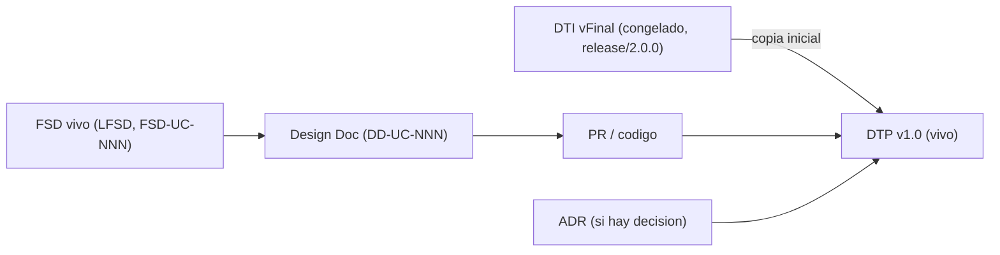

# Documento Técnico del Producto (DTP) – Plantilla

> **Rutas en este repo**: las referencias a `m4/plantillas/` y `m4/docs/` son del repo del
> docente. Aquí: plantillas en `templates/`, modelo en
> `templates/MODELO_DOCUMENTAL_IMPLEMENTACION.md`. El DTP **instanciado y vivo** de SimonCloud
> está en `docs/product/DTP.md`.

> **Qué es**: el DTP es la **continuación viva del DTI**. Donde el DTI fue *"el plano"* (foto técnica congelada al cierre de M4, `release/2.0.0`), el DTP es *"el DTI que compila"*: el **contrato técnico vigente** del producto mientras se implementa. Consolida la entrega final (documentación + software).
>
> **Regla de oro** (heredada del modelo documental de M4, ver [`m4/docs/MODELO_DOCUMENTAL_IMPLEMENTACION.md`](../docs/MODELO_DOCUMENTAL_IMPLEMENTACION.md)): **cero divergencia silenciosa**. Si el código necesita contradecir una decisión del DTI vFinal, primero se actualiza el ADR + el DTP + la spec viva; **nunca al revés**.
>
> **Qué NO es**: el DTP **no reescribe** el baseline congelado (`BRD/MRD/PRD/FSD clásico + DTI vFinal` en `docs/baseline/`, recuperable por el tag `release/2.0.0`). El baseline es el registro histórico evaluado de M4 y permanece intacto.

## Cómo se origina

1. Se copia el **DTI vFinal** como punto de partida del DTP (`status: vivo`).
2. A partir de aquí, **todo cambio técnico** entra por el flujo de control de cambios (ver §A).
3. El baseline de M4 queda inmutable en `docs/baseline/` + tag `release/2.0.0`.

---

## A. Control de cambios (núcleo del DTP) `[humano+máquina]`

> Esta sección es lo que distingue al DTP del DTI. Todo cambio técnico durante la implementación se registra aquí.

### A.1 Changelog de implementación

| Fecha | Cambio | Disparador (FSD-UC / DD / hallazgo) | ADR | PR / commit | Autor |
|-------|--------|-------------------------------------|-----|-------------|-------|
| `<dd/mm/aaaa>` | `<qué cambió en el producto/arquitectura>` | `FSD-UC-001` / `DD-UC-001` | `ADR-0006` | `#123 / <sha>` | `<…>` |

### A.2 Deltas respecto al DTI vFinal

> Diferencias **deliberadas** entre lo diseñado en M4 y lo construido. Cada delta significativo exige un ADR.

| # | Sección del DTI afectada | Qué decía el DTI vFinal | Qué dice ahora el DTP | Motivo | ADR |
|---|--------------------------|-------------------------|-----------------------|--------|-----|
| 1 | `§3.1 Estilo arquitectónico` | `<…>` | `<…>` | `<aprendizaje de implementación / POC / restricción real>` | `ADR-NNNN` |

### A.3 Estado de implementación por FSD-UC

| FSD-UC | Design Doc | Estado | Release | Tests/Evals | Notas |
|--------|------------|--------|---------|-------------|-------|
| `FSD-UC-001` | `DD-UC-001` | pendiente / en curso / hecho | `release/3.0.0` | `<enlace>` | `<…>` |

### A.4 Trazabilidad código ↔ DTP

> Cadena completa por feature. Debe poder reconstruirse para cualquier línea del producto.

`BRD/MRD (baseline)` → `PRD/FSD vivo (FSD-UC-NNN)` → `Design Doc (DD-UC-NNN)` → `Prompt (PR-IMPL-NNN)` → `PR/commit` → `Tests/Evals` → `ADR (si aplica)` → **DTP**.

---

## B. Contenido técnico vigente `[humano+máquina]`

> El DTP mantiene **al día** las mismas secciones que el DTI (no se duplica la plantilla: se reusa la estructura de [`DOCUMENTO_TECNICO_INICIAL_TEMPLATE.md`](DOCUMENTO_TECNICO_INICIAL_TEMPLATE.md)). Para cada sección, si **no cambió** respecto al DTI vFinal, basta referenciarla; si **cambió**, se reescribe aquí y se registra el delta en §A.2.

| Sección (espejo del DTI) | ¿Cambió vs DTI vFinal? | Dónde está la versión vigente |
|--------------------------|------------------------|-------------------------------|
| §1 Visión del producto | no | DTI vFinal §1 |
| §2 Contexto del sistema (C4 N1) | no / sí | `<DTI / este DTP §B.x>` |
| §3 Arquitectura de alto nivel (C4 N2/N3) | no / sí | `<…>` |
| §3.5 Contenedores agénticos | no / sí | `<…>` |
| §4 Modelo de dominio | no / sí | `<…>` |
| §5 Arquitectura hexagonal del core | no / sí | `<…>` |
| §6 Distribuida (si aplica) | no / sí | `<…>` |
| §7 Asíncrona / event-driven | no / sí | `<…>` |
| §8 Despliegue cloud | no / sí | `<…>` |
| §9 Capa de IA / agentes | no / sí | `<…>` |
| §10 Prompt mapping | sí (crece con PR-IMPL-*) | `docs/PROMPT_MAPPING.md` |
| §11 NFRs | no / sí | `<…>` |
| §12 POCs | no / sí | `<…>` |
| §13–§16 Seguridad / Observabilidad / DevOps / Antipatrones | no / sí | `<…>` |
| §21 ADRs | sí (crece) | `docs/adr/` |
| §22–§23 Auditoría IA / Evals | sí | `<…>` |

> **Solo escribir aquí las secciones que cambiaron.** Las que no cambiaron se mantienen por referencia al DTI vFinal, preservando un único punto de verdad por release.

---

## Checklist del DTP (entrega de implementación)

- [ ] Frontmatter con `baseline_ref` (DTI vFinal + tag `release/2.0.0`) y `status: vivo`.
- [ ] §A.1 Changelog de implementación poblado y al día.
- [ ] §A.2 Deltas vs DTI vFinal, **cada uno con ADR**.
- [ ] §A.3 Estado por FSD-UC con su Design Doc.
- [ ] §A.4 Trazabilidad código ↔ DTP reconstruible para cada feature.
- [ ] §B: solo secciones cambiadas reescritas; el resto referencia al DTI vFinal.
- [ ] `docs/PROMPT_MAPPING.md` ampliado con prompts de implementación (`PR-IMPL-*`).
- [ ] `AGENTS.md` sincronizado.
- [ ] Baseline congelado (`docs/baseline/`) **intacto** (sin commits que lo modifiquen).
