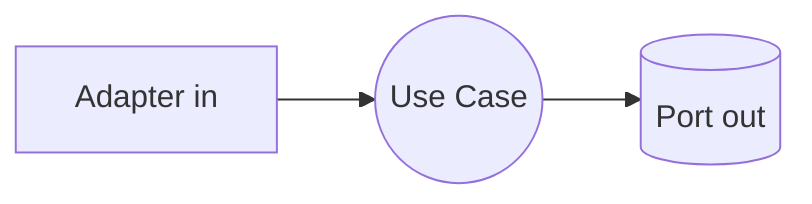

# Design Doc `DD-UC-NNN` — `<Título del feature>`

> **Qué es**: documento de diseño de **un feature** (un *vertical slice* o caso de uso). Describe **cómo** se construye, con trazabilidad explícita al FSD. Es la unidad que el equipo crea "por cada cosa que hace en el código".
>
> **Relación con otros documentos**:
> - **Trazabilidad obligatoria al FSD** (`fsd_uc` en el frontmatter). Sin FSD-UC asociado, el design doc no es válido.
> - **Complementa al ADR, no lo reemplaza**: aquí va el *cómo* (diseño del feature); en el ADR va la *decisión* significativa y costosa de revertir. Si este diseño implica una decisión así, se crea/enlaza un ADR.
> - Alimenta el **DTP** (changelog + estado por FSD-UC + deltas vs DTI vFinal).

## 1. Objetivo y contexto

- **Qué resuelve este feature** (2–4 líneas): `<…>`
- **Caso(s) de uso del FSD que implementa**: `FSD-UC-001` (`<nombre>`), enlace: `docs/product/FSD.md#fsd-uc-001`.
- **Alcance**: dentro / fuera de alcance de este DD.

## 2. Diseño (el "cómo") `[humano+máquina]`

- **Enfoque elegido**: `<descripción del diseño de la solución>`.
- **Componentes tocados** (capas hexagonales): dominio / aplicación / adaptadores / infra.
- **Contratos y tipos**: puertos, DTOs, eventos, esquema de datos afectado.
- **Diagrama** (si ayuda):

## 3. Alternativas consideradas

| Alternativa | Pros | Contras | ¿Elegida? |
|-------------|------|---------|-----------|
| A. `<…>` | | | sí/no |
| B. `<…>` | | | sí/no |

> Si la elección es significativa o costosa de revertir → crear `ADR-NNNN` y enlazarlo en el frontmatter.

## 4. Impacto en las specs vivas `[máquina]`

> Qué se actualiza al implementar este feature. Esto lo consume el flujo de `dtp-sync`.

| Artefacto vivo | Cambio | ¿Delta vs DTI vFinal? |
|----------------|--------|-----------------------|
| `docs/product/FSD.md` (`FSD-UC-001`) | `<ajuste de criterio/flujo>` | no |
| `docs/product/PRD.md` (`PRD-REQ-01`) | `<…>` | no |
| `docs/product/DTP.md` | `<changelog + estado UC>` | sí → `ADR-NNNN` |

> **Recordatorio (regla de oro)**: el baseline congelado de M4 (`docs/baseline/`) **no se toca**. Los cambios viven en `docs/product/`.

## 5. Prompts usados `[máquina]`

| Prompt | Tarea | Artefacto generado |
|--------|-------|--------------------|
| `PR-IMPL-NNN` | `<generación de código / tests / migración>` | `<src/… , tests/…>` |

> Cada prompt sigue [`PROMPT_TEMPLATE.md`](PROMPT_TEMPLATE.md), vive en `docs/prompts/impl/PR-IMPL-NNN.md` y se referencia desde `docs/PROMPT_MAPPING.md`.

## 6. Plan de pruebas y evals

- **Unit**: `<qué se prueba sin BD/HTTP/red>`.
- **Integration**: `<adaptadores, BD efímera>`.
- **E2E / Gherkin**: deriva de los criterios de aceptación del `FSD-UC-001`.
- **Evals de IA** (si el feature usa un agente): dataset + métricas.

## 7. Definition of Done (checklist)

- [ ] `fsd_uc` declarado y enlazado (trazabilidad al FSD).
- [ ] Diseño (§2) y alternativas (§3) documentados.
- [ ] ADR creado/enlazado si hubo decisión significativa.
- [ ] §4 Impacto en specs vivas registrado (sin tocar el baseline).
- [ ] Prompt(s) versionado(s) en `docs/prompts/impl/` y en `PROMPT_MAPPING.md`.
- [ ] Tests/evals definidos y pasando.
- [ ] DTP actualizado (changelog + estado del FSD-UC) vía `dtp-sync`.
- [ ] PR declara: prompts usados, archivos generados vs editados a mano.
