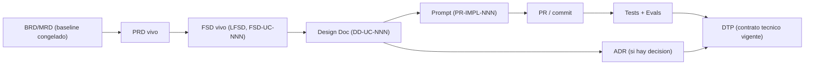

# Modelo documental y transición a implementación (AI-SDLC)

> **Mapeo de rutas en este repo (G01 SimonCloud)**: las referencias internas a
> `m4/plantillas/`, `m4/docs/`, `m4/PLAN_MODULO_4.md`, `m4/SYLLABUS.md` y `.cursor/skills/`
> provienen del repo del docente. Equivalentes aquí: plantillas en `templates/`, este modelo
> en `templates/MODELO_DOCUMENTAL_IMPLEMENTACION.md`, skills instalados en `.claude/commands/`
> (`feature-design-doc`, `dtp-sync`). Las capas viven en `docs/baseline/` (congelado) y
> `docs/product/`, `docs/design/`, `docs/prompts/impl/` (vivo).

> **Propósito**: definir cómo evoluciona la documentación del producto **después de cerrar M4** (cuando los grupos pasan de especificar a implementar el FSD), preservando el baseline evaluado y manteniendo trazabilidad total entre specs, prompts, decisiones y código.
>
> Este documento es el **detalle normativo** que referencian [`m4/PLAN_MODULO_4.md`](../PLAN_MODULO_4.md) y [`m4/SYLLABUS.md`](../SYLLABUS.md). Aplica al producto del grupo de forma continua (M4 → implementación → módulos siguientes).

## 1. El problema que resuelve

Al implementar los features del FSD con asistencia de IA (Claude Code, Cursor, etc.), el agente tiende a **reescribir el BRD/PRD/FSD** para reflejar lo construido. Eso es valioso, pero **contamina el baseline congelado de M4** (el registro histórico que se evaluó) y borra la trazabilidad de *qué se diseñó* vs *qué se construyó*.

La solución es separar dos capas y mover **toda** la evolución a la capa viva.

## 2. Las dos capas

### 2.1 Baseline congelado (M4, `release/2.0.0`)

`BRD + MRD + PRD + FSD clásico + DTI vFinal`.

- Es el **registro histórico evaluado** de M4. **No se reescribe nunca.**
- Vive en `docs/baseline/` y es recuperable por el tag `release/2.0.0`.
- Se marca con `status: congelado` en el frontmatter.
- **Claude Code (y cualquier agente) tiene prohibido editarlo.** Protección recomendada:
  - `CODEOWNERS` que exija revisión humana sobre `docs/baseline/**`.
  - Regla en `AGENTS.md`: *"NUNCA editar `docs/baseline/`; los cambios van a `docs/product/`."*
  - Espejo opcional en `.cursor/rules/baseline-congelado.mdc`.

### 2.2 Capa viva (implementación, `release/3.0.0`+)

`PRD vivo + FSD vivo (LFSD ⚡) + DTP + design docs por feature`.

- Aquí evoluciona todo con el código.
- El **FSD vivo usa el modo LFSD ⚡** ya definido en [`m4/plantillas/FSD_TEMPLATE.md`](../plantillas/FSD_TEMPLATE.md) (versión ágil mantenida sprint-a-sprint).
- El **DTP (Documento Técnico del Producto)** es la continuación viva del DTI: nace como copia del DTI vFinal y es "el DTI que compila". Plantilla: [`m4/plantillas/DTP_TEMPLATE.md`](../plantillas/DTP_TEMPLATE.md).
- Los **design docs por feature** (uno o más por FSD, trazables al FSD-UC) describen el *cómo*. Plantilla: [`m4/plantillas/FEATURE_DESIGN_DOC_TEMPLATE.md`](../plantillas/FEATURE_DESIGN_DOC_TEMPLATE.md).

## 3. Layout en el repo del grupo

```
docs/
  baseline/                 # CONGELADO (M4). No tocar. status: congelado
    BRD.md  MRD.md  PRD.md  FSD.md  DTI_vFinal.md
  product/                  # VIVO
    PRD.md                  # copia viva
    FSD.md                  # copia viva (LFSD ⚡)
    DTP.md                  # Documento Técnico del Producto (vivo)
  design/                   # design docs por feature
    DD-UC-001.md  DD-UC-002.md  ...
  adr/                      # NNNN-*.md (continúa la numeración de M4)
  prompts/impl/             # PR-IMPL-NNN.md (prompts de implementación)
  PROMPT_MAPPING.md         # se amplía con los PR-IMPL-*
AGENTS.md                   # incluye la regla de protección del baseline
```

## 4. Regla de oro: cero divergencia silenciosa

Si la implementación obliga a cambiar lo diseñado:

1. Se actualiza la **spec viva** (`docs/product/PRD.md` / `FSD.md`) y el **DTP** (changelog + delta).
2. Si la decisión es significativa o costosa de revertir → se crea un **ADR** *antes* de codear (nunca al revés).
3. El **PR** declara: prompt(s) usados, archivos generados vs editados a mano. Si la edición manual supera ~30 % del diff, se documenta como ADR de aprendizaje.
4. El **baseline congelado permanece intacto**.

## 5. Trazabilidad de extremo a extremo (con IDs)



Convenciones de ID:
- `FSD-UC-NNN` — caso de uso (en FSD vivo).
- `DD-UC-NNN` — design doc del feature (uno o varios por FSD).
- `PR-IMPL-NNN` — prompt de implementación (`docs/prompts/impl/`, referenciado en `PROMPT_MAPPING.md`).
- `ADR-NNNN` — decisión arquitectónica (continúa la numeración de M4).

## 6. Skills de apoyo

- [`feature-design-doc`](../../.cursor/skills/feature-design-doc/SKILL.md): genera un design doc estandarizado a partir de uno o más `FSD-UC`, con trazabilidad al FSD y registro del prompt en `PROMPT_MAPPING.md`.
- [`dtp-sync`](../../.cursor/skills/dtp-sync/SKILL.md): a partir de un diff/PR de implementación, propone actualizaciones a las specs vivas + DTP + changelog, crea un ADR si detecta una decisión significativa, valida la trazabilidad `código → FSD-UC → DD → prompt` y **nunca toca el baseline**.

## 7. Postura sobre frameworks SDD (Spec Kit / OpenSpec / BMAD / SPDD / propios)

> Respuesta oficial a la duda recurrente de los equipos: *"¿hay que usar Spec Kit estrictamente?"*

**El módulo es agnóstico de framework SDD. Se exige el *contrato*, no la *herramienta*.** El piso no negociable es:

1. Specs **vivas y trazables** (PRD/FSD en modo LFSD ⚡).
2. Prompts **versionados** con anatomía completa (ver [`PROMPT_TEMPLATE.md`](../plantillas/PROMPT_TEMPLATE.md)).
3. **ADR-first**: las decisiones significativas se registran antes de codear.
4. **Design doc por FSD-UC** y **DTP consolidado**.
5. Trazabilidad de extremo a extremo (§5).

Cumpliendo ese piso, **cada equipo elige libremente** OpenSpec, GitHub Spec Kit, BMAD, Structured Prompt-Driven Development, AI Unified Process, Agent Skills, o una combinación propia de skills/comandos/reglas. En el FSD, Spec Kit aparece como **vocabulario de referencia** (fases Specify / Plan / Tasks / Implement), **no como obligación**.

**Equipos con herramientas mixtas** (p. ej. 9 integrantes, algunos con Claude, otros con Gemini/Cursor/Codex): se estandarizan **los outputs y las convenciones de carpeta**, no la herramienta. Todos los artefactos son **markdown plano + Git**, producibles por cualquier asistente. Los skills `feature-design-doc` y `dtp-sync` solo asumen un agente con acceso al repo; no son exclusivos de Claude. Recomendación: que todo el equipo produzca los mismos artefactos (no que solo una persona genere el código), para aprovechar la maestría como escenario real de proceso.
